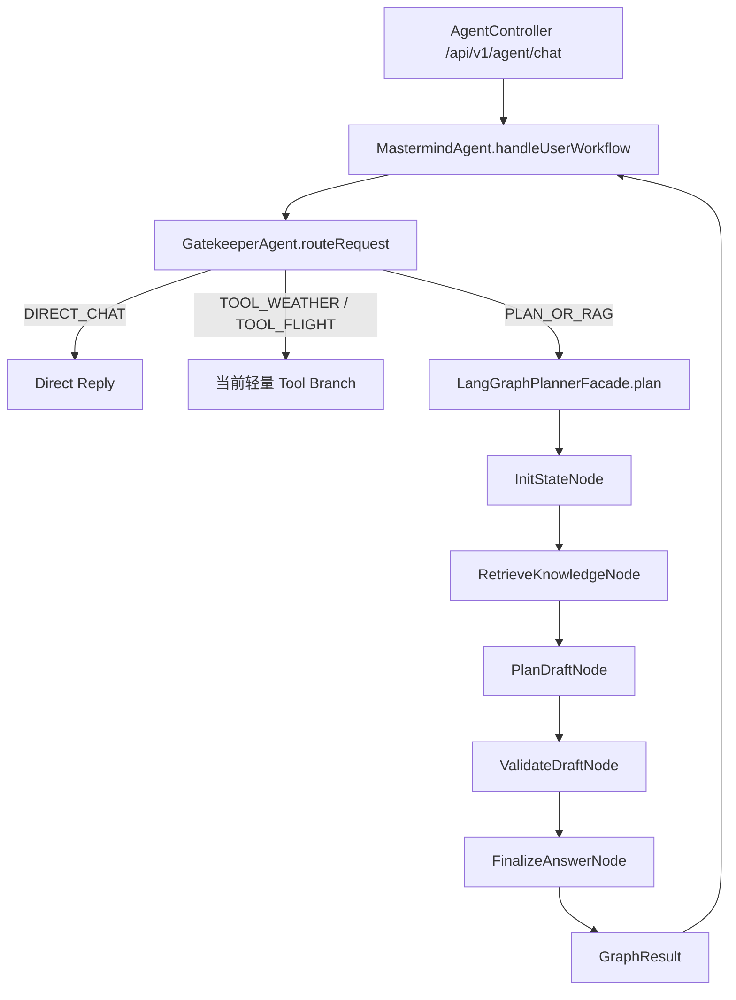

# 第一阶段直线流程

本文档是第一阶段编码实施说明。后续写代码时，以本文档作为任务边界和验收标准。

第一阶段的目标不是一次性完成完整 Agentic 系统，而是先做一条稳定、可测试、可理解的直线流程：

```text
用户输入
  -> Gatekeeper 意图识别
  -> 初始化 TravelPlanState
  -> RAG 检索
  -> Planner 生成初步规划草案
  -> Validator 校验草案
  -> Finalizer 输出最终回复
```

第一阶段暂时不做：

- 多分支 Agent 并行调用。
- 航班、天气、酒店、景点分支 Agent 编排。
- Validator 失败后的多轮循环修正。 
- 多轮会话记忆。
- SSE / WebSocket 流式输出。
- 复杂预算计算引擎。

这些放到第二阶段、第三阶段继续做。

## 1. 第一阶段目标

第一阶段要把当前项目从“Controller 调用 MastermindAgent，然后模型直接回答”升级为“复杂规划任务进入一个有状态的直线工作流”。

完成后，系统应该具备以下能力：

1. `/api/v1/agent/chat` 仍然作为新版主入口。
2. `GatekeeperAgent` 继续负责意图识别。
3. 当意图是 `DIRECT_CHAT` 时，仍然可以低成本直接回复。
4. 当意图是 `TOOL_WEATHER` 或 `TOOL_FLIGHT` 时，第一阶段可以继续走当前已有的轻量分支逻辑，不在本阶段重构。
5. 当意图是 `PLAN_OR_RAG` 时，不再由 `MastermindAgent` 直接调用 DeepSeek Pro 一次性回答，而是进入 `LangGraphPlannerFacade`。
6. `LangGraphPlannerFacade` 内部先执行一条直线流程：

```text
InitState -> RetrieveKnowledge -> PlanDraft -> ValidateDraft -> FinalizeAnswer
```

7. 每个节点都读写同一个 `TravelPlanState`。
8. 最终返回用户一个自然语言 Markdown 回复。
9. 每个节点都可以通过日志看出输入、输出和失败原因。
10. 代码有最小测试覆盖，确保状态对象、RAG 注入、Validator 逻辑、Facade 流程可验证。

## 2. 第一阶段架构图



## 3. 第一阶段目录规划

建议新增包：

```text
AgentProjectTrip/src/main/java/com/travel/agent/ai/graph
├── LangGraphPlannerFacade.java
├── model
│   ├── TravelPlanState.java
│   ├── GraphInputRequest.java
│   ├── GraphResult.java
│   ├── PlannerDraft.java
│   └── ValidationIssue.java
└── node
    ├── InitStateNode.java
    ├── RetrieveKnowledgeNode.java
    ├── PlanDraftNode.java
    ├── ValidateDraftNode.java
    └── FinalizeAnswerNode.java
```

第一阶段可以先把节点实现为普通 Spring `@Component`，由 `LangGraphPlannerFacade` 顺序调用。

也就是说，第一阶段允许先不强行接入真正的 LangGraph4j API。原因是：当前最重要的是把状态协议、节点职责和测试闭环跑通。等这个直线流程稳定后，第二阶段再把 Facade 内部替换成 LangGraph4j `StateGraph`。

如果在第一阶段就引入 LangGraph4j，也可以，但必须保持节点职责和状态对象不变。

## 4. 核心数据模型

### 4.1 GraphInputRequest

用途：`MastermindAgent` 传给 `LangGraphPlannerFacade` 的入口对象。

建议字段：

```java
public class GraphInputRequest {
    private String userQuery;
    private GatekeeperResponse route;
}
```

第一阶段只放必要字段。后续阶段可以扩展：

- `sessionId`
- `userId`
- `conversationSummary`
- `userProfile`
- `locale`

### 4.2 TravelPlanState

用途：第一阶段直线流程的共享状态。

建议字段：

```java
public class TravelPlanState {
    private String userQuery;
    private GatekeeperResponse route;

    private List<String> destinations;
    private String travelTime;
    private List<String> keywords;

    private String ragContext;
    private PlannerDraft draft;
    private List<ValidationIssue> validationIssues;

    private String finalAnswer;
    private boolean success;
    private String errorMessage;
}
```

字段解释：

| 字段 | 说明 |
|---|---|
| `userQuery` | 用户原始输入 |
| `route` | Gatekeeper 输出的结构化意图 |
| `destinations` | 从 Gatekeeper entities 中提取的目的地 |
| `travelTime` | 用户提到的出行时间 |
| `keywords` | 用户偏好、限制、关键词 |
| `ragContext` | Pinecone / KnowledgeTools 检索到的攻略上下文 |
| `draft` | Planner 生成的初步方案草案 |
| `validationIssues` | Validator 发现的问题 |
| `finalAnswer` | 最终返回给用户的 Markdown |
| `success` | 流程是否成功完成 |
| `errorMessage` | 流程失败原因 |

### 4.3 PlannerDraft

用途：Planner 节点生成的结构化草案。

第一阶段不需要设计成非常复杂，建议先这样：

```java
public class PlannerDraft {
    private String title;
    private String summary;
    private String itineraryMarkdown;
    private String budgetNotes;
    private String riskNotes;
    private List<String> assumptions;
}
```

字段解释：

| 字段 | 说明 |
|---|---|
| `title` | 方案标题 |
| `summary` | 总体思路 |
| `itineraryMarkdown` | 分天行程，Markdown 格式 |
| `budgetNotes` | 预算说明。第一阶段可以是模型估算和提醒 |
| `riskNotes` | 风险、防坑、预约、天气、交通提醒 |
| `assumptions` | 因用户信息不足而做出的假设 |

### 4.4 ValidationIssue

用途：Validator 节点返回的结构化问题。

建议字段：

```java
public class ValidationIssue {
    private String severity; // HIGH / MEDIUM / LOW
    private String code;
    private String message;
}
```

建议 `code` 取值：

```text
MISSING_DATE
MISSING_BUDGET
MISSING_DESTINATION
INSUFFICIENT_RAG
WEAK_ITINERARY_STRUCTURE
BUDGET_NOT_ADDRESSED
TOO_VAGUE
```

第一阶段 Validator 不做循环，只把问题交给 Finalizer。

### 4.5 GraphResult

用途：Facade 返回给 `MastermindAgent` 的结果对象。

建议字段：

```java
public class GraphResult {
    private boolean success;
    private String answer;
    private List<ValidationIssue> validationIssues;
    private String errorMessage;
}
```

`MastermindAgent` 只关心 `answer`。如果失败，则用 `errorMessage` 做降级回复。

## 5. 节点职责

### 5.1 InitStateNode

输入：

- `GraphInputRequest`

输出：

- `TravelPlanState`

职责：

1. 创建新的 `TravelPlanState`。
2. 写入 `userQuery`。
3. 写入 `route`。
4. 从 `route.entities` 提取：
   - `destinations`
   - `travelTime`
   - `keywords`
5. 对 null 做安全兜底。

伪代码：

```java
TravelPlanState init(GraphInputRequest request) {
    TravelPlanState state = new TravelPlanState();
    state.setUserQuery(request.getUserQuery());
    state.setRoute(request.getRoute());

    Entities entities = request.getRoute().getEntities();
    state.setDestinations(safeList(entities.getLocations()));
    state.setTravelTime(defaultIfBlank(entities.getTime(), "未指定"));
    state.setKeywords(safeList(entities.getKeywords()));

    state.setSuccess(false);
    return state;
}
```

验收标准：

- 输入 route 为空时不抛异常。
- entities 为空时不抛异常。
- locations / keywords 为空时变成空列表。

### 5.2 RetrieveKnowledgeNode

输入：

- `TravelPlanState`

输出：

- 更新后的 `TravelPlanState`

职责：

1. 基于用户原始问题、目的地、关键词生成检索 query。
2. 调用 `KnowledgeTools.searchTravelGuide(query)`。
3. 将结果写入 `state.ragContext`。
4. 如果检索失败，写入温和兜底文本，不中断流程。

第一阶段可以复用当前已有工具：

```text
com.travel.agent.ai.tools.KnowledgeTools
```

伪代码：

```java
TravelPlanState retrieve(TravelPlanState state) {
    String query = buildQuery(state);
    try {
        String rag = knowledgeTools.searchTravelGuide(query);
        state.setRagContext(rag);
    } catch (Exception e) {
        state.setRagContext("私有知识库暂时不可用，本次规划将主要基于通用旅行知识生成。");
    }
    return state;
}
```

验收标准：

- RAG 工具异常时流程继续。
- `ragContext` 永远不为 null。
- 日志中能看到 query 和检索结果长度。

### 5.3 PlanDraftNode

输入：

- `TravelPlanState`

输出：

- 更新 `state.draft`

职责：

1. 使用 `coreChatModel` / DeepSeek Pro 生成初步方案草案。
2. Prompt 中必须包含：
   - 用户原始输入。
   - 目的地。
   - 出行时间。
   - 关键词。
   - RAG 上下文。
   - 当前系统日期。
3. 尽量要求模型输出结构化 JSON，方便解析成 `PlannerDraft`。
4. 如果 JSON 解析失败，第一阶段可以降级为把完整模型输出放入 `itineraryMarkdown`。

建议 prompt 输出格式：

```json
{
  "title": "string",
  "summary": "string",
  "itineraryMarkdown": "string",
  "budgetNotes": "string",
  "riskNotes": "string",
  "assumptions": ["string"]
}
```

伪代码：

```java
TravelPlanState plan(TravelPlanState state) {
    String response = coreChatClient.prompt()
        .system(buildSystemPrompt(state))
        .user(state.getUserQuery())
        .call()
        .content();

    PlannerDraft draft = parseOrFallback(response);
    state.setDraft(draft);
    return state;
}
```

验收标准：

- 模型返回合法 JSON 时能解析成 `PlannerDraft`。
- 模型返回 Markdown 或非 JSON 时能降级，不导致接口 500。
- Prompt 中包含 `ragContext`。
- Prompt 中包含当前日期。

### 5.4 ValidateDraftNode

输入：

- `TravelPlanState`

输出：

- 更新 `state.validationIssues`

职责：

第一阶段 Validator 先使用 Java 规则，不急着调用模型。

建议规则：

1. 用户没有目的地：
   - `HIGH / MISSING_DESTINATION`
2. 用户没有时间：
   - `MEDIUM / MISSING_DATE`
3. 用户提到预算，但草案中没有预算说明：
   - `HIGH / BUDGET_NOT_ADDRESSED`
4. 草案为空：
   - `HIGH / EMPTY_DRAFT`
5. RAG 为空或不可用：
   - `LOW / INSUFFICIENT_RAG`
6. 行程内容太短：
   - `MEDIUM / TOO_VAGUE`

伪代码：

```java
TravelPlanState validate(TravelPlanState state) {
    List<ValidationIssue> issues = new ArrayList<>();

    if (state.getDestinations().isEmpty()) {
        issues.add(high("MISSING_DESTINATION", "用户没有提供明确目的地。"));
    }

    if (isBlank(state.getTravelTime()) || "未指定".equals(state.getTravelTime())) {
        issues.add(medium("MISSING_DATE", "用户没有提供明确出行时间。"));
    }

    if (mentionsBudget(state.getUserQuery()) && isBlank(state.getDraft().getBudgetNotes())) {
        issues.add(high("BUDGET_NOT_ADDRESSED", "用户提到了预算，但草案没有预算说明。"));
    }

    state.setValidationIssues(issues);
    return state;
}
```

验收标准：

- 不调用外部模型。
- 不抛空指针。
- 至少能识别目的地缺失、时间缺失、预算未回应、草案为空。

### 5.5 FinalizeAnswerNode

输入：

- `TravelPlanState`

输出：

- 更新 `state.finalAnswer`
- 更新 `state.success`

职责：

1. 把 `PlannerDraft` 整理成最终 Markdown。
2. 如果有 `HIGH` 级问题，不要假装完美，应该在答案中提示“需要用户补充”或“不确定项”。
3. 如果只是 `LOW` 或 `MEDIUM` 问题，可以输出方案并附带提醒。
4. 如果整个流程失败，输出友好降级回复。

第一阶段 Finalizer 可以不用模型，直接用 Java 拼 Markdown。这样更稳定、可测试。

建议最终结构：

```text
# 旅行规划草案标题

## 总体思路
...

## 推荐行程
...

## 预算与预订提醒
...

## 防坑与风险提醒
...

## 需要确认的信息
...
```

伪代码：

```java
TravelPlanState finalize(TravelPlanState state) {
    StringBuilder sb = new StringBuilder();
    PlannerDraft draft = state.getDraft();

    sb.append("# ").append(draft.getTitle()).append("\n\n");
    sb.append("## 总体思路\n").append(draft.getSummary()).append("\n\n");
    sb.append("## 推荐行程\n").append(draft.getItineraryMarkdown()).append("\n\n");
    sb.append("## 预算与预订提醒\n").append(draft.getBudgetNotes()).append("\n\n");
    sb.append("## 防坑与风险提醒\n").append(draft.getRiskNotes()).append("\n\n");

    if (!state.getValidationIssues().isEmpty()) {
        sb.append("## 需要确认或注意的信息\n");
        for (ValidationIssue issue : state.getValidationIssues()) {
            sb.append("- [").append(issue.getSeverity()).append("] ")
              .append(issue.getMessage()).append("\n");
        }
    }

    state.setFinalAnswer(sb.toString());
    state.setSuccess(true);
    return state;
}
```

验收标准：

- 输出稳定 Markdown。
- validation issues 会体现在最终回复里。
- draft 为空时也能输出友好错误。

## 6. LangGraphPlannerFacade 设计

第一阶段 Facade 是 Mastermind 调用直线流程的唯一入口。

建议类：

```text
com.travel.agent.ai.graph.LangGraphPlannerFacade
```

建议方法：

```java
public GraphResult plan(GraphInputRequest request)
```

第一阶段内部执行顺序：

```java
public GraphResult plan(GraphInputRequest request) {
    try {
        TravelPlanState state = initStateNode.init(request);
        state = retrieveKnowledgeNode.retrieve(state);
        state = planDraftNode.plan(state);
        state = validateDraftNode.validate(state);
        state = finalizeAnswerNode.finish(state);

        return GraphResult.success(
            state.getFinalAnswer(),
            state.getValidationIssues()
        );
    } catch (Exception e) {
        return GraphResult.failure(
            "规划流程暂时遇到问题，请稍后重试或补充更多旅行信息。",
            e.getMessage()
        );
    }
}
```

注意：

- 第一阶段类名仍然叫 `LangGraphPlannerFacade`，即使内部暂时是手写直线流程。
- 这样第二阶段替换为真正 LangGraph4j 时，`MastermindAgent` 不需要再改调用方。
- Facade 是“黑箱边界”，外部只传 `GraphInputRequest`，只拿 `GraphResult`。

## 7. MastermindAgent 改造计划

当前 `MastermindAgent.handlePlanOrRag` 直接调用 `coreChatClient`。

第一阶段改造目标：

```text
PLAN_OR_RAG
  -> 构造 GraphInputRequest
  -> 调用 LangGraphPlannerFacade.plan
  -> 返回 GraphResult.answer
```

伪代码：

```java
private String handlePlanOrRag(GatekeeperResponse.Entities entities, String userMessage) {
    GraphInputRequest request = new GraphInputRequest();
    request.setUserQuery(userMessage);
    request.setRoute(currentRoute);

    GraphResult result = langGraphPlannerFacade.plan(request);

    if (result.isSuccess()) {
        return result.getAnswer();
    }
    return "抱歉，规划流程暂时遇到问题：" + result.getErrorMessage();
}
```

注意：当前方法只传了 `entities`，没有传完整 `GatekeeperResponse route`。实际编码时建议调整方法签名：

```java
private String handlePlanOrRag(GatekeeperResponse route, String userMessage)
```

switch 分支里改成：

```java
case "PLAN_OR_RAG" -> handlePlanOrRag(route, userMessage);
```

这样 Facade 可以拿到完整路由信息。

## 8. 测试计划

第一阶段至少补以下测试。

### 8.1 Model 测试

目标：

- DTO getter/setter 正常。
- 空字段不会导致节点 NPE。

建议测试类：

```text
src/test/java/com/travel/agent/ai/graph/model/TravelPlanStateTest.java
```

### 8.2 InitStateNode 测试

场景：

1. route 包含 locations/time/keywords，能正确写入 state。
2. route.entities 为 null，输出空 destinations、空 keywords、`travelTime=未指定`。

### 8.3 RetrieveKnowledgeNode 测试

场景：

1. mock `KnowledgeTools` 返回字符串，state.ragContext 被写入。
2. mock `KnowledgeTools` 抛异常，state.ragContext 写入兜底文本。

### 8.4 ValidateDraftNode 测试

场景：

1. 没有目的地 -> `MISSING_DESTINATION`。
2. 没有时间 -> `MISSING_DATE`。
3. 用户提到预算，但 draft 没有 budgetNotes -> `BUDGET_NOT_ADDRESSED`。
4. draft 为空 -> `EMPTY_DRAFT`。

### 8.5 FinalizeAnswerNode 测试

场景：

1. draft 正常，输出包含标题、行程、预算、风险。
2. 有 validation issues，输出包含“需要确认或注意的信息”。
3. draft 为空，输出友好降级文本。

### 8.6 LangGraphPlannerFacade 测试

第一阶段不要在单元测试里真的调用大模型。

建议：

- mock 每个 Node。
- 验证调用顺序。
- 验证成功时返回 `GraphResult.success=true`。
- 验证某个节点抛异常时返回 `GraphResult.success=false`。

### 8.7 MastermindAgent 路由测试

如果当前测试成本较高，可放到第一阶段最后。

目标：

- Gatekeeper 返回 `PLAN_OR_RAG` 时，`MastermindAgent` 调用 `LangGraphPlannerFacade`。
- Gatekeeper 返回 `DIRECT_CHAT` 时，不调用 Facade。

## 9. 第一阶段任务清单

### 任务 1：新增 graph model 包

新增：

- `GraphInputRequest`
- `TravelPlanState`
- `PlannerDraft`
- `ValidationIssue`
- `GraphResult`

验收：

- 编译通过。
- 基础 getter/setter 可用。
- 无业务逻辑。

### 任务 2：新增 InitStateNode

新增：

- `InitStateNode`

验收：

- 能从 `GatekeeperResponse` 初始化状态。
- null-safe。
- 单元测试通过。

### 任务 3：新增 RetrieveKnowledgeNode

新增：

- `RetrieveKnowledgeNode`

依赖：

- `KnowledgeTools`

验收：

- 能构建检索 query。
- 能写入 `ragContext`。
- 工具失败时不终止流程。
- 单元测试通过。

### 任务 4：新增 PlanDraftNode

新增：

- `PlanDraftNode`

依赖：

- `coreChatModel`
- `ObjectMapper`

验收：

- 能调用 DeepSeek Pro。
- 能解析 JSON 为 `PlannerDraft`。
- JSON 解析失败时降级为 Markdown draft。
- Prompt 包含 `ragContext` 和当前日期。

### 任务 5：新增 ValidateDraftNode

新增：

- `ValidateDraftNode`

验收：

- 使用 Java 规则校验。
- 至少覆盖目的地、时间、预算、草案为空。
- 单元测试通过。

### 任务 6：新增 FinalizeAnswerNode

新增：

- `FinalizeAnswerNode`

验收：

- 输出 Markdown。
- 包含 validation issues。
- draft 为空时有兜底。
- 单元测试通过。

### 任务 7：新增 LangGraphPlannerFacade

新增：

- `LangGraphPlannerFacade`

验收：

- 串联 5 个节点。
- 返回 `GraphResult`。
- 节点异常时捕获并降级。
- Facade 测试通过。

### 任务 8：改造 MastermindAgent

修改：

- 注入 `LangGraphPlannerFacade`。
- `PLAN_OR_RAG` 分支改为调用 Facade。
- `handlePlanOrRag` 改为接收完整 `GatekeeperResponse`。

验收：

- `/api/v1/agent/chat` 对复杂规划请求走新直线流程。
- `DIRECT_CHAT` 不受影响。
- `TOOL_WEATHER` / `TOOL_FLIGHT` 第一阶段不强制重构。

### 任务 9：前端入口暂不切换或谨慎切换

当前前端调用：

```text
/api/v1/travel/chat
```

第一阶段建议有两个选择：

1. 保持不动，先用 Postman / 浏览器手动测试 `/api/v1/agent/chat`。
2. 等第一阶段后端测试稳定后，再切到 `/api/v1/agent/chat`。

建议采用第 1 种，避免文档阶段或半成品阶段影响当前可用前端。

### 任务 10：补充测试和手动验证

建议手动验证输入：

```text
你好，你是谁？
```

预期：

- `DIRECT_CHAT`
- 不进入 Facade。

```text
帮我规划国庆去法国和意大利的10天行程，预算1200欧，想避开人多的地方。
```

预期：

- `PLAN_OR_RAG`
- 进入 Facade。
- RAG 被检索。
- 输出包含行程、预算提醒、防坑提醒、需要确认的信息。

```text
我想下个月去欧洲玩，帮我安排。
```

预期：

- `PLAN_OR_RAG`
- Validator 发现目的地/时间/预算等信息不足。
- Finalizer 输出方案或追问提示，不胡乱假设为确定事实。

## 10. 第一阶段完成标准

必须全部满足：

1. 项目编译通过。
2. 新增 graph model 和 node 的单元测试通过。
3. `/api/v1/agent/chat` 对 `PLAN_OR_RAG` 请求会进入 `LangGraphPlannerFacade`。
4. `TravelPlanState` 能完整经过：

```text
InitState -> RetrieveKnowledge -> PlanDraft -> ValidateDraft -> FinalizeAnswer
```

5. RAG 检索结果会进入规划 prompt。
6. Validator 至少能输出基础问题。
7. Finalizer 能把问题显示给用户。
8. 任意节点异常不会导致接口直接崩溃。
9. 旧接口 `/api/v1/travel/chat` 暂时不被破坏。
10. 文档中的第一阶段任务可以删除或归档，进入第二阶段。

## 11. 第一阶段不解决的问题

这些问题明确留到后续阶段：

### 第二阶段候选内容

- 真正引入 LangGraph4j `StateGraph`。
- 将第一阶段手写直线流程迁移成图节点。
- 接入 `BranchDispatcher`。
- 添加天气、航班分支 Agent。
- 分支返回 `BranchResult`。

### 第三阶段候选内容

- 酒店、景点、预算估算分支。
- Validator 失败后的自动修正循环。
- `revisionCount` 控制最大循环次数。
- `ASK_USER` 追问状态。

### 第四阶段候选内容

- Redis / DB 会话状态。
- 多轮旅行需求记忆。
- SSE 流式过程展示。
- 前端展示 Agent 执行步骤。

## 12. 编码时注意事项

1. 第一阶段以稳定为主，不追求花哨。
2. 节点之间只通过 `TravelPlanState` 传递信息。
3. 不让分支 Agent 在第一阶段互相聊天。
4. Finalizer 第一阶段用 Java 拼 Markdown，减少不可控模型调用。
5. Validator 第一阶段用 Java 规则，方便测试。
6. Prompt 输出 JSON，但必须有解析失败降级。
7. 所有外部调用都要 try-catch。
8. 日志要能看出当前执行到哪个节点。
9. 不破坏旧版 `/api/v1/travel/chat`。
10. 每完成一个任务，先跑相关测试，再继续下一个任务。

## 13. 后续规则

当第一阶段所有任务完成，并且代码测试通过后，保留本文档，然后创建第二阶段文档。

推进条件：

1. 第一阶段完成标准全部满足。
2. 用户人工审核确认。
3. 代码已经进入稳定状态。
4. 第二阶段计划已经单独成文。
