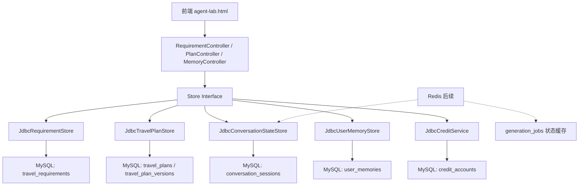

# 第七阶段用户记忆与数据库持久化底座

本文档是第七阶段编码实施说明。第一到第六阶段、阶段 6.5 文档保留不删除。本阶段的目标是把当前以内存为主的 Agent 原型升级为“可持久化、可恢复、可审计、可积累用户偏好”的工程底座。

第七阶段的核心思想是：

```text
需求表、计划版本、会话状态、额度、用户记忆
从内存 Map 迁移到 MySQL 主存储
再逐步引入 Redis 作为短期缓存和任务状态缓存
```

当前开发数据库使用 MAMP MySQL：

```text
host: localhost
port: 3306
database: agent_project_trip
username: root
password: root
```

数据库由本阶段创建。当前 MAMP 实测使用 root/root，后续部署时必须改为环境变量和低权限业务账号。

## 1. 第七阶段目标

完成后，系统应该具备以下能力：

1. 需求表不再只存在内存中，后端重启后仍可按 `requirementId` 查询。
2. 旅行计划和历史版本不再只存在内存中，后端重启后仍可按 `planId` 查询。
3. 会话状态可以恢复，用户刷新页面或后端重启后不会完全丢失上下文。
4. 额度账户持久化，避免重启后免费额度重置。
5. 建立用户长短期记忆模型。
6. Planner 可以读取用户长期偏好，但不能覆盖本次明确需求。
7. 系统可以记录“本次旅行有效”的短期记忆。
8. 系统可以记录“以后都适用”的长期记忆。
9. 用户记忆可查询、可新增、可禁用，避免黑箱记忆。
10. 保留现有 Store 接口，优先通过 JDBC 实现替换内存实现，降低改造风险。

第七阶段暂时不做：

- 正式登录注册系统。
- 复杂权限体系。
- 向量数据库长期语义记忆。
- 自动总结全部聊天记录。
- Redis 高可用和集群部署。
- 正式支付订单系统。
- 异步生成任务完整落地，先预留表结构。
- 复杂 ORM 建模，第一版优先使用 `JdbcTemplate`。

## 2. 为什么第七阶段先做记忆和持久化

当前系统已经可以完成：

```text
自然语言需求 -> 需求表确认 -> 完整规划 -> 计划版本化 -> 自然语言修改 -> 前端调试台
```

但现在仍有几个工程短板：

1. **重启丢数据**：内存 Store 会丢失 `requirementId`、`planId`、版本记录和额度。
2. **无法长期学习用户偏好**：用户多次强调“不住青旅”，系统无法在下一次旅行中稳定记住。
3. **难以审计**：无法稳定追踪某个计划是基于哪份需求表、哪次修改生成的。
4. **前端测试不稳定**：调试台刷新或后端重启后，很多 ID 会失效。
5. **商业化前置条件不足**：支付、订单、用户中心都依赖持久化底座。

所以第七阶段不急着继续增加 Agent 数量，而是先把数据层打稳。

## 3. 总体架构



第一版采用：

```text
MySQL = 主存储
Redis = 后续缓存和任务状态
Map = 单元测试或本地兜底
JSON 字段 = 保存复杂对象快照
```

## 4. 存储策略

### 4.1 MySQL

MySQL 是第七阶段的唯一主数据源。

保存内容：

- 需求表。
- 计划主记录。
- 计划版本。
- 会话状态。
- 用户记忆。
- 用户额度。
- 生成任务记录预留。

### 4.2 Redis

Redis 不是主数据源。

后续用途：

- 当前会话短期缓存。
- 生成任务进度缓存。
- 防重复提交锁。
- 热门用户记忆缓存。

如果 Redis 不可用，系统应该仍能依赖 MySQL 工作。

### 4.3 Map

Map 只用于：

- 单元测试。
- 本地开发兜底。
- 某些组件尚未迁移前的过渡实现。

生产链路不应该依赖 Map 保存核心数据。

### 4.4 文档 / JSON

复杂对象第一版可以用 JSON 字段保存快照，例如：

- `TravelRequirementSpec`
- `PlannerDraft`
- `RiskAssessment`
- `ValidationIssue`
- 完整 Markdown 答案

这样可以减少早期表结构拆得过细导致的改造成本。后续字段稳定后，再把高频查询字段拆成普通列。

## 5. 用户身份策略

第七阶段暂时没有正式登录系统，所以采用开发期策略：

```text
userId = sessionId
```

新增一个轻量工具类：

```java
UserContextResolver
```

职责：

1. 如果请求里有 `userId`，优先使用 `userId`。
2. 如果没有 `userId`，使用 `sessionId` 作为临时 `userId`。
3. 如果两者都没有，使用 `anonymous-default`，但只允许开发期使用。

后续正式登录后：

```text
sessionId 负责当前会话
userId 负责长期用户身份
```

## 6. 记忆系统设计

### 6.1 记忆分类

记忆分为两层：

```text
短期记忆：当前会话、本次计划、本次修改有效
长期记忆：未来多次旅行都应参考
```

短期记忆示例：

```text
本次 planId = plan-001
本次用户想去法国和意大利
本次预算是 1200 欧
本次用户要求第三天放松
```

长期记忆示例：

```text
用户默认从上海出发
用户不喜欢青旅
用户偏好火车
用户喜欢小众慢旅行
用户想避开人多和网红景点
```

### 6.2 写入原则

记忆写入必须保守。

可以写长期记忆：

1. 用户明确说“以后都……”
2. 用户明确说“我一直……”
3. 用户在需求表中确认过的稳定偏好。
4. 用户多次重复表达同一个偏好。
5. 用户保存或最终接受某个计划版本后的明确反馈。

只写短期记忆：

1. “这次不要住青旅。”
2. “这次预算 1200 欧。”
3. “第三天太赶了。”
4. “这次从上海出发。”

不写记忆：

1. 模型自己猜测的用户偏好。
2. 一次普通闲聊。
3. 模糊表达，例如“感觉不太好”。
4. 系统为了补全答案临时做出的假设。

### 6.3 读取原则

记忆读取不能污染本次明确需求。

优先级：

```text
用户本次明确输入 > 用户确认过的本次需求表 > 短期记忆 > 长期记忆 > 系统默认假设
```

例子：

```text
长期记忆：用户不住青旅
本次用户明确说：这次为了省钱可以住青旅
结果：本次以用户明确输入为准
```

Planner 使用记忆时应该写成：

```text
用户长期偏好，仅供参考，不得覆盖本次明确需求：
- 不住青旅
- 偏好火车
- 避开人多
```

## 7. 推荐目录结构

第七阶段建议新增和扩展以下目录：

```text
AgentProjectTrip/src/main/java/com/travel/agent
├── ai
│   ├── dto
│   │   ├── UserMemoryRequest.java
│   │   └── UserMemoryResponse.java
│   └── graph
│       ├── model
│       │   ├── UserMemory.java
│       │   ├── MemoryScope.java
│       │   ├── MemoryType.java
│       │   ├── MemorySource.java
│       │   └── GenerationJob.java
│       └── store
│           ├── UserMemoryStore.java
│           ├── JdbcUserMemoryStore.java
│           ├── JdbcRequirementStore.java
│           ├── JdbcTravelPlanStore.java
│           └── JdbcConversationStateStore.java
├── core
│   └── service
│       ├── UserContextResolver.java
│       └── impl
│           └── JdbcCreditService.java
├── config
│   └── DatabaseConfig.java                 可选，第一版可只用 Spring Boot 自动配置
└── web
    └── MemoryController.java
```

如果继续保持配置包收敛，也可以把数据库配置放到：

```text
com.travel.agent.config
```

AI 模型配置仍放：

```text
com.travel.agent.ai.config
```

## 8. Maven 依赖计划

第七阶段需要新增：

```xml
<dependency>
    <groupId>org.springframework.boot</groupId>
    <artifactId>spring-boot-starter-jdbc</artifactId>
</dependency>

<dependency>
    <groupId>com.mysql</groupId>
    <artifactId>mysql-connector-j</artifactId>
    <scope>runtime</scope>
</dependency>
```

暂时不引入：

- Spring Data JPA
- MyBatis
- Flyway
- Liquibase

原因：

1. 当前对象很多是 JSON 快照，`JdbcTemplate` 更直接。
2. 第七阶段重点是替换内存 Store，不是建立复杂 ORM。
3. 等字段稳定后，再考虑 Flyway 做数据库版本管理。

## 9. application.properties 计划

开发期配置建议：

```properties
# MySQL / MAMP
spring.datasource.url=jdbc:mysql://localhost:3306/agent_project_trip?useUnicode=true&characterEncoding=utf8&serverTimezone=Europe/Dublin&allowPublicKeyRetrieval=true&useSSL=false
spring.datasource.username=root
spring.datasource.password=root
spring.datasource.driver-class-name=com.mysql.cj.jdbc.Driver
```

正式配置建议改为环境变量：

```properties
spring.datasource.url=${TRAVEL_DB_URL}
spring.datasource.username=${TRAVEL_DB_USERNAME}
spring.datasource.password=${TRAVEL_DB_PASSWORD}
```

## 10. 数据库初始化

第一版数据库名：

```sql
CREATE DATABASE IF NOT EXISTS agent_project_trip
  CHARACTER SET utf8mb4
  COLLATE utf8mb4_unicode_ci;
```

后续代码可以提供一个开发期 SQL 文件：

```text
AgentProjectTrip/src/main/resources/schema-mysql.sql
```

第一版可以让 Spring Boot 执行 schema 文件，也可以手动在 MAMP phpMyAdmin 中执行。

## 11. 数据表设计

### 11.1 conversation_sessions

用途：保存会话状态和当前正在操作的需求、计划。

```sql
CREATE TABLE IF NOT EXISTS conversation_sessions (
  session_id VARCHAR(80) PRIMARY KEY,
  user_id VARCHAR(80) NOT NULL,
  current_requirement_id VARCHAR(80),
  current_plan_id VARCHAR(80),
  current_job_id VARCHAR(80),
  state_json JSON,
  created_at TIMESTAMP NOT NULL DEFAULT CURRENT_TIMESTAMP,
  updated_at TIMESTAMP NOT NULL DEFAULT CURRENT_TIMESTAMP ON UPDATE CURRENT_TIMESTAMP,
  INDEX idx_conversation_user_id (user_id)
) ENGINE=InnoDB DEFAULT CHARSET=utf8mb4 COLLATE=utf8mb4_unicode_ci;
```

### 11.2 travel_requirements

用途：保存第五阶段结构化需求表。

```sql
CREATE TABLE IF NOT EXISTS travel_requirements (
  requirement_id VARCHAR(80) PRIMARY KEY,
  session_id VARCHAR(80) NOT NULL,
  user_id VARCHAR(80) NOT NULL,
  status VARCHAR(40) NOT NULL,
  original_message TEXT,
  spec_json JSON NOT NULL,
  validation_json JSON,
  created_at TIMESTAMP NOT NULL DEFAULT CURRENT_TIMESTAMP,
  updated_at TIMESTAMP NOT NULL DEFAULT CURRENT_TIMESTAMP ON UPDATE CURRENT_TIMESTAMP,
  INDEX idx_requirement_session_id (session_id),
  INDEX idx_requirement_user_id (user_id),
  INDEX idx_requirement_status (status)
) ENGINE=InnoDB DEFAULT CHARSET=utf8mb4 COLLATE=utf8mb4_unicode_ci;
```

### 11.3 travel_plans

用途：保存计划主记录。

```sql
CREATE TABLE IF NOT EXISTS travel_plans (
  plan_id VARCHAR(80) PRIMARY KEY,
  requirement_id VARCHAR(80),
  session_id VARCHAR(80) NOT NULL,
  user_id VARCHAR(80) NOT NULL,
  current_version INT NOT NULL DEFAULT 1,
  requirement_spec_json JSON,
  created_at TIMESTAMP NOT NULL DEFAULT CURRENT_TIMESTAMP,
  updated_at TIMESTAMP NOT NULL DEFAULT CURRENT_TIMESTAMP ON UPDATE CURRENT_TIMESTAMP,
  INDEX idx_plan_requirement_id (requirement_id),
  INDEX idx_plan_session_id (session_id),
  INDEX idx_plan_user_id (user_id)
) ENGINE=InnoDB DEFAULT CHARSET=utf8mb4 COLLATE=utf8mb4_unicode_ci;
```

### 11.4 travel_plan_versions

用途：保存每个计划版本。

```sql
CREATE TABLE IF NOT EXISTS travel_plan_versions (
  id BIGINT AUTO_INCREMENT PRIMARY KEY,
  plan_id VARCHAR(80) NOT NULL,
  version INT NOT NULL,
  final_answer MEDIUMTEXT,
  draft_json JSON,
  risk_assessment_json JSON,
  validation_issues_json JSON,
  modification_summary VARCHAR(500),
  user_instruction TEXT,
  created_at TIMESTAMP NOT NULL DEFAULT CURRENT_TIMESTAMP,
  UNIQUE KEY uk_plan_version (plan_id, version),
  INDEX idx_version_plan_id (plan_id)
) ENGINE=InnoDB DEFAULT CHARSET=utf8mb4 COLLATE=utf8mb4_unicode_ci;
```

### 11.5 user_memories

用途：保存用户短期和长期记忆。

```sql
CREATE TABLE IF NOT EXISTS user_memories (
  memory_id VARCHAR(80) PRIMARY KEY,
  user_id VARCHAR(80) NOT NULL,
  session_id VARCHAR(80),
  scope VARCHAR(30) NOT NULL,
  type VARCHAR(40) NOT NULL,
  memory_key VARCHAR(120) NOT NULL,
  memory_value TEXT NOT NULL,
  source VARCHAR(40) NOT NULL,
  confidence DECIMAL(4,3) NOT NULL DEFAULT 1.000,
  active BOOLEAN NOT NULL DEFAULT TRUE,
  metadata_json JSON,
  created_at TIMESTAMP NOT NULL DEFAULT CURRENT_TIMESTAMP,
  updated_at TIMESTAMP NOT NULL DEFAULT CURRENT_TIMESTAMP ON UPDATE CURRENT_TIMESTAMP,
  INDEX idx_memory_user_scope (user_id, scope),
  INDEX idx_memory_user_active (user_id, active),
  INDEX idx_memory_key (memory_key)
) ENGINE=InnoDB DEFAULT CHARSET=utf8mb4 COLLATE=utf8mb4_unicode_ci;
```

### 11.6 credit_accounts

用途：保存开发期额度账户。

```sql
CREATE TABLE IF NOT EXISTS credit_accounts (
  user_id VARCHAR(80) PRIMARY KEY,
  remaining_credits INT NOT NULL DEFAULT 3,
  consumed_credits INT NOT NULL DEFAULT 0,
  created_at TIMESTAMP NOT NULL DEFAULT CURRENT_TIMESTAMP,
  updated_at TIMESTAMP NOT NULL DEFAULT CURRENT_TIMESTAMP ON UPDATE CURRENT_TIMESTAMP
) ENGINE=InnoDB DEFAULT CHARSET=utf8mb4 COLLATE=utf8mb4_unicode_ci;
```

### 11.7 generation_jobs

用途：预留异步生成任务。第七阶段可以先建表，不一定完成异步流程。

```sql
CREATE TABLE IF NOT EXISTS generation_jobs (
  job_id VARCHAR(80) PRIMARY KEY,
  user_id VARCHAR(80) NOT NULL,
  session_id VARCHAR(80) NOT NULL,
  requirement_id VARCHAR(80),
  plan_id VARCHAR(80),
  status VARCHAR(40) NOT NULL,
  current_stage VARCHAR(80),
  request_json JSON,
  result_json JSON,
  error_message TEXT,
  credit_charged BOOLEAN NOT NULL DEFAULT FALSE,
  created_at TIMESTAMP NOT NULL DEFAULT CURRENT_TIMESTAMP,
  updated_at TIMESTAMP NOT NULL DEFAULT CURRENT_TIMESTAMP ON UPDATE CURRENT_TIMESTAMP,
  finished_at TIMESTAMP NULL,
  INDEX idx_job_user_id (user_id),
  INDEX idx_job_session_id (session_id),
  INDEX idx_job_status (status)
) ENGINE=InnoDB DEFAULT CHARSET=utf8mb4 COLLATE=utf8mb4_unicode_ci;
```

## 12. 核心模型设计

### 12.1 UserMemory

```java
public class UserMemory {
    private String memoryId;
    private String userId;
    private String sessionId;
    private MemoryScope scope;
    private MemoryType type;
    private String key;
    private String value;
    private MemorySource source;
    private double confidence;
    private boolean active;
    private Map<String, Object> metadata;
    private Instant createdAt;
    private Instant updatedAt;
}
```

### 12.2 MemoryScope

```java
public enum MemoryScope {
    SHORT_TERM,
    LONG_TERM
}
```

### 12.3 MemoryType

```java
public enum MemoryType {
    PREFERENCE,
    CONSTRAINT,
    FACT,
    HISTORY,
    SYSTEM
}
```

### 12.4 MemorySource

```java
public enum MemorySource {
    USER_EXPLICIT,
    CONFIRMED_REQUIREMENT,
    PLAN_FEEDBACK,
    SYSTEM_EVENT,
    MANUAL
}
```

### 12.5 GenerationJob

```java
public class GenerationJob {
    private String jobId;
    private String userId;
    private String sessionId;
    private String requirementId;
    private String planId;
    private GenerationJobStatus status;
    private String currentStage;
    private String errorMessage;
    private boolean creditCharged;
    private Instant createdAt;
    private Instant updatedAt;
    private Instant finishedAt;
}
```

## 13. Store 接口设计

### 13.1 UserMemoryStore

```java
public interface UserMemoryStore {
    UserMemory save(UserMemory memory);

    Optional<UserMemory> findById(String memoryId);

    List<UserMemory> findActiveByUserId(String userId);

    List<UserMemory> findActiveByUserIdAndScope(String userId, MemoryScope scope);

    void deactivate(String memoryId);
}
```

### 13.2 JdbcRequirementStore

职责：

1. 实现现有 `RequirementStore`。
2. 使用 `ObjectMapper` 把 `TravelRequirementSpec` 和 `RequirementValidation` 写入 JSON 字段。
3. 保持现有 Controller 不大改。
4. 根据 `requirementId` 读取时完整还原对象。

### 13.3 JdbcTravelPlanStore

职责：

1. 实现现有 `TravelPlanStore`。
2. 保存 `TravelPlanRecord` 到 `travel_plans`。
3. 保存 `TravelPlanVersion` 到 `travel_plan_versions`。
4. 添加新版本时更新 `travel_plans.current_version`。
5. 使用事务保证主记录和版本记录一致。

### 13.4 JdbcConversationStateStore

职责：

1. 实现现有 `ConversationStateStore`。
2. 把 `TravelPlanState` 或关键会话状态保存为 JSON。
3. 支持按 `sessionId` 恢复。

### 13.5 JdbcCreditService

职责：

1. 替换当前 `InMemoryCreditService`。
2. 新用户默认创建 3 次额度。
3. 每次生成消耗 1 次额度。
4. 后续支持退款、充值、订单绑定。

## 14. 记忆写入流程

### 14.1 从需求表写入短期记忆

用户确认需求表后：

```text
TravelRequirementSpec CONFIRMED
-> MemoryExtractionPolicy
-> 写入 SHORT_TERM 记忆
```

可写字段：

- 本次目的地。
- 本次预算。
- 本次出发城市。
- 本次旅行人数。
- 本次住宿偏好。
- 本次交通偏好。
- 本次 avoidances。

### 14.2 从明确表达写入长期记忆

用户说：

```text
以后都不要给我推荐青旅
```

系统写入：

```text
scope = LONG_TERM
type = PREFERENCE
key = accommodationPreference
value = 不住青旅
source = USER_EXPLICIT
confidence = 1.0
```

### 14.3 从计划反馈写入记忆

用户说：

```text
这个版本很好，以后都按这种慢节奏来
```

系统可以写入：

```text
scope = LONG_TERM
type = PREFERENCE
key = travelStyle
value = 慢节奏
source = PLAN_FEEDBACK
confidence = 0.9
```

第一版可以先不做模型自动抽取长期记忆，只提供手动接口和需求表确认后的规则写入。

## 15. 记忆读取流程

### 15.1 RequirementExtractionAgent

读取长期记忆：

```text
默认出发城市
默认人数
常用预算币种
长期住宿偏好
```

使用方式：

```text
仅作为候选默认值或提示，不直接覆盖用户本次输入。
```

### 15.2 RequirementValidationNode

如果缺字段但长期记忆存在：

```text
缺少 departureCity
长期记忆：默认从上海出发
```

返回提示：

```text
我记得你通常从上海出发，本次是否也从上海出发？
```

### 15.3 PlanDraftNode

注入已确认的长期偏好：

```text
用户长期偏好，仅供参考，不得覆盖本次明确需求：
- 不住青旅
- 偏好火车
- 避开人多
```

### 15.4 PlanModificationAgent

读取短期记忆：

```text
当前 planId
当前版本
最近修改要求
本次计划偏好
```

## 16. API 设计

### 16.1 查看用户记忆

```http
GET /api/v1/memories?sessionId=test-007
```

可选参数：

```text
scope=LONG_TERM
active=true
```

返回：

```json
{
  "userId": "test-007",
  "memories": []
}
```

### 16.2 新增用户记忆

```http
POST /api/v1/memories
```

请求：

```json
{
  "sessionId": "test-007",
  "scope": "LONG_TERM",
  "type": "PREFERENCE",
  "key": "accommodationPreference",
  "value": "不住青旅",
  "source": "USER_EXPLICIT"
}
```

### 16.3 禁用用户记忆

```http
DELETE /api/v1/memories/{memoryId}
```

第一版不物理删除，只设置：

```text
active=false
```

### 16.4 从需求表同步短期记忆

内部接口或服务方法：

```java
memoryService.syncFromConfirmedRequirement(spec);
```

用户不需要直接调用。

## 17. 与已有阶段的关系

### 17.1 与第五阶段关系

第五阶段的 `TravelRequirementSpec` 是记忆写入的重要来源。

```text
用户确认需求表
-> 写入 travel_requirements
-> 提取本次短期记忆
-> 可选写入明确长期偏好
```

### 17.2 与第六阶段关系

第六阶段的 `TravelPlanRecord` 和 `TravelPlanVersion` 要迁移到 MySQL。

```text
生成 v1
-> 保存 travel_plans
-> 保存 travel_plan_versions

用户修改 v2
-> 新增 travel_plan_versions
-> 更新 travel_plans.current_version
```

### 17.3 与阶段 6.5 关系

调试台需要增加：

1. 刷新后可重新加载 `requirementId` 和 `planId`。
2. 显示当前用户记忆。
3. 提供新增长期记忆按钮。
4. 提供禁用记忆按钮。

第一版前端可以只加一个简单“记忆调试区”。

### 17.4 与第八阶段预告

第八阶段可以基于第七阶段继续做：

- 异步生成任务。
- 任务进度推送。
- 正式前端工程化。
- 用户登录。
- 真实支付。
- 向量化长期记忆。

## 18. 编码步骤

### Step 1：创建第七阶段文档

当前文档即为 Step 1。

验收：

```text
文档通过人工审核。
```

### Step 2：增加 JDBC 和 MySQL 依赖

修改 `pom.xml`：

```text
spring-boot-starter-jdbc
mysql-connector-j
```

验收：

```text
mvn test 通过。
```

### Step 3：增加数据库配置

修改 `application.properties`：

```text
spring.datasource.*
```

开发期使用 MAMP MySQL。

验收：

```text
应用可以连接 localhost:3306。
```

### Step 4：创建 schema 文件

新增：

```text
src/main/resources/schema-mysql.sql
```

包含：

- `CREATE DATABASE`
- `conversation_sessions`
- `travel_requirements`
- `travel_plans`
- `travel_plan_versions`
- `user_memories`
- `credit_accounts`
- `generation_jobs`

验收：

```text
MAMP MySQL 中可以看到表。
```

### Step 5：实现 JdbcRequirementStore

替换：

```text
InMemoryRequirementStore
```

保留：

```text
RequirementStore 接口
```

验收：

```text
需求表 draft / update / confirm / generate 后重启仍可查询。
```

### Step 6：实现 JdbcTravelPlanStore

替换：

```text
InMemoryTravelPlanStore
```

验收：

```text
生成计划后重启应用，仍可通过 planId 查询当前版本和历史版本。
```

### Step 7：实现 JdbcCreditService

替换：

```text
InMemoryCreditService
```

验收：

```text
额度消耗后重启不会恢复默认值。
```

### Step 8：实现 UserMemory 模型和 Store

新增：

```text
UserMemory
MemoryScope
MemoryType
MemorySource
UserMemoryStore
JdbcUserMemoryStore
```

验收：

```text
可以保存、查询、禁用用户记忆。
```

### Step 9：实现 MemoryController

新增接口：

```text
GET /api/v1/memories
POST /api/v1/memories
DELETE /api/v1/memories/{memoryId}
```

验收：

```text
可以通过浏览器或前端调试台手动测试用户记忆。
```

### Step 10：接入 Planner 读取长期记忆

在进入 `PlanDraftNode` 前读取：

```text
LONG_TERM active memories
SHORT_TERM current session memories
```

写入 `TravelPlanState` 或 prompt context。

验收：

```text
用户保存“不住青旅”长期记忆后，下一次规划 prompt 会包含该偏好。
```

### Step 11：从确认需求表同步短期记忆

用户确认需求表后：

```text
syncFromConfirmedRequirement(spec)
```

验收：

```text
确认法国意大利 10 天需求后，数据库出现本次短期记忆。
```

### Step 12：更新前端调试台

在 `agent-lab.html` 增加记忆调试区：

```text
当前用户记忆列表
新增长期记忆
禁用记忆
刷新记忆
```

验收：

```text
可以在页面里新增“不住青旅”，再生成计划观察结果。
```

## 19. 测试计划

### 19.1 数据库连接测试

目标：

```text
应用启动时可以连接 MAMP MySQL。
```

测试：

```text
mvn test
启动 Spring Boot
访问 agent-lab.html
```

### 19.2 RequirementStore 测试

用例：

1. 保存需求表。
2. 按 `requirementId` 查询。
3. 更新需求表状态。
4. JSON 字段能正确反序列化。

### 19.3 TravelPlanStore 测试

用例：

1. 保存 v1。
2. 新增 v2。
3. 查询当前版本。
4. 查询指定版本。
5. 重启后数据仍存在。

### 19.4 CreditService 测试

用例：

1. 新用户默认 3 次额度。
2. 消耗 1 次后剩余 2 次。
3. 额度不足时拒绝生成。
4. 重启后额度不重置。

### 19.5 UserMemoryStore 测试

用例：

1. 新增长期记忆。
2. 查询 active 记忆。
3. 按 scope 查询。
4. 禁用记忆。
5. 禁用后 Planner 不再读取。

### 19.6 Planner 记忆接入测试

测试输入：

```text
先保存长期记忆：不住青旅，偏好火车，避开人多。
再输入：国庆去法国和意大利玩10天，预算1200欧，不含国际机票，2个人，从上海出发。
```

期望：

1. Planner prompt 包含长期记忆。
2. 最终方案不主动推荐青旅。
3. 最终方案优先考虑火车。
4. 最终方案继续遵守本次需求。

## 20. 验收标准

第七阶段第一版完成后必须满足：

1. MySQL 数据库 `agent_project_trip` 创建成功。
2. 应用可以连接 MAMP MySQL。
3. 需求表保存到 MySQL。
4. 旅行计划和版本保存到 MySQL。
5. 额度保存到 MySQL。
6. 用户记忆可以保存、查询、禁用。
7. 后端重启后，已生成的 `requirementId` 和 `planId` 仍可查询。
8. Planner 可以读取用户长期记忆。
9. 本次明确需求优先级高于长期记忆。
10. 所有新增测试和既有测试全部通过。

## 21. 人工测试流程

### 21.1 初始化数据库

确认 MAMP MySQL 已启动。

执行：

```sql
CREATE DATABASE IF NOT EXISTS agent_project_trip
  CHARACTER SET utf8mb4
  COLLATE utf8mb4_unicode_ci;
```

### 21.2 保存长期记忆

请求：

```http
POST /api/v1/memories
```

Body：

```json
{
  "sessionId": "test-007",
  "scope": "LONG_TERM",
  "type": "PREFERENCE",
  "key": "accommodationPreference",
  "value": "不住青旅",
  "source": "USER_EXPLICIT"
}
```

期望：

```text
返回 memoryId。
数据库 user_memories 出现记录。
```

### 21.3 生成计划

输入：

```text
国庆去法国和意大利玩10天，预算1200欧，不含国际机票，2个人，从上海出发，想避开人多的地方
```

期望：

```text
生成结果尽量避免青旅。
生成后 MySQL 中有 requirement、plan、version。
```

### 21.4 重启后查询

重启 Spring Boot。

查询：

```http
GET /api/v1/plans/{planId}
GET /api/v1/requirements/{requirementId}
GET /api/v1/memories?sessionId=test-007
```

期望：

```text
数据仍然存在。
```

## 22. 风险和注意事项

1. MAMP MySQL 空密码只适合本地开发。
2. JSON 字段方便快速落地，但后续复杂查询能力有限。
3. 长期记忆必须保守写入，不能把模型猜测当作事实。
4. 用户必须能查看和禁用长期记忆。
5. 长期记忆不能覆盖本次明确需求。
6. 数据库连接失败时，应用应该给出清晰错误，而不是静默回落到内存导致数据分裂。
7. 第七阶段先保证 MySQL 主存储稳定，再考虑 Redis 缓存。

## 23. 第七阶段完成后的下一阶段建议

第八阶段建议做：

```text
异步生成任务与任务进度可视化
```

原因：

第七阶段完成后，所有核心数据已经可以持久化。第八阶段就可以把完整规划从同步 HTTP 请求升级为：

```text
POST generate -> 返回 jobId -> 前端查询 job 状态 -> 成功后读取 planId
```

这会明显改善长耗时 Agent 工作流的用户体验。
