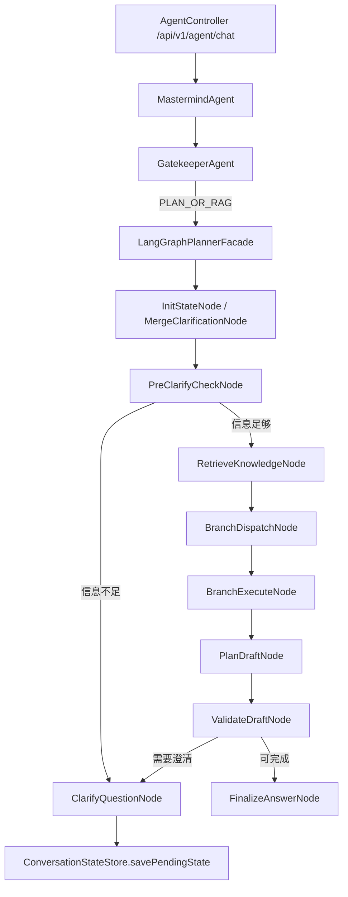

# 第三阶段分支 Agent 工具化流程

本文档是第三阶段编码实施说明。第一阶段和第二阶段文档保留不删除，本阶段在已有 Graph 直线流程和澄清续跑能力上继续演进。

第三阶段的核心目标是：让核心规划 Graph 不再只依赖一次核心模型生成方案，而是能够在生成规划前，主动向分支 Agent / 工具层请求结构化信息，再把这些结果注入 Planner。

## 1. 第三阶段目标

完成后，系统应该具备以下能力：

1. `PLAN_OR_RAG` 请求仍然由 `LangGraphPlannerFacade` 承接。
2. Graph 在 Planner 之前可以生成分支任务，例如天气、航班、景点、知识库等。
3. 分支任务使用统一协议表达，不让核心 Graph 直接关心具体工具实现细节。
4. 第一版分支执行采用顺序执行，不做并行，确保可测试、可观察。
5. 分支执行结果写入 `TravelPlanState`，供 `PlanDraftNode` 生成规划时使用。
6. 分支执行失败时不抛出异常，而是写入失败结果，由 Planner / Finalizer 显式说明风险。
7. 保留第二阶段的前置澄清逻辑：目的地过宽时仍然先追问，不进入 RAG 和分支执行。
8. 将行程时长从 `travelTime` / `keywords` 中拆出来，独立保存为 `durationDays` 和 `durationText`。
9. 支持识别 `10天`、`5晚6天`、`一周左右` 等常见时长表达，避免把旅行天数误当作出发日期。

第三阶段暂时不做：

- 多分支并行执行。
- LangGraph4j 真正 StateGraph 迁移。
- 分支 Agent 自己再调用大模型做复杂推理。
- Google Flights / 酒店等真实付费 API 深度接入。
- Redis / 数据库持久化 branch result。
- 工具失败后的多轮自动重试。

## 2. 第三阶段流程图



## 3. 推荐目录结构

新增和扩展：

```text
AgentProjectTrip/src/main/java/com/travel/agent/ai
├── agents
│   ├── BranchAgentFacade.java              新增
│   ├── GatekeeperAgent.java
│   ├── MastermindAgent.java
│   └── DataExtractionAgent.java
└── graph
    ├── model
    │   ├── BranchTask.java                 新增
    │   ├── BranchResult.java               新增
    │   ├── BranchTaskType.java             新增
    │   └── TravelPlanState.java            扩展 duration / branchTasks / branchResults
    └── node
        ├── BranchDispatchNode.java         新增
        ├── BranchExecuteNode.java          新增
        ├── DurationParser.java             新增
        └── PlanDraftNode.java              注入 branchResults
```

## 4. 核心模型设计

### 4.1 BranchTaskType

分支任务类型枚举：

```java
public enum BranchTaskType {
    WEATHER,
    FLIGHT,
    PLACES,
    KNOWLEDGE
}
```

第一版建议只实际执行：

- `WEATHER`
- `PLACES`
- `KNOWLEDGE`

`FLIGHT` 可以先保留协议，但在执行层返回“第三阶段暂未启用真实航班查询”的降级结果。原因是航班查询需要更严格的机场代码、日期和方向，不能随便脑补。

### 4.2 BranchTask

用途：Planner 之前的分支请求协议。

建议字段：

```java
public class BranchTask {
    private String taskId;
    private BranchTaskType type;
    private String query;
    private List<String> destinations;
    private String travelTime;
    private List<String> constraints;
}
```

### 4.3 BranchResult

用途：分支执行结果协议。

建议字段：

```java
public class BranchResult {
    private String taskId;
    private BranchTaskType type;
    private boolean success;
    private String summary;
    private String rawData;
    private String errorMessage;
}
```

### 4.4 TravelPlanState 扩展

新增字段：

```java
private Integer durationDays;
private String durationText;
private List<BranchTask> branchTasks;
private List<BranchResult> branchResults;
```

`durationDays` / `durationText` 用于区分“出发时间”和“行程时长”：

```text
“下个月去法国玩10天”
travelTime = 下个月
durationDays = 10
durationText = 10天

“法国和意大利，10天”
travelTime = 未指定
durationDays = 10
durationText = 10天
```

`branchTasks` / `branchResults` 在 `BranchDispatchNode` 和 `BranchExecuteNode` 之间传递，并由 `PlanDraftNode` 注入 Prompt。

### 4.5 DurationParser

用途：从用户原文、Gatekeeper `time` 和 `keywords` 中提取行程时长。

当前支持：

| 用户表达 | durationDays | durationText |
|---|---:|---|
| `10天` | 10 | `10天` |
| `5晚6天` | 6 | `5晚6天` |
| `一周左右` | 7 | `一周左右` |

解析策略：

1. 优先读取 `keywords`，因为 Gatekeeper 经常把 `10天` 放在关键词里。
2. 如果 Gatekeeper 把 `10天` 放进 `time`，系统会将其转入 `duration`，并把 `travelTime` 保持为 `未指定`。
3. 已识别为时长的关键词会从 `keywords` 中移除，避免 Planner 把它当作普通偏好。

## 5. 节点职责

### 5.1 BranchDispatchNode

职责：

1. 读取 `TravelPlanState` 的目的地、时间、时长、关键词和用户原文。
2. 根据规则生成分支任务。
3. 第一版最多生成 3 类任务，避免一次请求过重。
4. 不调用外部 API，不调用模型，只做任务编排。
5. 识别“不含机票 / 机票自理 / 不查机票”等预算边界表达，避免误触发航班分支。

建议规则：

| 条件 | 任务 |
|---|---|
| 有明确目的地 | `KNOWLEDGE` |
| 有明确目的地和时间 | `WEATHER` |
| 用户提到景点/游玩/安排/行程/小众/避开人多 | `PLACES` |
| 用户明确正向提到航班/机票/机场 | `FLIGHT` |
| 用户说不含机票/机票自理/不需要航班 | 不生成 `FLIGHT` |

### 5.2 BranchExecuteNode

职责：

1. 读取 `branchTasks`。
2. 调用 `BranchAgentFacade` 顺序执行任务。
3. 捕获分支异常，写入失败 `BranchResult`。
4. 将结果写回 `branchResults`。

第一版不并行，原因：

- 日志更清楚。
- 测试更稳定。
- 外部 API 错误更容易定位。
- 后续迁移并行时只替换 Execute 内部实现，不影响上游协议。

### 5.3 BranchAgentFacade

职责：

1. 作为 Graph 节点和具体工具/服务之间的统一门面。
2. 根据 `BranchTaskType` 分发到天气、景点、知识库、航班等能力。
3. 每个分支都返回 `BranchResult`，不向上抛异常。

第一版实现策略：

| 分支 | 第一版执行方式 |
|---|---|
| `WEATHER` | 调用 `WeatherTools.getWeather` 或 `WeatherService` |
| `PLACES` | 调用 `PlacesTools.searchAttractions` |
| `KNOWLEDGE` | 复用当前 RAG 上下文或调用 `KnowledgeTools.searchTravelGuide` |
| `FLIGHT` | 返回降级结果，提示需要后续真实航班参数 |

## 6. Planner Prompt 升级

`PlanDraftNode` 当前主要使用：

```text
用户输入
Gatekeeper 结构化实体
行程时长 duration
RAG 上下文
Branch Results
当前系统日期
```

第三阶段要增加：

```text
行程时长:
- durationDays: 10
- durationText: 10天

Branch Results:
- WEATHER: ...
- PLACES: ...
- KNOWLEDGE: ...
- FLIGHT: ...
```

Planner 必须遵守：

1. 如果分支结果成功，可以引用结果。
2. 如果分支结果失败，不要伪造实时数据。
3. 如果航班结果为降级，不要写具体航班号和实时票价。
4. 如果天气结果不可用，只能给季节性建议，不能声称实时天气。
5. 如果行程时长已知，推荐行程必须尽量匹配该天数。

## 7. 测试计划

新增测试：

1. `BranchDispatchNodeTest`
   - 目的地明确时生成知识任务。
   - 有目的地和时间时生成天气任务。
   - 行程规划类请求生成景点任务。

2. `BranchExecuteNodeTest`
   - 能顺序执行任务并写回结果。
   - 空任务时不报错。

3. `BranchAgentFacadeTest`
   - 支持已知任务类型。
   - 未启用航班任务时返回降级结果。

4. `PlanDraftNodeTest`
   - Prompt 中包含 branch result 摘要。

5. `LangGraphPlannerFacadeTest`
   - 前置澄清通过后会执行分支派发和分支执行。
   - 前置澄清失败时不会执行分支。

6. `DurationParserTest`
   - 能识别 `10天`。
   - 能识别 `5晚6天`。
   - 能识别 `一周左右`。
   - 能从 keywords 中移除已经结构化的时长表达。

7. 其他节点测试补充
   - `InitStateNodeTest` 验证 `10天` 被写入 duration，而不是 travelTime。
   - `MergeClarificationNodeTest` 验证 pending 续跑时可以合并新的 duration。
   - `RetrieveKnowledgeNodeTest` 验证 RAG query 包含 `时长: 10天`。
   - `ValidateDraftNodeTest` 验证缺少行程时长时输出 `MISSING_DURATION`。
   - `FinalizeAnswerNodeTest` 验证最终答案展示“已确认信息：行程时长”。

## 8. 验收标准

第三阶段第一版完成后必须满足：

1. 第一、第二阶段已有测试全部通过。
2. `PLAN_OR_RAG` 在信息足够时会执行 BranchDispatch 和 BranchExecute。
3. 目的地过宽时仍然停在 PreClarifyCheck，不执行 RAG、分支和 Planner。
4. `PlanDraftNode` Prompt 能看到 `branchResults`。
5. 分支失败不会导致整个 Graph 失败。
6. 日志能看到分支任务数量和分支结果数量。
7. `10天`、`5晚6天`、`一周左右` 等表达能进入 duration 字段。
8. `travelTime` 只表达出发日期、月份、季节或假期范围，不再混入旅行天数。
9. `PlanDraftNode` Prompt 能同时看到 `travelTime`、`duration` 和 `branchResults`。
10. 注释遵守《注释规范.md》，重点解释类职责、系统位置、状态读写和降级策略。

## 9. 后续第四阶段预告

第三阶段第一版稳定后，第四阶段可以继续做：

- 分支任务并行执行。
- 工具失败后的重试策略。
- 航班真实参数解析和真实 API 接入。
- 酒店价格分支。
- BranchResult 持久化。
- LangGraph4j StateGraph 迁移。
