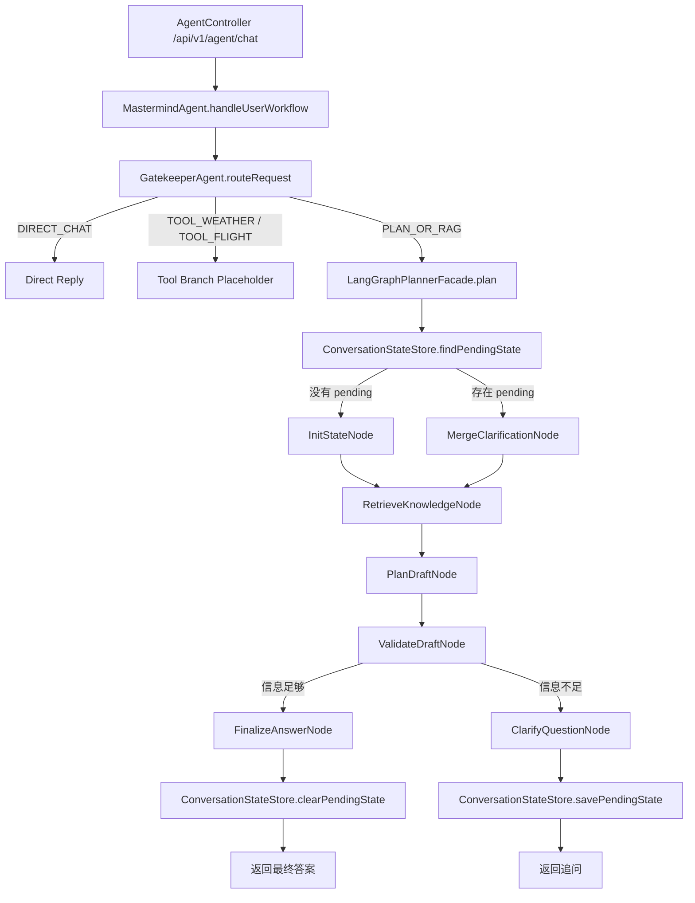

# 第二阶段澄清循环流程

本文档是第二阶段编码实施说明。第一阶段文档《第一阶段直线流程.md》保留不删除，本阶段在第一阶段已经跑通的直线工作流上继续演进。

第二阶段的核心目标不是一次性完成所有分支 Agent，而是先让系统具备真正 Agentic 工作流里最重要的闭环能力：

```text
用户输入
  -> Gatekeeper 意图识别
  -> Graph 初始化状态
  -> RAG 检索
  -> Planner 生成草案
  -> Validator 校验信息缺口
  -> 如果信息足够：Finalize 输出完整答案
  -> 如果信息不足：Clarify 生成追问
  -> 保存 Pending 状态
  -> 用户补充回答
  -> 合并补充信息
  -> 重新进入 Planner / Validator / Finalizer
```

也就是说，第二阶段要从“直线流程”升级成“可暂停、可追问、可续跑的一轮循环流程”。

## 1. 第二阶段目标

完成后，系统应该具备以下能力：

1. `/api/v1/agent/chat` 继续作为主要入口。
2. 接口新增可选 `sessionId` 参数，用来识别同一个用户会话。
3. `GraphInputRequest` 增加 `sessionId`、`conversationTurn`、`resumeMode` 等字段。
4. `TravelPlanState` 增加任务状态字段，例如 `workflowStatus`、`pendingQuestions`、`clarificationAnswers`。
5. `ValidateDraftNode` 不只输出 `ValidationIssue`，还要判断哪些问题会阻塞继续规划。
6. 新增 `ClarifyQuestionNode`，负责把阻塞性问题转成自然语言追问。
7. 新增 `ConversationStateStore`，第一版可以用内存 Map 保存 pending 状态。
8. 当用户需求太宽泛时，系统不再只输出完整行程加提醒，而是优先反问关键问题。
9. 当用户补充回答后，系统能找到上一次 pending 状态，把新信息合并进去，然后继续生成规划。
10. 保留第一阶段所有测试，并新增澄清循环相关单元测试。

第二阶段暂时不做：

- 多个分支 Agent 并行执行。
- 天气、航班、酒店等工具的真实 Function Calling 编排。
- 长期数据库会话记忆。
- Redis / MySQL 持久化状态。
- SSE / WebSocket 流式输出。
- 真正 LangGraph4j StateGraph 迁移。

这些放到第三阶段或后续阶段。

## 2. 第二阶段架构图



## 3. 推荐目录结构

在第一阶段目录基础上新增：

```text
AgentProjectTrip/src/main/java/com/travel/agent/ai/graph
├── LangGraphPlannerFacade.java
├── model
│   ├── GraphInputRequest.java
│   ├── GraphResult.java
│   ├── PlannerDraft.java
│   ├── TravelPlanState.java
│   ├── ValidationIssue.java
│   ├── WorkflowStatus.java              新增
│   └── ClarificationQuestion.java       新增
├── node
│   ├── InitStateNode.java
│   ├── RetrieveKnowledgeNode.java
│   ├── PlanDraftNode.java
│   ├── ValidateDraftNode.java
│   ├── ClarifyQuestionNode.java         新增
│   ├── MergeClarificationNode.java      新增
│   └── FinalizeAnswerNode.java
└── store
    ├── ConversationStateStore.java      新增
    └── InMemoryConversationStateStore.java 新增
```

测试目录新增：

```text
AgentProjectTrip/src/test/java/com/travel/agent/ai/graph
├── LangGraphPlannerFacadeTest.java
├── store
│   └── InMemoryConversationStateStoreTest.java
└── node
    ├── ClarifyQuestionNodeTest.java
    └── MergeClarificationNodeTest.java
```

## 4. 核心状态设计

### 4.1 WorkflowStatus

新增枚举：

```java
public enum WorkflowStatus {
    PLANNING,
    NEEDS_CLARIFICATION,
    COMPLETED,
    FAILED
}
```

含义：

| 状态 | 说明 |
|---|---|
| `PLANNING` | 正在正常执行规划流程 |
| `NEEDS_CLARIFICATION` | 信息不足，需要向用户追问 |
| `COMPLETED` | 已生成最终答案 |
| `FAILED` | 工作流失败，进入降级答案 |

### 4.2 ClarificationQuestion

新增对象，用于保存系统追问的问题：

```java
public class ClarificationQuestion {
    private String id;
    private String field;
    private String question;
    private boolean required;
}
```

字段说明：

| 字段 | 说明 |
|---|---|
| `id` | 问题唯一标识，例如 `destination_scope` |
| `field` | 关联的状态字段，例如 `destinations`、`budget`、`travelTime` |
| `question` | 面向用户的自然语言问题 |
| `required` | 是否必须回答后才能继续 |

### 4.3 TravelPlanState 扩展字段

在第一阶段字段基础上新增：

```java
private String sessionId;
private WorkflowStatus workflowStatus;
private List<ClarificationQuestion> pendingQuestions;
private List<String> clarificationAnswers;
private int turnCount;
private String lastUserMessage;
```

说明：

| 字段 | 说明 |
|---|---|
| `sessionId` | 当前会话 ID，用于查询 pending 状态 |
| `workflowStatus` | 当前工作流状态 |
| `pendingQuestions` | 系统正在等待用户回答的问题 |
| `clarificationAnswers` | 用户后续补充的回答 |
| `turnCount` | 当前任务已交互轮数，避免无限追问 |
| `lastUserMessage` | 当前轮用户输入 |

## 5. 接口设计

当前接口：

```text
GET /api/v1/agent/chat?message=我想下个月去欧洲玩，帮我安排
```

第二阶段建议改成兼容式接口：

```text
GET /api/v1/agent/chat?sessionId=demo-001&message=我想下个月去欧洲玩，帮我安排
```

规则：

1. `message` 仍然必填。
2. `sessionId` 可选。
3. 如果用户没有传 `sessionId`，后端生成一个临时默认值，例如 `default-session`。
4. 后续真正接前端时，由前端为每个聊天窗口生成稳定 `sessionId`。

第一版可以继续返回 `String`，不急着改成 JSON。原因是当前前端和测试成本最低。

后续第三阶段可以升级成：

```json
{
  "sessionId": "demo-001",
  "status": "NEEDS_CLARIFICATION",
  "answer": "我需要先确认两个问题...",
  "questions": []
}
```

## 6. 工作流规则

### 6.1 普通规划流程

当用户信息基本足够时：

```text
InitState
  -> RetrieveKnowledge
  -> PlanDraft
  -> ValidateDraft
  -> FinalizeAnswer
```

输出完整规划。

### 6.2 信息不足流程

当 `ValidateDraftNode` 发现阻塞性信息缺口时：

```text
ValidateDraft
  -> ClarifyQuestion
  -> savePendingState
  -> 返回追问
```

例如用户输入：

```text
我想下个月去欧洲玩，帮我安排
```

预期输出不再直接生成完整 12 日大行程，而是类似：

```text
可以，我先确认几个关键信息，这样后面规划会更准：

1. 你更想去哪些国家或城市？如果不确定，我可以按“经典路线 / 自然风景 / 小众避人流”帮你选。
2. 预算大概是多少？是否包含国际往返机票？
3. 你计划玩几天？
```

### 6.3 用户补充后的续跑流程

当同一 `sessionId` 下存在 pending 状态时：

```text
findPendingState
  -> MergeClarification
  -> RetrieveKnowledge
  -> PlanDraft
  -> ValidateDraft
  -> FinalizeAnswer
```

例如用户继续输入：

```text
想去法国和意大利，预算1200欧，不含国际机票，玩10天，想避开人多的地方
```

系统应该合并这些信息，然后输出完整规划。

## 7. 节点职责

### 7.1 ClarifyQuestionNode

职责：

1. 读取 `TravelPlanState.validationIssues`。
2. 只挑选阻塞性问题生成追问。
3. 最多一次问 3 个问题，避免用户压力过大。
4. 设置 `workflowStatus = NEEDS_CLARIFICATION`。
5. 把追问写入 `pendingQuestions` 和 `finalAnswer`。

第一版不需要调用大模型，可以用 Java 规则生成稳定追问。

建议规则：

| ValidationIssue 内容 | 追问问题 |
|---|---|
| 目的地过宽 | 你更想去哪些国家或城市？ |
| 缺少天数 | 你计划玩几天？ |
| 缺少预算 | 你的预算大概是多少？是否包含国际机票？ |
| 缺少偏好 | 你更偏好自然风景、城市文化、美食、购物还是小众路线？ |

### 7.2 MergeClarificationNode

职责：

1. 读取 `ConversationStateStore` 中保存的旧 `TravelPlanState`。
2. 把当前用户输入作为补充信息写入 `clarificationAnswers`。
3. 重新构造用于规划的 `userQuery`。
4. 必要时重新调用 Gatekeeper，或先复用旧 route 并追加关键词。
5. 清理旧的 `pendingQuestions`。
6. 设置 `workflowStatus = PLANNING`。

第一版推荐简单做法：

```text
newUserQuery = oldUserQuery + "\n用户补充信息：" + currentUserMessage
```

这样 Planner 能同时看到原始需求和补充需求。

### 7.3 ConversationStateStore

接口：

```java
public interface ConversationStateStore {
    Optional<TravelPlanState> findPendingState(String sessionId);
    void savePendingState(String sessionId, TravelPlanState state);
    void clearPendingState(String sessionId);
}
```

第一版实现：

```java
@Component
public class InMemoryConversationStateStore implements ConversationStateStore {
    private final Map<String, TravelPlanState> states = new ConcurrentHashMap<>();
}
```

注意：

1. 内存 Map 重启后丢失，第二阶段可以接受。
2. 后续第三阶段再迁移到 Redis 或数据库。
3. 保存时只保存 `NEEDS_CLARIFICATION` 状态。
4. 完成规划后必须清理 pending 状态，避免下一次普通聊天误续跑。

## 8. Validator 升级规则

第一阶段的 Validator 只是把问题追加到最终答案里。

第二阶段要把问题分成两类：

| 类型 | 行为 |
|---|---|
| 非阻塞问题 | 可以继续输出方案，只在最终答案里提醒 |
| 阻塞问题 | 暂停输出方案，进入 ClarifyQuestionNode |

建议第一版阻塞条件：

1. 目的地只有“欧洲”这种大洲级范围，且用户没有明确要求系统自动推荐国家。
2. 没有旅行天数。
3. 没有预算，且用户要求“帮我安排完整行程”。

非阻塞条件：

1. 没有具体航班。
2. 没有酒店偏好。
3. 没有餐饮偏好。
4. 部分景点需要预约。

## 9. LangGraphPlannerFacade 改造计划

第一阶段：

```java
TravelPlanState state = initStateNode.init(request);
state = retrieveKnowledgeNode.retrieve(state);
state = planDraftNode.plan(state);
state = validateDraftNode.validate(state);
state = finalizeAnswerNode.finish(state);
```

第二阶段建议改成：

```java
TravelPlanState state = conversationStateStore.findPendingState(request.getSessionId())
        .map(oldState -> mergeClarificationNode.merge(oldState, request))
        .orElseGet(() -> initStateNode.init(request));

state = retrieveKnowledgeNode.retrieve(state);
state = planDraftNode.plan(state);
state = validateDraftNode.validate(state);

if (state.getWorkflowStatus() == WorkflowStatus.NEEDS_CLARIFICATION) {
    state = clarifyQuestionNode.ask(state);
    conversationStateStore.savePendingState(state.getSessionId(), state);
    return GraphResult.success(state.getFinalAnswer(), state.getValidationIssues());
}

state = finalizeAnswerNode.finish(state);
conversationStateStore.clearPendingState(state.getSessionId());
return GraphResult.success(state.getFinalAnswer(), state.getValidationIssues());
```

注意：代码实现时不一定要完全照抄这个片段，但职责边界应该保持一致。

## 10. 测试计划

### 10.1 单元测试

新增测试：

1. `ClarifyQuestionNodeTest`
   - 目的地过宽时生成目的地追问。
   - 缺预算时生成预算追问。
   - 最多只输出 3 个问题。

2. `MergeClarificationNodeTest`
   - 能把旧需求和新补充合并成新的 `userQuery`。
   - 能清空旧 `pendingQuestions`。
   - 能把状态改回 `PLANNING`。

3. `InMemoryConversationStateStoreTest`
   - 能保存 pending 状态。
   - 能读取 pending 状态。
   - 完成后能清理 pending 状态。

4. `LangGraphPlannerFacadeTest`
   - 信息不足时返回追问并保存 pending 状态。
   - 用户补充信息后能续跑并清理 pending 状态。

5. `MastermindAgentTest`
   - 带 `sessionId` 的规划请求能进入 Graph。
   - TOOL 分支不受 session 逻辑影响。

### 10.2 手动测试

启动服务后测试：

```text
GET http://localhost:8080/api/v1/agent/chat?sessionId=test-001&message=我想下个月去欧洲玩，帮我安排
```

预期：

```text
系统返回追问，不直接输出完整行程。
```

继续测试：

```text
GET http://localhost:8080/api/v1/agent/chat?sessionId=test-001&message=法国和意大利，10天，预算1200欧，不含国际机票，想避开人多的地方
```

预期：

```text
系统输出完整法国 + 意大利行程，并清理 pending 状态。
```

再测试：

```text
GET http://localhost:8080/api/v1/agent/chat?sessionId=test-001&message=你好
```

预期：

```text
不会误用上一轮旅行规划状态。
```

## 11. 验收标准

第二阶段完成后必须满足：

1. 第一阶段所有测试继续通过。
2. 新增澄清循环测试全部通过。
3. 信息足够的请求仍然能一次性输出完整规划。
4. 信息不足的请求会优先反问，而不是硬编完整行程。
5. 同一 `sessionId` 下，用户补充信息后可以继续原任务。
6. 最终规划完成后，pending 状态会被清理。
7. 不同 `sessionId` 的 pending 状态互不影响。
8. `TOOL_WEATHER`、`TOOL_FLIGHT`、`DIRECT_CHAT` 分支不被破坏。
9. 代码注释继续遵守《注释规范.md》。

## 12. 实施顺序

建议按以下顺序写代码：

1. 扩展模型层：`WorkflowStatus`、`ClarificationQuestion`、`GraphInputRequest`、`TravelPlanState`。
2. 新增 `ConversationStateStore` 和 `InMemoryConversationStateStore`。
3. 新增 `ClarifyQuestionNode`，先用规则生成追问。
4. 新增 `MergeClarificationNode`，实现旧状态和新消息合并。
5. 升级 `ValidateDraftNode`，让阻塞性问题设置 `NEEDS_CLARIFICATION`。
6. 改造 `LangGraphPlannerFacade`，接入 pending 状态判断、追问保存、续跑清理。
7. 改造 `AgentController` 和 `MastermindAgent`，传递可选 `sessionId`。
8. 补齐单元测试。
9. 运行 Maven 测试。
10. 手动调用接口验证两轮对话。

## 13. 第二阶段完成后的系统形态

完成第二阶段后，系统将从：

```text
一次输入 -> 一次规划 -> 一次输出
```

升级为：

```text
一次输入 -> 判断信息是否足够
  -> 足够：直接规划
  -> 不足：追问用户
       -> 用户补充
       -> 合并上下文
       -> 继续规划
```

这一步是后续第三阶段“核心 Agent 与多个分支 Agent 反复交互”的基础。因为只有先有了状态保存、暂停、续跑和循环判断，后面才能自然扩展出：

- Planner 向 FlightAgent 请求航班信息。
- FlightAgent 返回不确定结果。
- Planner 决定是否继续问用户或换方案。
- WeatherAgent / HotelAgent / PlacesAgent 多轮反馈。
- Validator 发现冲突后让 Planner 重写局部方案。

所以第二阶段的重点是把“追问闭环”做扎实，而不是急着把所有工具都接进来。
