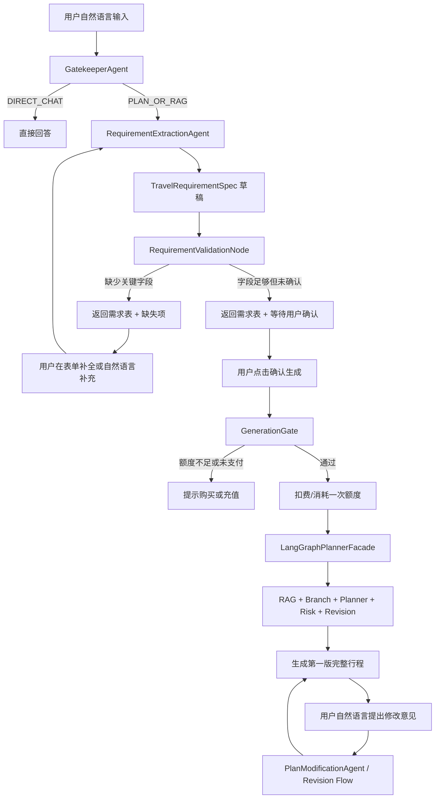

# 第五阶段结构化需求确认与生成门控

本文档是第五阶段编码实施说明。第一、第二、第三、第四阶段文档保留不删除。**本阶段的目标不是继续增强 Planner 的生成能力，而是在进入高成本 Agent 工作流之前，增加一层稳定、可审计、可确认的“旅行需求表”。**

第五阶段的核心思想是：

```text
自然语言输入 -> 便宜模型抽取结构化需求 -> 前端表单确认/补全 -> 生成门控检查 -> 扣费或消耗额度 -> 进入完整 Agent 规划 -> 第一版结果后支持自然语言修改
```

这样既保留聊天式自然语言体验，又避免用户一句话有歧义时直接触发 RAG、分支 Agent、Planner、RiskReasoning、Revision 等高成本流程，减少 token 浪费，也降低无效答案概率。

## 1. 第五阶段目标

完成后，系统应该具备以下能力：

1. 用户仍然可以用自然语言描述旅行需求。
2. 系统先用轻量模型把自然语言抽取成结构化旅行需求表。
3. 前端把结构化结果展示成可编辑表单，而不是直接生成完整行程。
4. 系统检查必填字段是否完整，例如目的地、时间、天数、预算、人数、出发地等。
5. 只有需求表通过检查并由用户确认后，才进入高成本完整规划流程。
6. 可以把扣费点放在“确认需求并生成完整规划”之前。
7. Planner、BranchAgent、RiskReasoning 后续优先读取结构化需求表，而不是依赖原始自然语言。
8. 第一版行程生成后，用户可以继续用自然语言提出修改意见，系统基于已有 `planId` 和结构化需求做局部重规划。

第五阶段暂时不做：

- 完整支付系统接入。
- 真实订单、发票、退款、风控体系。
- 复杂用户画像和长期记忆。
- 多个旅行方案同时比价生成。
- 前端复杂 UI 美化，只先完成可用表单和确认流程。
- 把所有自然语言修改都做成局部 diff，第一版可以先重走 Revision 流程。

## 2. 为什么需要第五阶段

当前系统已经具备：

- Gatekeeper 意图识别。
- 前置澄清判断。
- RAG 检索。
- 分支 Agent 工具调用。
- Planner 初稿生成。
- 风险推理和自动修正。

但如果用户输入过于随意，例如：

```text
我想下个月去欧洲玩，帮我安排
```

系统即使有前置澄清，也仍然需要依赖模型判断哪些信息缺失。如果用户自然语言中有偏差、遗漏或矛盾，高成本流程可能产出一个看似完整但基础假设错误的答案。

第五阶段要解决的是工程稳定性问题：

1. **降低无效规划概率**：先确认需求表，再生成行程。
2. **节省 token 和工具调用成本**：缺字段时不进入 RAG、Branch、Planner。
3. **方便付费门控**：整理需求免费，完整生成消耗额度。
4. **方便多轮修改**：后续修改基于明确的 `TravelRequirementSpec`。
5. **提升可解释性**：用户能看到系统理解了什么，也能手动修正。

## 3. 第五阶段流程图



## 4. 推荐目录结构

第五阶段建议新增和扩展以下目录：

```text
AgentProjectTrip/src/main/java/com/travel/agent
├── web
│   ├── AgentController.java                保留原聊天入口
│   └── RequirementController.java          新增，需求表抽取/确认/生成入口
├── core
│   ├── dto
│   └── service
│       ├── CreditService.java              新增，可先做模拟额度
│       └── impl
│           └── InMemoryCreditService.java  新增，第一版内存实现
└── ai
    ├── agents
    │   ├── RequirementExtractionAgent.java 新增，轻量模型抽取需求表
    │   ├── MastermindAgent.java            扩展，支持从需求表进入规划
    │   └── PlanModificationAgent.java      可选，第一版结果后的自然语言修改
    ├── dto
    │   ├── RequirementDraftResponse.java   新增，返回给前端的需求表草稿
    │   ├── RequirementConfirmRequest.java  新增，用户确认需求表
    │   └── PlanModificationRequest.java    新增，修改已有行程
    └── graph
        ├── model
        │   ├── TravelRequirementSpec.java  新增，结构化需求唯一真相源
        │   ├── RequirementValidation.java  新增，需求表检查结果
        │   └── TravelPlanState.java        扩展 requirementSpec / planId
        ├── node
        │   └── RequirementValidationNode.java 新增
        └── store
            ├── RequirementStore.java       新增
            └── InMemoryRequirementStore.java 新增，第一版内存实现
```

## 5. 核心模型设计

### 5.1 TravelRequirementSpec

用途：结构化旅行需求表，是 Planner、BranchAgent、RiskReasoning 后续优先读取的“唯一真相源”。

第一版字段建议：

```java
public class TravelRequirementSpec {
    private String requirementId;
    private String sessionId;
    private String originalMessage;

    private List<String> destinations;
    private String departureCity;
    private String startDateText;
    private LocalDate startDate;
    private Integer durationDays;
    private Integer travelerCount;

    private BigDecimal budgetAmount;
    private String budgetCurrency;
    private Boolean budgetIncludesInternationalFlight;

    private List<String> preferences;
    private List<String> avoidances;
    private String travelStyle;
    private String accommodationPreference;
    private String transportPreference;

    private RequirementStatus status;
    private List<String> missingFields;
    private List<String> warnings;
}
```

字段说明：

- `requirementId`：需求表 ID，后续确认、生成、修改都围绕它进行。
- `sessionId`：会话 ID，用于多轮补全。
- `originalMessage`：用户原始自然语言，保留用于审计和提示词上下文。
- `destinations`：明确目的地，不能只长期停留在“欧洲”这种宽泛概念。
- `departureCity`：出发城市，影响航班、预算、签证和交通。
- `startDateText`：保留用户原始时间表达，例如“国庆”“下个月”。
- `startDate`：能解析成具体日期时写入，不能解析时为空。
- `durationDays`：行程天数。
- `travelerCount`：旅行人数。
- `budgetAmount` / `budgetCurrency`：预算金额和币种。
- `budgetIncludesInternationalFlight`：预算是否包含国际机票。
- `preferences`：正向偏好，例如小众、亲子、美食、博物馆。
- `avoidances`：负向偏好，例如避开人多、不想住青旅、不去网红景点。
- `status`：草稿、待确认、已确认、已生成等状态。
- `missingFields`：当前缺失字段。
- `warnings`：非阻塞风险或歧义提示。

### 5.2 RequirementStatus

```java
public enum RequirementStatus {
    DRAFT,
    NEEDS_USER_INPUT,
    READY_TO_CONFIRM,
    CONFIRMED,
    GENERATING,
    GENERATED,
    CANCELLED
}
```

状态含义：

- `DRAFT`：刚从自然语言抽取出来。
- `NEEDS_USER_INPUT`：缺少关键字段，不能生成。
- `READY_TO_CONFIRM`：字段足够，但还需要用户确认。
- `CONFIRMED`：用户已确认，可以进入扣费和生成。
- `GENERATING`：正在生成完整方案。
- `GENERATED`：已经生成第一版方案。
- `CANCELLED`：用户放弃或重新开始。

### 5.3 RequirementValidation

用途：需求表检查结果。

```java
public class RequirementValidation {
    private boolean complete;
    private boolean readyToConfirm;
    private List<String> missingFields;
    private List<String> warnings;
    private List<String> blockingReasons;
}
```

第一版必填字段建议：

| 字段 | 是否必填 | 原因 |
|---|---|---|
| `destinations` | 是 | 没有明确目的地无法规划 |
| `durationDays` | 是 | 没有天数无法安排每日行程 |
| `budgetAmount` | 是 | 没有预算无法控制方案强度 |
| `budgetCurrency` | 是 | 防止人民币、欧元、英镑混淆 |
| `budgetIncludesInternationalFlight` | 是 | 防止预算误算 |
| `travelerCount` | 建议必填 | 影响住宿、餐饮、门票预算 |
| `departureCity` | 建议必填 | 影响入境城市和交通假设 |
| `startDateText` 或 `startDate` | 建议必填 | 影响旺季、天气、签证和开放时间 |

第一版可以允许 `departureCity` 和 `startDate` 作为可确认假设，但最终答案必须明确写出假设。更稳的商业版建议把它们设为必填。

### 5.4 RequirementDraftResponse

返回给前端的需求表草稿：

```java
public class RequirementDraftResponse {
    private String requirementId;
    private TravelRequirementSpec spec;
    private RequirementValidation validation;
    private String assistantMessage;
}
```

示例：

```json
{
  "requirementId": "req-001",
  "spec": {
    "destinations": ["法国", "意大利"],
    "startDateText": "国庆",
    "durationDays": 10,
    "budgetAmount": 1200,
    "budgetCurrency": "EUR",
    "budgetIncludesInternationalFlight": false,
    "travelerCount": null,
    "departureCity": null,
    "preferences": ["小众"],
    "avoidances": ["人多", "网红景点"]
  },
  "validation": {
    "complete": false,
    "readyToConfirm": false,
    "missingFields": ["travelerCount", "departureCity"],
    "warnings": ["未提供出发城市，系统无法准确判断入境与返程衔接。"]
  },
  "assistantMessage": "我已整理出旅行需求表，但还需要补充旅行人数和出发城市。"
}
```

## 6. Agent 和节点职责

### 6.1 RequirementExtractionAgent

职责：

1. 使用轻量模型从用户自然语言中抽取 `TravelRequirementSpec`。
2. 只做信息抽取，不生成完整行程。
3. 输出严格 JSON。
4. 保留不确定字段为空，不要脑补。
5. 对“国庆”“下个月”“春节”等相对时间保留原始表达，能解析时再写入具体日期。
6. 对预算是否包含国际机票这类关键字段，不确定时必须为空。

提示词原则：

```text
你是旅行需求抽取器，不是行程规划师。
只抽取用户明确提供的信息。
不要补全用户没说的信息。
不能输出完整旅行方案。
必须返回 JSON。
```

### 6.2 RequirementValidationNode

职责：

1. 读取 `TravelRequirementSpec`。
2. 检查必填字段是否完整。
3. 检查字段是否互相矛盾。
4. 输出 `RequirementValidation`。
5. 决定需求表状态：`NEEDS_USER_INPUT` 或 `READY_TO_CONFIRM`。

第一版检查规则：

| 条件 | 结果 |
|---|---|
| `destinations` 为空 | 阻塞生成 |
| `destinations` 只有“欧洲”等大洲级概念 | 阻塞生成 |
| `durationDays` 为空 | 阻塞生成 |
| `budgetAmount` 为空 | 阻塞生成 |
| `budgetCurrency` 为空 | 阻塞生成 |
| `budgetIncludesInternationalFlight` 为空 | 阻塞生成 |
| `travelerCount` 为空 | 阻塞或强提醒，按产品策略决定 |
| `departureCity` 为空 | 阻塞或强提醒，按产品策略决定 |
| 预算明显过低 | 警告，不一定阻塞 |
| 目的地过多但天数过短 | 警告，不一定阻塞 |

### 6.3 GenerationGate

职责：

1. 检查需求表是否 `READY_TO_CONFIRM` 或 `CONFIRMED`。
2. 检查用户是否点击确认生成。
3. 检查用户额度、支付状态或免费次数。
4. 通过后消耗一次额度。
5. 生成失败时，按策略决定是否退还额度。

第一版可以先不接真实支付，只做模拟额度：

```text
每个 session 默认 3 次免费生成额度。
每次确认生成消耗 1 次。
需求抽取、表单补全、普通聊天不消耗额度。
```

### 6.4 MastermindAgent 扩展

当前 `MastermindAgent` 主要根据 Gatekeeper 结果决定 DIRECT、TOOL 或 PLAN_OR_RAG。

第五阶段扩展后：

1. 对新的旅行规划请求，先进入 `RequirementExtractionAgent`。
2. 对已确认的 `TravelRequirementSpec`，再进入 `LangGraphPlannerFacade`。
3. 对已有 `planId` 的修改请求，进入 `PlanModificationAgent` 或 `PlanRevisionNode`。
4. 保留原有 DIRECT_CHAT 能力。

### 6.5 PlanModificationAgent

第一版可选。如果第五阶段时间有限，可以先复用第四阶段 `PlanRevisionNode`。

职责：

1. 接收 `planId`、当前行程草案、结构化需求表和用户修改指令。
2. 判断修改是否改变核心需求表。
3. 如果改变核心需求，例如预算、目的地、天数，则更新 `TravelRequirementSpec` 并重新确认。
4. 如果只是偏好调整，例如“第三天太赶”“多加美食”，则局部重写行程。

示例：

```text
用户：第三天太赶了，少安排一个城市。
系统：不改变需求表，只对第3天做 revision。
```

```text
用户：预算改成800欧。
系统：更新 TravelRequirementSpec.budgetAmount，并重新检查是否可生成。
```

## 7. 推荐接口设计

### 7.1 抽取需求表

```http
POST /api/v1/requirements/draft
```

请求：

```json
{
  "sessionId": "test-005",
  "message": "国庆去法国和意大利玩10天，预算1200欧，不含国际机票，想避开人多"
}
```

响应：

```json
{
  "requirementId": "req-001",
  "status": "NEEDS_USER_INPUT",
  "spec": {},
  "validation": {},
  "assistantMessage": "我已整理出需求表，还需要确认出发城市和旅行人数。"
}
```

### 7.2 更新需求表

```http
PUT /api/v1/requirements/{requirementId}
```

用途：

- 前端表单保存。
- 用户自然语言补充后合并字段。
- 用户手动修改预算、天数、目的地等。

### 7.3 确认需求表

```http
POST /api/v1/requirements/{requirementId}/confirm
```

要求：

- 需求表必须通过 `RequirementValidationNode`。
- 如果缺少阻塞字段，返回错误和缺失项。
- 通过后状态变为 `CONFIRMED`。

### 7.4 生成完整规划

```http
POST /api/v1/requirements/{requirementId}/generate
```

流程：

1. 检查需求表状态。
2. 检查额度。
3. 消耗额度。
4. 将 `TravelRequirementSpec` 注入 `TravelPlanState`。
5. 调用 `LangGraphPlannerFacade`。
6. 返回第一版完整行程。

### 7.5 修改已有规划

```http
POST /api/v1/plans/{planId}/modify
```

请求：

```json
{
  "sessionId": "test-005",
  "message": "第三天太赶了，减少一个城市，多留一点自由时间"
}
```

第一版可以同步返回修改后的答案；后续如果生成耗时长，可以改成异步任务。

## 8. 前端表单建议

第一版表单不需要复杂，但必须清晰。

推荐字段：

```text
目的地：多选/标签输入
出发城市：文本输入
出行时间：日期选择 + 原始文本显示
行程天数：数字输入
旅行人数：数字输入
预算金额：数字输入
预算币种：下拉框 CNY / EUR / USD / GBP
预算是否包含国际机票：是 / 否 / 不确定
旅行偏好：标签输入
不想要的内容：标签输入
住宿偏好：青旅 / 经济酒店 / 中档酒店 / 不确定
交通偏好：火车 / 自驾 / 公共交通 / 不确定
```

按钮：

```text
保存需求
确认并生成完整规划
重新识别自然语言
```

页面提示原则：

- 不要把“缺字段”包装成模型失败。
- 明确告诉用户还差什么。
- 需求整理阶段不扣费。
- 点击“确认并生成完整规划”前明确提示会消耗 1 次额度。

## 9. 与前四阶段的关系

第五阶段不是替代前四阶段，而是把它们放到更稳的入口后面。

新的主链路：

```text
第五阶段 RequirementSpec 确认
-> 第一阶段基础规划流程
-> 第二阶段澄清能力
-> 第三阶段分支 Agent 工具化
-> 第四阶段风险推理与自动修正
```

其中：

- 第二阶段的澄清能力仍然保留，但更多用于生成过程中的深层问题。
- 第三阶段的 BranchDispatch 应优先读取 `TravelRequirementSpec`。
- 第四阶段的 RiskReasoning 应对照 `TravelRequirementSpec` 审查草案，而不是只看用户原始句子。
- `TravelPlanState` 应同时保留 `originalUserMessage` 和 `requirementSpec`。

## 10. 测试计划

新增测试：

1. `RequirementExtractionAgentTest`
   - 能从“国庆去法国和意大利玩10天，预算1200欧，不含国际机票”抽取目的地、时间、天数、预算和机票边界。
   - 对“下个月去欧洲玩”保留宽泛目的地，不脑补国家。
   - 对未说明是否包含国际机票的请求，不自动填 `true` 或 `false`。

2. `RequirementValidationNodeTest`
   - 目的地为空时阻塞。
   - 目的地只有“欧洲”时阻塞。
   - 缺少天数时阻塞。
   - 缺少预算币种时阻塞。
   - 字段完整时进入 `READY_TO_CONFIRM`。

3. `RequirementStoreTest`
   - 可以保存、读取、更新需求表。
   - 不同 session 的需求表互不污染。

4. `GenerationGateTest`
   - 需求表未确认时不能生成。
   - 额度不足时不能生成。
   - 生成前消耗一次额度。
   - 生成失败时按策略退还或保留扣费记录。

5. `LangGraphPlannerFacadeTest`
   - 当 `TravelPlanState` 包含 `requirementSpec` 时，Planner 使用结构化需求。
   - RiskReasoning 对照 `requirementSpec` 检查目的地、天数、预算。

6. `PlanModificationAgentTest`
   - “第三天太赶”触发行程 revision，不改变需求表。
   - “预算改成800欧”触发需求表更新和重新确认。

## 11. 验收标准

第五阶段第一版完成后必须满足：

1. 用户输入自然语言后，系统先返回结构化需求表，而不是直接生成完整行程。
2. 缺少关键字段时，不进入 RAG、Branch、Planner。
3. 需求表字段完整时，系统返回“等待确认生成”的状态。
4. 用户确认后才消耗额度并进入完整 Agent 工作流。
5. `LangGraphPlannerFacade` 能接收 `TravelRequirementSpec`。
6. Planner 的 prompt 优先使用结构化字段。
7. RiskReasoning 能对照结构化需求检查答案是否跑偏。
8. 第一版行程生成后，用户可以继续用自然语言提出修改。
9. 需求抽取失败时，系统给出可编辑空表单，而不是报错中断。
10. 所有新增和既有测试通过。

## 12. 推荐测试问题

### 12.1 信息较完整，应进入待确认

```text
国庆去法国和意大利玩10天，预算1200欧，不含国际机票，2个人，从上海出发，想避开人多的地方
```

期望：

1. 抽取 `destinations=["法国","意大利"]`。
2. 抽取 `durationDays=10`。
3. 抽取 `budgetAmount=1200`、`budgetCurrency=EUR`。
4. 抽取 `budgetIncludesInternationalFlight=false`。
5. 抽取 `travelerCount=2`、`departureCity=上海`。
6. 状态为 `READY_TO_CONFIRM`。
7. 不直接生成完整行程，等待用户确认。

### 12.2 信息不完整，应阻塞生成

```text
我想下个月去欧洲玩，帮我安排
```

期望：

1. 目的地只识别为“欧洲”或宽泛目的地。
2. 缺少预算、人数、出发地、是否包含国际机票。
3. 状态为 `NEEDS_USER_INPUT`。
4. 不进入 RAG、Branch、Planner。
5. 返回需求表和缺失字段。

### 12.3 用户补全后再生成

第一轮：

```text
我想下个月去欧洲玩，帮我安排
```

第二轮：

```text
法国和意大利，10天，预算1200欧，不含国际机票，2个人，从上海出发
```

期望：

1. 第二轮合并进同一个 `requirementId`。
2. 需求表变为 `READY_TO_CONFIRM`。
3. 用户确认后才进入完整生成。

### 12.4 第一版结果后的自然语言修改

在第一版行程生成后输入：

```text
第三天太赶了，少安排一个城市，多留一点自由活动时间
```

期望：

1. 不重新抽取完整需求表。
2. 使用已有 `planId` 和 `requirementSpec`。
3. 只触发行程 revision。
4. 最终说明已根据用户反馈放松第 3 天安排。

## 
