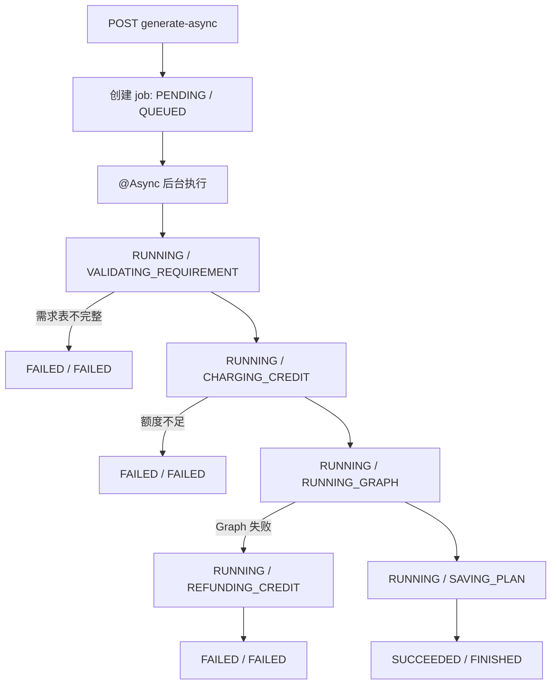

# 第八阶段异步生成任务与进度可视化

本文档是第八阶段编码实施说明。第一到第七阶段、阶段 6.5、阶段 7.5 文档保留不删除。本阶段的目标是把“完整规划生成”从长时间同步 HTTP 请求升级为可查询、可恢复、可展示进度的异步任务流程。

第八阶段的核心思想是：

```text
点击生成完整规划
-> 立即创建 generation job
-> 后台线程执行高成本 Agent 工作流
-> 前端轮询 job 状态
-> 成功后自动读取 planId 和最终计划
```

当前已有基础：

```text
第七阶段 MySQL 持久化底座
generation_jobs 表已预留
RequirementStore / TravelPlanStore / CreditService 已可持久化
阶段 7.5 调试台已接入记忆系统
```

## 1. 第八阶段目标

完成后，系统应该具备以下能力：

1. 保留现有同步生成接口 `POST /api/v1/requirements/{requirementId}/generate`，避免破坏旧测试和旧前端流程。
2. 新增异步生成接口 `POST /api/v1/requirements/{requirementId}/generate-async`。
3. 异步生成接口立即返回 `jobId`，不等待完整 Graph 跑完。
4. 后端后台线程执行完整规划流程。
5. `generation_jobs` 表记录任务状态、当前阶段、错误信息、planId、结果摘要和扣费状态。
6. 前端可以通过 `GET /api/v1/jobs/{jobId}` 查询任务进度。
7. 前端调试台展示 `jobId`、`status`、`currentStage`、`planId`、`errorMessage`。
8. 任务成功后，前端自动读取 `planId` 并展示最终计划。
9. 任务失败时，后端按策略退还额度。
10. 防止同一个 `requirementId` 在已有运行中任务时重复创建任务。
11. MySQL 持久化任务记录，便于刷新页面或重启后查看任务状态。

第八阶段暂时不做：

- WebSocket。
- Server-Sent Events。
- RabbitMQ / Kafka。
- 分布式任务队列。
- 多实例任务抢占。
- 任务暂停 / 恢复执行。
- 复杂取消任务。
- 真实支付订单联动。
- 后台任务失败后的自动重试。
- 任务级 Graph 节点细粒度 tracing 表。

第一版采用：

```text
Spring @Async
ThreadPoolTaskExecutor
MySQL generation_jobs
前端 setInterval 轮询
```

## 2. 为什么需要异步生成

当前同步生成接口会执行完整链路：

```text
RequirementValidation
CreditService.consumeGenerationCredit
RequirementStatus.GENERATING
LangGraphPlannerFacade.plan
RAG 检索
BranchDispatch
BranchExecute
PlanDraft
ValidateDraft
TripRiskReasoning
PlanRevision
FinalizeAnswer
TravelPlanStore.save
RequirementStatus.GENERATED
```

这条链路可能耗时几十秒到几分钟。同步 HTTP 有几个问题：

1. **前端像卡住**：用户只能等请求返回，不知道系统跑到哪里。
2. **容易超时**：浏览器、代理或服务器都有 HTTP 超时风险。
3. **重复点击风险**：用户以为没反应，连续点击生成，可能重复扣费或重复跑 Graph。
4. **失败不可观测**：失败时很难知道是额度、RAG、工具、Planner 还是保存计划出错。
5. **不利于正式产品**：真实产品需要任务状态、进度、失败提示和历史记录。

第八阶段要把这件事工程化。

## 3. 新旧接口关系

### 3.1 保留同步接口

保留：

```http
POST /api/v1/requirements/{requirementId}/generate
```

用途：

- 兼容已有调试链路。
- 方便单元测试。
- 方便开发时快速验证。

### 3.2 新增异步接口

新增：

```http
POST /api/v1/requirements/{requirementId}/generate-async
```

响应：

```json
{
  "jobId": "job-...",
  "requirementId": "req-...",
  "status": "PENDING",
  "currentStage": "QUEUED",
  "planId": null,
  "assistantMessage": "已创建异步生成任务。"
}
```

### 3.3 新增任务查询接口

新增：

```http
GET /api/v1/jobs/{jobId}
```

响应：

```json
{
  "jobId": "job-...",
  "requirementId": "req-...",
  "planId": "plan-...",
  "status": "SUCCEEDED",
  "currentStage": "FINISHED",
  "errorMessage": null,
  "creditCharged": true,
  "createdAt": "2026-06-04T16:30:00Z",
  "updatedAt": "2026-06-04T16:31:20Z",
  "finishedAt": "2026-06-04T16:31:20Z"
}
```

## 4. 状态机设计

### 4.1 GenerationJobStatus

```java
public enum GenerationJobStatus {
    PENDING,
    RUNNING,
    SUCCEEDED,
    FAILED,
    CANCELLED
}
```

语义：

| 状态 | 含义 |
|---|---|
| `PENDING` | 任务已创建，等待后台线程开始执行 |
| `RUNNING` | 后台线程正在执行 |
| `SUCCEEDED` | 任务成功，已保存 planId |
| `FAILED` | 任务失败，已记录错误 |
| `CANCELLED` | 用户或系统取消，第一版可预留不用 |

### 4.2 GenerationJobStage

第一版可以先用字符串常量，不一定做 enum。推荐值：

```text
QUEUED
VALIDATING_REQUIREMENT
CHECKING_DUPLICATE_JOB
CHARGING_CREDIT
RUNNING_GRAPH
SAVING_PLAN
REFUNDING_CREDIT
FINISHED
FAILED
```

后续如果要更严格，可以改成：

```java
public enum GenerationJobStage
```

### 4.3 状态流转



## 5. 数据表设计

第七阶段已预留 `generation_jobs`：

```sql
CREATE TABLE IF NOT EXISTS generation_jobs (
  job_id VARCHAR(80) PRIMARY KEY,
  user_id VARCHAR(80) NOT NULL,
  session_id VARCHAR(80) NOT NULL,
  requirement_id VARCHAR(80),
  plan_id VARCHAR(80),
  status VARCHAR(40) NOT NULL,
  current_stage VARCHAR(80),
  request_json JSON,
  result_json JSON,
  error_message TEXT,
  credit_charged BOOLEAN NOT NULL DEFAULT FALSE,
  created_at TIMESTAMP NOT NULL DEFAULT CURRENT_TIMESTAMP,
  updated_at TIMESTAMP NOT NULL DEFAULT CURRENT_TIMESTAMP ON UPDATE CURRENT_TIMESTAMP,
  finished_at TIMESTAMP NULL,
  INDEX idx_job_user_id (user_id),
  INDEX idx_job_session_id (session_id),
  INDEX idx_job_status (status)
) ENGINE=InnoDB DEFAULT CHARSET=utf8mb4 COLLATE=utf8mb4_unicode_ci;
```

第八阶段建议补一个索引，用于防重复任务查询：

```sql
CREATE INDEX idx_job_requirement_status
  ON generation_jobs (requirement_id, status);
```

如果 MySQL 不支持重复执行该语句，第一版可以手动检查后再加，或者暂时不加，逻辑仍可工作。

## 6. 核心模型设计

### 6.1 GenerationJob

```java
public class GenerationJob {
    private String jobId;
    private String userId;
    private String sessionId;
    private String requirementId;
    private String planId;
    private GenerationJobStatus status;
    private String currentStage;
    private Map<String, Object> request;
    private Map<String, Object> result;
    private String errorMessage;
    private boolean creditCharged;
    private Instant createdAt;
    private Instant updatedAt;
    private Instant finishedAt;
}
```

字段说明：

- `jobId`：任务 ID。
- `userId`：开发期等于 sessionId。
- `sessionId`：当前会话。
- `requirementId`：来源需求表。
- `planId`：成功后保存的计划 ID。
- `status`：任务状态。
- `currentStage`：当前阶段，供前端展示。
- `request`：任务创建时的请求快照。
- `result`：成功或失败后的轻量结果快照。
- `errorMessage`：失败原因。
- `creditCharged`：是否已经扣费，用于失败退费判断。
- `finishedAt`：任务结束时间。

### 6.2 GenerationJobResponse

```java
public class GenerationJobResponse {
    private String jobId;
    private String requirementId;
    private String planId;
    private GenerationJobStatus status;
    private String currentStage;
    private String errorMessage;
    private boolean creditCharged;
    private String assistantMessage;
    private Instant createdAt;
    private Instant updatedAt;
    private Instant finishedAt;
}
```

### 6.3 GenerationJobCreateResponse

可以复用 `GenerationJobResponse`，无需单独建类。

## 7. Store 设计

### 7.1 GenerationJobStore

```java
public interface GenerationJobStore {
    GenerationJob save(GenerationJob job);

    Optional<GenerationJob> findById(String jobId);

    Optional<GenerationJob> findRunningByRequirementId(String requirementId);

    void markRunning(String jobId, String currentStage);

    void updateStage(String jobId, String currentStage);

    void markCreditCharged(String jobId);

    void markSucceeded(String jobId, String planId, Map<String, Object> result);

    void markFailed(String jobId, String currentStage, String errorMessage, Map<String, Object> result);
}
```

### 7.2 JdbcGenerationJobStore

职责：

1. 读写 `generation_jobs`。
2. 使用 JSON 字段保存 request/result 快照。
3. 查询同一个 `requirementId` 下是否已有 `PENDING` 或 `RUNNING` 任务。
4. 所有状态更新都通过明确方法完成，避免业务层直接写 SQL。

### 7.3 InMemoryGenerationJobStore

可选，但建议新增。

用途：

- 单元测试。
- `travel.persistence.type=memory` 兜底。

## 8. Service 设计

### 8.1 GenerationJobService

职责：

1. 创建任务。
2. 防重复任务。
3. 调用后台执行器。
4. 查询任务状态。

方法建议：

```java
GenerationJob createJob(String requirementId);

Optional<GenerationJob> findById(String jobId);
```

### 8.2 AsyncPlanGenerationService

职责：

1. 后台执行完整规划。
2. 更新 job 阶段。
3. 扣费和失败退费。
4. 调用 `LangGraphPlannerFacade`。
5. 保存 `TravelPlanRecord`。
6. 更新需求表状态。

核心方法：

```java
@Async("generationTaskExecutor")
public void runGenerationJob(String jobId);
```

### 8.3 PlanGenerationWorkflowService

建议抽出一个同步工作流服务，避免 `RequirementController.generateFromSpec` 和异步任务复制大量逻辑。

职责：

```text
把“从已确认需求表生成计划”的核心逻辑从 Controller 移到 Service
同步 generate 和异步 job 共用同一套生成逻辑
```

建议模型：

```java
public class PlanGenerationResult {
    private boolean success;
    private String planId;
    private RequirementGenerateResponse response;
    private String errorMessage;
}
```

核心方法：

```java
PlanGenerationResult generate(TravelRequirementSpec spec, GenerationProgressSink progressSink);
```

`GenerationProgressSink` 可以是一个简单接口：

```java
public interface GenerationProgressSink {
    void stage(String stage);
}
```

同步接口传入 no-op：

```java
stage -> {}
```

异步任务传入：

```java
stage -> generationJobStore.updateStage(jobId, stage)
```

这样可以减少重复代码。

## 9. Executor 配置

新增配置类：

```text
com.travel.agent.config.AsyncGenerationConfig
```

配置：

```java
@EnableAsync
@Configuration
public class AsyncGenerationConfig {
    @Bean("generationTaskExecutor")
    public Executor generationTaskExecutor() {
        ThreadPoolTaskExecutor executor = new ThreadPoolTaskExecutor();
        executor.setCorePoolSize(2);
        executor.setMaxPoolSize(4);
        executor.setQueueCapacity(20);
        executor.setThreadNamePrefix("generation-job-");
        executor.initialize();
        return executor;
    }
}
```

第一版线程池不要太大，避免多个高成本 Graph 同时打爆模型 API 和外部工具。

## 10. Controller 设计

### 10.1 RequirementController 新增异步入口

```java
@PostMapping("/{requirementId}/generate-async")
public ResponseEntity<GenerationJobResponse> generateAsync(@PathVariable String requirementId) {
    GenerationJob job = generationJobService.createJob(requirementId);
    return ResponseEntity.accepted().body(GenerationJobResponse.from(job));
}
```

语义：

- `202 Accepted` 表示任务已接受。
- 如果已有同一个 requirement 的运行中任务，返回已有 job，而不是创建新任务。
- 如果需求表不存在，返回 `404`。
- 如果需求表未确认，返回 `400`。

### 10.2 GenerationJobController

新增：

```text
AgentProjectTrip/src/main/java/com/travel/agent/web/GenerationJobController.java
```

接口：

```http
GET /api/v1/jobs/{jobId}
```

可选：

```http
GET /api/v1/jobs?sessionId=test-008
```

第一版只做按 `jobId` 查询即可。

## 11. 防重复任务策略

同一个 `requirementId` 如果已有状态：

```text
PENDING
RUNNING
```

则 `generate-async` 不创建新任务，直接返回已有任务：

```json
{
  "jobId": "job-existing",
  "status": "RUNNING",
  "assistantMessage": "该需求表已有生成任务正在运行。"
}
```

原因：

- 防止重复扣费。
- 防止重复跑高成本 Graph。
- 前端刷新或重复点击时可以安全恢复。

如果已有状态：

```text
SUCCEEDED
FAILED
CANCELLED
```

则允许创建新任务。

## 12. 扣费策略

第一版策略：

```text
任务开始执行后扣费
Graph 成功：保留扣费
Graph 失败：退还额度
保存计划失败：退还额度
额度不足：任务 FAILED，不扣费
```

job 字段：

```text
creditCharged
```

用途：

- 失败时判断是否需要退费。
- 后续订单系统接入时可以变成账务记录。

## 13. 异常处理策略

### 13.1 需求表不存在

创建任务阶段直接返回：

```http
404 Not Found
```

不创建 job。

### 13.2 需求表未确认

创建任务阶段直接返回：

```http
400 Bad Request
```

不创建 job。

### 13.3 额度不足

创建 job 后后台执行时发现额度不足：

```text
status = FAILED
currentStage = FAILED
errorMessage = 当前生成额度不足
creditCharged = false
```

也可以在创建阶段先查额度，但真正扣减仍建议放后台工作流里统一处理。

### 13.4 Graph 异常

后台捕获异常：

```text
status = FAILED
currentStage = FAILED
errorMessage = e.getMessage()
如果 creditCharged=true，则 refund
```

### 13.5 保存计划失败

视为任务失败，并退还额度。

## 14. 前端调试台改造

修改文件：

```text
AgentProjectTrip/src/main/resources/static/agent-lab.html
```

### 14.1 新增状态

```javascript
const state = {
  generationJobId: null,
  generationJobStatus: null,
  generationJobStage: null,
  generationPollTimer: null
};
```

### 14.2 顶部状态栏新增

建议新增：

```text
Job ID
Job Status
```

如果顶部太拥挤，也可以在规划结果区显示。

### 14.3 生成按钮调整

保留两个按钮：

```text
同步生成完整规划
异步生成完整规划
```

或者把原按钮改为异步，另提供“同步生成”作为 secondary。

推荐：

```text
生成完整规划（异步）
同步生成（兼容）
```

原因：

- 新流程是主推荐。
- 旧流程保留方便排查。

### 14.4 轮询逻辑

```javascript
async function generatePlanAsync() {}

async function loadJob(jobId) {}

function startJobPolling(jobId) {}

function stopJobPolling() {}

function handleJobResponse(job) {}
```

轮询间隔：

```text
2 秒
```

停止条件：

```text
SUCCEEDED
FAILED
CANCELLED
```

### 14.5 任务成功处理

如果 job 返回：

```json
{
  "status": "SUCCEEDED",
  "planId": "plan-..."
}
```

前端执行：

```javascript
state.planId = job.planId;
await loadPlan(true);
```

### 14.6 任务失败处理

显示：

```text
生成失败：{errorMessage}
```

并停止轮询。

## 15. 推荐目录结构

```text
AgentProjectTrip/src/main/java/com/travel/agent
├── config
│   └── AsyncGenerationConfig.java
├── ai
│   ├── dto
│   │   └── GenerationJobResponse.java
│   └── graph
│       ├── model
│       │   ├── GenerationJob.java
│       │   ├── GenerationJobStatus.java
│       │   └── PlanGenerationResult.java
│       └── store
│           ├── GenerationJobStore.java
│           ├── JdbcGenerationJobStore.java
│           └── InMemoryGenerationJobStore.java
├── core
│   └── service
│       ├── GenerationJobService.java
│       ├── AsyncPlanGenerationService.java
│       ├── PlanGenerationWorkflowService.java
│       └── GenerationProgressSink.java
└── web
    ├── RequirementController.java
    └── GenerationJobController.java
```

注意：

- 生成任务服务放 `core.service`，因为它编排的是业务流程，不是单个 AI 节点。
- `GenerationJob` 放 `ai.graph.model` 可以接受，因为它记录 Graph 生成任务状态。
- 如果后续任务系统变通用，可以迁移到 `core.job`。

## 16. 编码步骤

### Step 1：新增模型和 DTO

新增：

```text
GenerationJob
GenerationJobStatus
GenerationJobResponse
PlanGenerationResult
GenerationProgressSink
```

验收：

```text
mvn test 编译通过。
```

### Step 2：新增 Store

新增：

```text
GenerationJobStore
JdbcGenerationJobStore
InMemoryGenerationJobStore
```

验收：

```text
可以保存 job、查询 job、更新 stage、标记成功/失败。
```

### Step 3：抽取同步生成工作流

从 `RequirementController.generateFromSpec` 抽取：

```text
PlanGenerationWorkflowService
```

同步接口继续工作。

验收：

```text
原同步 generate 行为不变。
```

### Step 4：新增异步执行服务

新增：

```text
AsyncGenerationConfig
AsyncPlanGenerationService
GenerationJobService
```

验收：

```text
generate-async 能返回 jobId。
后台能执行并更新 job 状态。
```

### Step 5：新增 Controller

新增：

```text
POST /api/v1/requirements/{requirementId}/generate-async
GET /api/v1/jobs/{jobId}
```

验收：

```text
可以通过 HTTP 创建和查询任务。
```

### Step 6：更新前端调试台

修改：

```text
agent-lab.html
```

新增：

```text
异步生成按钮
job 状态展示
轮询逻辑
成功后自动 loadPlan
```

验收：

```text
前端可以看到任务从 PENDING/RUNNING 到 SUCCEEDED/FAILED。
```

### Step 7：测试和回归

运行：

```text
mvn test
```

手动测试：

```text
完整需求表 -> confirm -> generate-async -> poll -> planId -> load plan
```

## 17. 测试计划

### 17.1 GenerationJobStoreTest

用例：

1. 保存任务。
2. 按 jobId 查询。
3. 更新 stage。
4. 标记扣费。
5. 标记成功。
6. 标记失败。
7. 按 requirementId 查询运行中任务。

### 17.2 PlanGenerationWorkflowServiceTest

用例：

1. 需求表未通过校验时返回失败。
2. 需求表未确认时返回失败。
3. 额度不足时返回失败。
4. Graph 成功时保存 plan。
5. Graph 失败时退还额度。
6. progressSink 能收到阶段更新。

### 17.3 GenerationJobServiceTest

用例：

1. 创建任务成功返回 PENDING。
2. 已有 RUNNING 任务时返回已有任务。
3. 需求表不存在时失败。
4. 需求表未确认时失败。

### 17.4 AsyncPlanGenerationServiceTest

用例：

1. 成功执行后 job=SUCCEEDED。
2. Graph 异常后 job=FAILED。
3. 失败后退还额度。

### 17.5 GenerationJobControllerTest

可选，第一版如果没有 Spring MVC 测试环境，可以先只测 Service。

用例：

1. `GET /api/v1/jobs/{jobId}` 找不到返回 404。
2. 找到任务返回 job 状态。

### 17.6 前端人工测试

流程：

```text
打开 agent-lab.html
整理完整需求表
确认需求表
点击“生成完整规划（异步）”
观察 job 状态变化
成功后自动显示 planId 和答案
```

## 18. 验收标准

第八阶段第一版完成后必须满足：

1. 同步生成接口仍可用。
2. 异步生成接口能返回 `jobId`。
3. `generation_jobs` 表能看到任务记录。
4. job 状态会从 `PENDING` 进入 `RUNNING`。
5. 成功后 job 状态为 `SUCCEEDED`，且写入 `planId`。
6. 失败后 job 状态为 `FAILED`，且写入 `errorMessage`。
7. Graph 失败或保存计划失败时能退还额度。
8. 同一个 requirement 已有运行中任务时不会重复创建任务。
9. 前端调试台能轮询并展示 job 状态。
10. 前端成功后自动加载计划。
11. 所有既有和新增测试通过。

## 19. 人工测试样例

### 19.1 成功异步生成

输入：

```text
国庆去法国和意大利玩10天，预算1200欧，不含国际机票，2个人，从上海出发，想避开人多的地方
```

流程：

```text
整理需求表
确认需求表
异步生成完整规划
等待轮询成功
```

期望：

```text
jobId 显示。
status 从 PENDING/RUNNING 到 SUCCEEDED。
planId 显示。
规划结果展示。
MySQL generation_jobs 有 SUCCEEDED 记录。
```

### 19.2 重复点击防护

流程：

```text
确认需求表
快速点击两次异步生成
```

期望：

```text
只创建一个运行中任务。
第二次返回已有 jobId。
不重复扣费。
```

### 19.3 额度不足

流程：

```text
把当前 session 额度消耗到 0
异步生成
```

期望：

```text
job=FAILED
errorMessage=额度不足
不进入 Graph
```

### 19.4 后端重启后查看任务

流程：

```text
创建异步任务
任务完成后重启后端
GET /api/v1/jobs/{jobId}
```

期望：

```text
任务记录仍存在。
如果 SUCCEEDED，planId 仍可查询。
```

## 20. 风险和注意事项

1. `@Async` 第一版只适合单机开发和轻量并发。
2. 后端重启时 RUNNING 中的任务不会自动恢复执行，第一版可以保留为 RUNNING 或后续启动时标记为 FAILED。
3. 不要把线程池开太大，避免并发模型调用成本失控。
4. 异步接口必须防重复任务，防止重复扣费。
5. 同步和异步生成逻辑应复用同一个 `PlanGenerationWorkflowService`，避免行为分叉。
6. 前端轮询间隔不要太短，2 秒足够。
7. 任务结果不要把完整超长 finalAnswer 全塞进 `generation_jobs.result_json`，完整答案应以 `planId` 从 `travel_plan_versions` 读取。

## 21. 第八阶段后的下一阶段建议

第九阶段可以考虑：

```text
正式用户系统、登录态和用户级数据隔离
```

或者：

```text
正式前端工程化与产品级 UI
```

选择取决于接下来你更想优先测试：

- 商业闭环：登录、额度、支付、订单。
- 产品体验：正式前端、Markdown 渲染、版本对比、地图/日历视图。
