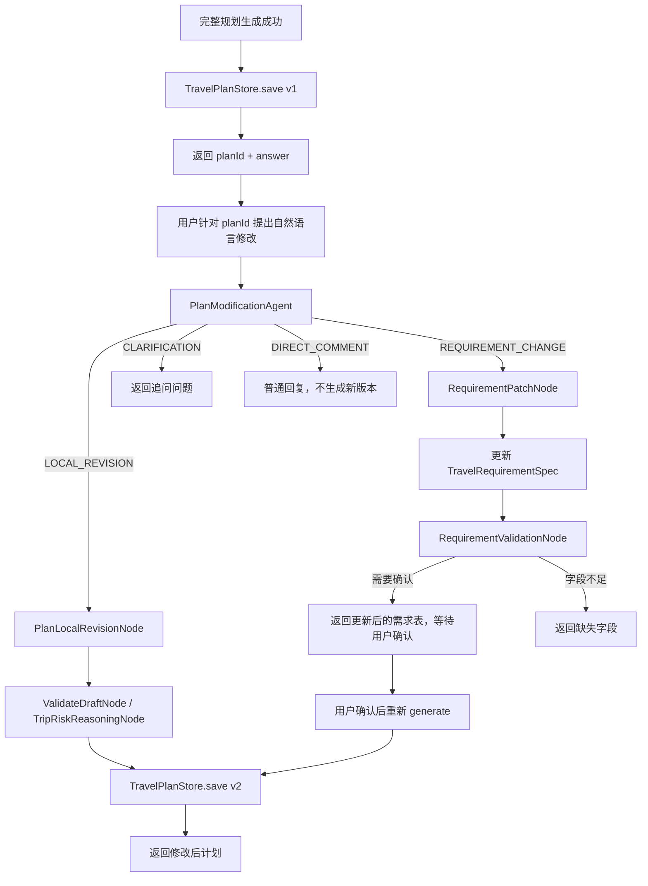

# 第六阶段计划版本化与自然语言修改闭环

本文档是第六阶段编码实施说明。第一到第五阶段文档保留不删除。本阶段的目标是解决“第一版行程生成之后，用户一定会继续要求修改”的产品闭环问题，让系统从一次性生成器升级为可持续协作修改的旅行规划 Agent。

第六阶段的核心思想是：

```text
第一版行程 -> 保存为计划记录 -> 用户自然语言提出修改 -> 判断修改类型 -> 局部重写 / 更新需求表 / 追问用户 -> 生成新版本
```

第五阶段已经让“生成前”变稳：

```text
自然语言输入 -> 需求表确认 -> 生成门控 -> 完整规划
```

第六阶段要让“生成后”也变稳：

```text
完整规划 v1 -> 用户反馈 -> 修改意图识别 -> 计划版本 v2 / v3 / ...
```

## 1. 第六阶段目标

完成后，系统应该具备以下能力：

1. 每次完整规划生成后，系统保存一条 `TravelPlanRecord`。
2. 每条计划记录都有稳定的 `planId`，可用于后续修改。
3. 用户可以针对某个 `planId` 用自然语言提出修改意见。
4. 系统能判断修改属于局部行程修改、核心需求变更、需要追问、普通评论等类型。
5. 局部修改不重新走完整需求确认和完整规划，只调用轻量 revision 流程。
6. 核心需求变更会更新 `TravelRequirementSpec`，并回到第五阶段的确认流程。
7. 每次有效修改生成一个新版本，例如 `v1`、`v2`、`v3`。
8. 系统保留历史版本，后续可以支持回滚、对比和审计。
9. 生成失败时保留旧版本，不破坏用户已有计划。

第六阶段暂时不做：

- 真实数据库持久化，第一版仍可使用内存仓库。
- 多版本可视化 diff。
- 复杂多人协作编辑。
- 完整支付订单和退款逻辑。
- 长期用户画像和跨会话记忆。
- 细粒度到每个景点对象的结构化编辑，第一版仍以 Markdown 草案为主。
- 真正的前端拖拽式日程编辑器。

## 2. 为什么需要第六阶段

旅行规划不是一次性问答。用户看到第一版方案后，很常见的反馈包括：

```text
第三天太赶了，少安排一个城市。
不要住青旅，改成经济型酒店。
预算从1200欧改成900欧。
多加一点美食内容。
我想从巴黎进，罗马出。
第七天不要安排徒步。
```

如果系统每次都从零生成，会出现几个问题：

1. **成本浪费**：每次修改都重新 RAG、分支工具、Planner、RiskReasoning，token 和工具调用成本高。
2. **上下文漂移**：重新生成可能把用户之前满意的部分改坏。
3. **商业体验差**：用户可能觉得每次小修改都要重新扣费，不合理。
4. **无法审计**：没有版本记录，就不知道 v2 是基于什么改出来的。
5. **难以产品化**：后续做前端编辑、订单、收藏和分享都需要 `planId` 和版本记录。

第六阶段的目标就是把“生成后的协作修改”变成一个明确工程流程。

## 3. 第六阶段流程图



## 4. 推荐目录结构

第六阶段建议新增和扩展以下目录：

```text
AgentProjectTrip/src/main/java/com/travel/agent
├── web
│   ├── RequirementController.java          扩展：generate 成功后保存 plan record
│   └── PlanController.java                 新增：计划查询、修改、版本读取
├── ai
│   ├── agents
│   │   └── PlanModificationAgent.java      新增：自然语言修改意图识别
│   ├── dto
│   │   ├── PlanModificationRequest.java    已预留，扩展 planId/message
│   │   ├── PlanModificationResponse.java   新增
│   │   └── TravelPlanRecordResponse.java   新增
│   └── graph
│       ├── model
│       │   ├── TravelPlanRecord.java       新增，计划主记录
│       │   ├── TravelPlanVersion.java      新增，计划版本记录
│       │   ├── PlanModificationIntent.java 新增，修改意图枚举
│       │   ├── PlanModificationDecision.java 新增，修改意图识别结果
│       │   └── RequirementPatch.java       新增，可选，需求表字段变更
│       ├── node
│       │   ├── PlanLocalRevisionNode.java  新增，局部重写
│       │   └── RequirementPatchNode.java   新增，核心需求变更合并
│       └── store
│           ├── TravelPlanStore.java        新增
│           └── InMemoryTravelPlanStore.java 新增
└── core
    └── service
        └── PlanVersionService.java         可选，用于版本号管理
```

## 5. 核心模型设计

### 5.1 TravelPlanRecord

用途：表示一个用户确认需求后生成的旅行计划主记录。

```java
public class TravelPlanRecord {
    private String planId;
    private String requirementId;
    private String sessionId;
    private TravelRequirementSpec requirementSpec;
    private int currentVersion;
    private List<TravelPlanVersion> versions;
    private String createdAt;
    private String updatedAt;
}
```

字段说明：

- `planId`：计划 ID，后续修改、查询、分享都围绕它。
- `requirementId`：来源需求表 ID。
- `sessionId`：所属会话或用户。
- `requirementSpec`：当前计划对应的结构化需求表快照。
- `currentVersion`：当前最新版本号。
- `versions`：历史版本列表。
- `createdAt` / `updatedAt`：第一版可以用字符串或 `Instant`。

### 5.2 TravelPlanVersion

用途：表示一次生成或修改后的具体计划版本。

```java
public class TravelPlanVersion {
    private int version;
    private PlannerDraft draft;
    private String finalAnswer;
    private RiskAssessment riskAssessment;
    private List<ValidationIssue> validationIssues;
    private String modificationSummary;
    private String userInstruction;
    private String createdAt;
}
```

字段说明：

- `version`：版本号，从 1 开始。
- `draft`：该版本对应的 PlannerDraft。
- `finalAnswer`：该版本最终返回给用户的 Markdown。
- `riskAssessment`：该版本输出前的风险审查结果。
- `validationIssues`：校验问题。
- `modificationSummary`：本次修改摘要，例如“放松第3天行程节奏”。
- `userInstruction`：触发该版本的用户自然语言修改指令。
- `createdAt`：版本生成时间。

### 5.3 PlanModificationIntent

用途：描述用户修改请求属于哪一类。

```java
public enum PlanModificationIntent {
    LOCAL_REVISION,
    REQUIREMENT_CHANGE,
    CLARIFICATION,
    DIRECT_COMMENT,
    UNSUPPORTED
}
```

语义：

- `LOCAL_REVISION`：只改当前计划内容，不改变核心需求表。
- `REQUIREMENT_CHANGE`：修改目的地、天数、预算、人数、时间、住宿偏好等核心需求。
- `CLARIFICATION`：用户表达不清，需要追问。
- `DIRECT_COMMENT`：普通反馈或闲聊，不生成新版本。
- `UNSUPPORTED`：当前系统暂不支持的修改类型。

### 5.4 PlanModificationDecision

用途：`PlanModificationAgent` 的结构化输出。

```java
public class PlanModificationDecision {
    private PlanModificationIntent intent;
    private String targetDay;
    private List<String> targetSections;
    private String instructionSummary;
    private RequirementPatch requirementPatch;
    private boolean requiresConfirmation;
    private String clarificationQuestion;
}
```

字段说明：

- `targetDay`：例如“第3天”，用于局部 revision。
- `targetSections`：例如 itinerary、budget、risk、accommodation。
- `instructionSummary`：模型压缩后的修改要求。
- `requirementPatch`：如果用户修改了核心需求，写入结构化字段变更。
- `requiresConfirmation`：核心需求变化时通常为 true。
- `clarificationQuestion`：需要追问时返回的问题。

### 5.5 RequirementPatch

用途：表示用户自然语言修改对需求表造成的结构化字段变更。

```java
public class RequirementPatch {
    private List<String> destinations;
    private String departureCity;
    private String startDateText;
    private Integer durationDays;
    private Integer travelerCount;
    private BigDecimal budgetAmount;
    private String budgetCurrency;
    private Boolean budgetIncludesInternationalFlight;
    private List<String> addPreferences;
    private List<String> removePreferences;
    private List<String> addAvoidances;
    private List<String> removeAvoidances;
    private String accommodationPreference;
    private String transportPreference;
}
```

第一版可以只支持部分字段：

- `budgetAmount`
- `durationDays`
- `destinations`
- `departureCity`
- `travelerCount`
- `accommodationPreference`
- `addPreferences`
- `addAvoidances`

## 6. Agent 和节点职责

### 6.1 PlanModificationAgent

职责：

1. 接收 `planId`、当前计划版本、结构化需求表和用户自然语言修改指令。
2. 判断修改类型，输出 `PlanModificationDecision`。
3. 不直接修改计划，不直接生成新行程。
4. 模型失败时用规则兜底：
   - 包含“预算改成”“天数改成”“加上某国”“不住青旅” → `REQUIREMENT_CHANGE`
   - 包含“第几天太赶”“少安排”“多一点自由时间” → `LOCAL_REVISION`
   - 表达不完整 → `CLARIFICATION`

提示词原则：

```text
你是旅行计划修改意图识别器，不是行程规划师。
只判断用户想怎么改，不生成新计划。
必须输出 JSON。
如果修改会改变目的地、时间、预算、人数、住宿偏好等核心需求，输出 REQUIREMENT_CHANGE。
如果只是调整某一天节奏、删减景点、增加美食、改写说明，输出 LOCAL_REVISION。
```

### 6.2 PlanLocalRevisionNode

职责：

1. 读取当前 `TravelPlanVersion`、`TravelRequirementSpec` 和 `PlanModificationDecision`。
2. 构造局部 revision prompt。
3. 要求模型尽量只修改目标日期或目标模块。
4. 不改变用户已确认的核心需求表。
5. 输出新的 `PlannerDraft` 或更新后的 Markdown。
6. 模型失败时保留旧版本，并返回失败提示。

局部 revision prompt 必须包含：

```text
当前需求表
当前计划版本
用户修改指令
修改范围
不得破坏的约束
输出 JSON Schema
```

重点约束：

1. 不要重新规划全部行程，除非用户明确要求。
2. 不要改变预算、天数、目的地等核心需求。
3. 不要删除用户没有要求删除的满意内容。
4. 修改后仍要保持最终答案结构完整。

### 6.3 RequirementPatchNode

职责：

1. 读取当前 `TravelRequirementSpec` 和 `RequirementPatch`。
2. 合并字段变更，生成新的需求表草稿。
3. 调用第五阶段 `RequirementValidationNode`。
4. 如果字段完整，返回 `READY_TO_CONFIRM`，等待用户重新确认。
5. 如果字段缺失，返回 `NEEDS_USER_INPUT` 和缺失字段。

例子：

```text
用户：预算改成900欧。
结果：TravelRequirementSpec.budgetAmount = 900，状态回到 READY_TO_CONFIRM。
```

```text
用户：目的地加瑞士。
结果：destinations = ["法国", "意大利", "瑞士"]，重新校验 10 天是否过赶，返回 warning。
```

### 6.4 TravelPlanStore

职责：

1. 保存 `TravelPlanRecord`。
2. 按 `planId` 读取当前计划。
3. 添加新版本。
4. 读取指定版本。
5. 后续支持回滚和版本对比。

第一版用内存实现：

```text
Map<String, TravelPlanRecord>
```

注意：内存实现重启丢失，只用于开发验证。

### 6.5 RequirementController 扩展

第五阶段的 `generate` 成功后，需要保存计划记录：

```text
GraphResult success
-> 从 GraphResult / TravelPlanState 提取 draft、finalAnswer、riskAssessment
-> TravelPlanStore.save(planRecord)
-> 返回 planId
```

如果第一版 `GraphResult` 暂时没有携带完整 `TravelPlanState`，可以先做过渡方案：

```text
TravelPlanVersion.finalAnswer = graphResult.answer
TravelPlanVersion.draft = null
TravelPlanVersion.riskAssessment = null
```

后续再扩展 `GraphResult` 携带 `PlannerDraft` 和风险审查。

## 7. 推荐接口设计

### 7.1 查询计划当前版本

```http
GET /api/v1/plans/{planId}
```

返回：

```json
{
  "planId": "plan-001",
  "requirementId": "req-001",
  "currentVersion": 2,
  "currentAnswer": "...",
  "requirementSpec": {}
}
```

### 7.2 查询计划某个版本

```http
GET /api/v1/plans/{planId}/versions/{version}
```

返回指定版本的答案和修改摘要。

### 7.3 修改已有计划

```http
POST /api/v1/plans/{planId}/modify
```

请求：

```json
{
  "sessionId": "test-006",
  "message": "第三天太赶了，少安排一个城市，多留一点自由时间"
}
```

响应分三类。

#### 局部修改成功

```json
{
  "planId": "plan-001",
  "status": "UPDATED",
  "version": 2,
  "modificationIntent": "LOCAL_REVISION",
  "answer": "..."
}
```

#### 核心需求变化，需要确认

```json
{
  "planId": "plan-001",
  "status": "REQUIREMENT_NEEDS_CONFIRMATION",
  "modificationIntent": "REQUIREMENT_CHANGE",
  "requirementSpec": {},
  "validation": {},
  "assistantMessage": "你把预算改成了900欧，请确认更新后的需求表。"
}
```

#### 需要追问

```json
{
  "planId": "plan-001",
  "status": "NEEDS_CLARIFICATION",
  "question": "你是希望减少第3天的城市数量，还是整体放慢所有天数的节奏？"
}
```

### 7.4 回滚到旧版本（可选）

第六阶段第一版可不做，但接口可以预留：

```http
POST /api/v1/plans/{planId}/versions/{version}/restore
```

## 8. 修改类型判断规则

### 8.1 LOCAL_REVISION

用户没有改变核心需求，只是在修改当前计划内容。

示例：

```text
第三天太赶了，少安排一个城市。
多加一点美食内容。
第七天不要徒步，换成室内活动。
预算说明写得更详细一点。
把罗马那天改轻松一点。
```

处理：

```text
PlanModificationAgent -> LOCAL_REVISION
PlanLocalRevisionNode -> 生成新版本
```

### 8.2 REQUIREMENT_CHANGE

用户改变了结构化需求表中的核心字段。

示例：

```text
预算改成900欧。
目的地加一个瑞士。
不要住青旅，改成经济型酒店。
从巴黎进，罗马出。
天数改成7天。
人数变成4个人。
```

处理：

```text
PlanModificationAgent -> REQUIREMENT_CHANGE
RequirementPatchNode -> 更新 TravelRequirementSpec
RequirementValidationNode -> 返回待确认需求表
用户确认 -> 重新 generate -> 新版本
```

### 8.3 CLARIFICATION

用户表达不清，系统无法安全修改。

示例：

```text
感觉不太好，帮我改改。
第三天那里换一下。
预算再合理点。
```

处理：

```text
返回追问，不生成新版本。
```

### 8.4 DIRECT_COMMENT

用户只是评论或感谢，不需要修改。

示例：

```text
这个不错。
谢谢。
我先看看。
```

处理：

```text
普通回复，不生成新版本。
```

## 9. 版本策略

第一版版本策略：

```text
完整生成成功 -> v1
每次 LOCAL_REVISION 成功 -> v(n+1)
核心需求变更确认并重新生成成功 -> v(n+1)
修改失败 -> 不新增版本
普通评论 -> 不新增版本
追问用户 -> 不新增版本
```

版本摘要规则：

```text
v1: 初始完整规划
v2: 根据用户反馈放松第3天节奏
v3: 根据用户确认将预算改为900欧后重新生成
```

后续可扩展：

- 版本对比。
- 版本回滚。
- 标记用户最满意版本。
- 将某个版本导出为 PDF / Markdown。

## 10. 与前五阶段的关系

第六阶段建立在前五阶段之上：

```text
第五阶段：生成前需求确认
第六阶段：生成后修改闭环
```

具体关系：

- 第五阶段的 `TravelRequirementSpec` 是第六阶段判断核心需求变更的基准。
- 第四阶段的 `PlanRevisionNode` 可以作为局部 revision 的技术参考，但第六阶段应新增更专门的 `PlanLocalRevisionNode`。
- 第四阶段的 `RiskReasoning` 仍应在局部修改后执行，避免修改后引入新风险。
- 第三阶段分支工具不一定每次局部修改都调用，除非用户修改涉及实时信息。
- 第二阶段澄清能力可复用，但第六阶段的澄清对象是“修改指令”，不是初始旅行需求。

## 11. 测试计划

新增测试：

1. `PlanModificationAgentTest`
   - “第三天太赶”识别为 `LOCAL_REVISION`。
   - “预算改成900欧”识别为 `REQUIREMENT_CHANGE`。
   - “谢谢”识别为 `DIRECT_COMMENT`。
   - “帮我改改”识别为 `CLARIFICATION`。
   - 模型失败时规则兜底仍能分类。

2. `RequirementPatchNodeTest`
   - 能把预算修改合并进 `TravelRequirementSpec`。
   - 能把新增目的地合并进目的地列表。
   - 修改后重新触发 `RequirementValidationNode`。
   - 字段不完整时返回 `NEEDS_USER_INPUT`。

3. `PlanLocalRevisionNodeTest`
   - 能构造包含当前版本、需求表和修改指令的 prompt。
   - 模型返回合法 JSON 时生成新 `PlannerDraft`。
   - 模型失败时保留旧版本，不新增版本。

4. `InMemoryTravelPlanStoreTest`
   - 保存计划记录。
   - 添加新版本。
   - 查询当前版本。
   - 查询指定版本。
   - 不同 planId 互不污染。

5. `PlanControllerTest`
   - 查询不存在 planId 返回 404。
   - 局部修改成功返回新版本。
   - 核心需求变更返回待确认需求表。
   - 普通评论不新增版本。

6. `RequirementControllerTest`
   - generate 成功后保存 `TravelPlanRecord`。
   - 响应中返回 `planId`。

## 12. 验收标准

第六阶段第一版完成后必须满足：

1. 完整规划生成成功后，系统返回 `planId`。
2. `TravelPlanStore` 能按 `planId` 找到计划记录。
3. 用户可以通过 `POST /api/v1/plans/{planId}/modify` 修改已有计划。
4. 局部修改成功后新增一个版本，不覆盖旧版本。
5. 修改预算、目的地、天数、人数等核心需求时，不直接改行程，而是返回更新后的需求表等待确认。
6. 模型分类失败时，规则兜底仍然能处理常见修改。
7. 修改失败时不破坏当前版本。
8. 普通评论和感谢不新增版本。
9. 所有新增测试和前五阶段已有测试全部通过。

## 13. 推荐测试问题

### 13.1 初始生成

先通过第五阶段生成一版完整计划：

```text
国庆去法国和意大利玩10天，预算1200欧，不含国际机票，2个人，从上海出发，想避开人多的地方
```

期望：

1. 生成成功。
2. 返回 `planId`。
3. 保存 `TravelPlanRecord`。
4. 当前版本为 `v1`。

### 13.2 局部修改

```text
第三天太赶了，少安排一个城市，多留一点自由时间
```

期望：

1. 识别为 `LOCAL_REVISION`。
2. 不修改 `TravelRequirementSpec`。
3. 新增 `v2`。
4. v1 保留。
5. v2 的修改摘要包含“放松第3天节奏”。

### 13.3 核心需求变更

```text
预算改成900欧，不想住青旅，改成经济型酒店
```

期望：

1. 识别为 `REQUIREMENT_CHANGE`。
2. 更新 `budgetAmount=900`。
3. 更新 `accommodationPreference=经济型酒店`。
4. 返回更新后的需求表。
5. 等待用户确认，不直接生成新版本。

### 13.4 需要追问

```text
第三天那里换一下
```

期望：

1. 识别为 `CLARIFICATION`。
2. 返回追问问题。
3. 不新增版本。

### 13.5 普通评论

```text
这个方案不错，我先看看
```

期望：

1. 识别为 `DIRECT_COMMENT`。
2. 返回普通确认回复。
3. 不新增版本。

