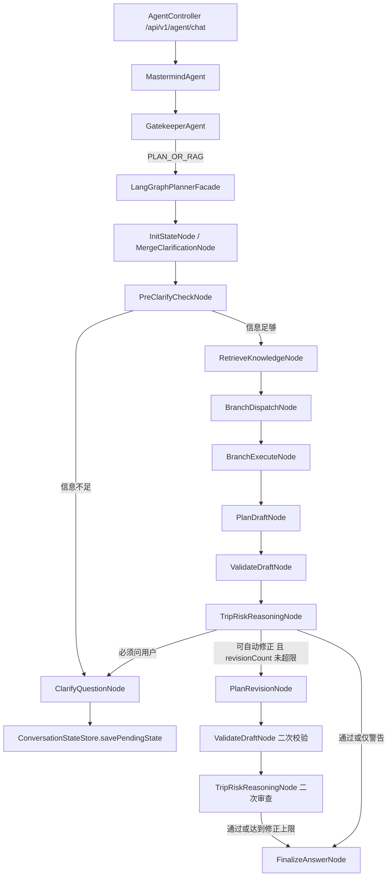

# 第四阶段自动修正与风险推理闭环

本文档是第四阶段编码实施说明。第一、第二、第三阶段文档保留不删除。本阶段在第三阶段“RAG + 分支 Agent 工具结果注入 Planner”的基础上**，继续把系统从直线生成升级为第一版可自我检查、可自动修正的 Agent 工作流。**

第四阶段的核心目标是：让系统在最终输出前，对草案、用户约束、RAG 上下文和分支工具结果做一次结构化风险审查。如果发现可以自动修正的问题，则把问题反馈给 Planner 重写；如果必须用户补充，则进入澄清；如果只是非阻塞风险，则在最终答案中明确提示。

特别注意：第四阶段的风险审查不能把所有风险都升级成澄清。只有真正缺少用户决策信息的问题才允许追问用户；工具失败、行程冲突、热门景点堆叠、预算表述错误等问题应优先自动修正，或降级为最终答案中的风险提醒。

## 1. 第四阶段目标

完成后，系统应该具备以下能力：

1. `PLAN_OR_RAG` 请求仍然由 `LangGraphPlannerFacade` 承接。
2. Planner 生成初稿后，不再直接进入 Finalizer，而是先进入风险推理与修正判断。
3. 系统能检查行程是否满足用户约束，例如预算、时长、目的地、避开人多、不含国际机票等。
4. 系统能检查工具结果和行程安排是否冲突，例如天气风险、景点查询结果、RAG 防坑信息等。
5. 对可自动修正的问题，进入 `PlanRevisionNode` 重新生成一版草案。
6. 对必须用户回答的问题，继续复用第二阶段的 `ClarifyQuestionNode`。
7. 对非阻塞问题，保留到最终答案的“需要确认或注意的信息”中。
8. 使用 `revisionCount` / `maxRevisionCount` 防止自动修正无限循环。

第四阶段暂时不做：

- 真正迁移到 LangGraph4j `StateGraph`。
- 多分支 Agent 并行互相对话。
- 精确到未来某一天的天气预报重排。
- 真实航班、酒店价格、景点开放时间的完整结构化接入。
- 长期记忆、用户画像和数据库持久化。
- 输出模型的完整思维链。风险推理节点只输出结构化结论，不输出隐藏推理过程。

## 2. 第四阶段流程图



## 3. 推荐目录结构

新增和扩展：

```text
AgentProjectTrip/src/main/java/com/travel/agent/ai
└── graph
    ├── model
    │   ├── RiskAssessment.java             新增
    │   ├── RiskIssue.java                  新增
    │   ├── RiskIssueType.java              新增
    │   ├── RiskSeverity.java               新增
    │   ├── RevisionDecision.java           新增，可选
    │   └── TravelPlanState.java            扩展 riskAssessment / revisionCount
    └── node
        ├── TripRiskReasoningNode.java      新增
        ├── PlanRevisionNode.java           新增
        ├── ValidateDraftNode.java          扩展需求一致性检查
        ├── PlanDraftNode.java              抽出可复用 prompt 构建或支持 revision prompt
        └── FinalizeAnswerNode.java         展示风险审查结果
```

## 4. 核心模型设计

### 4.1 RiskIssueType

风险问题类型枚举：

```java
public enum RiskIssueType {
    WEATHER_CONFLICT,
    CROWD_CONFLICT,
    BUDGET_CONFLICT,
    DURATION_MISMATCH,
    DESTINATION_MISMATCH,
    FLIGHT_BUDGET_CONFLICT,
    TRANSPORT_RISK,
    OVERLOADED_DAY,
    RAG_WARNING,
    TOOL_UNAVAILABLE
}
```

说明：

- `WEATHER_CONFLICT`：天气或季节风险与户外安排冲突。
- `CROWD_CONFLICT`：用户要求避开人多，但行程大量安排热门景点或高峰时段。
- `BUDGET_CONFLICT`：预算估算明显超出用户预算。
- `DURATION_MISMATCH`：用户说 10 天，但行程不是 10 天。
- `DESTINATION_MISMATCH`：用户要求法国和意大利，但草案遗漏某个国家。
- `FLIGHT_BUDGET_CONFLICT`：用户说不含国际机票，但预算里把国际机票算进去了。
- `TRANSPORT_RISK`：跨城移动过密、换乘不现实或交通衔接风险高。
- `OVERLOADED_DAY`：单日安排过多，行程强度不合理。
- `RAG_WARNING`：RAG 提示的防坑信息没有被行程吸收。
- `TOOL_UNAVAILABLE`：分支工具失败，Planner 不应伪造对应实时数据。

### 4.2 RiskSeverity

风险严重程度：

```java
public enum RiskSeverity {
    HIGH,
    MEDIUM,
    LOW
}
```

建议语义：

- `HIGH`：会明显破坏用户需求，应该自动修正或追问。
- `MEDIUM`：会影响质量，优先自动修正；无法修正时提示用户。
- `LOW`：作为最终答案风险提醒即可。

### 4.3 RiskIssue

用途：描述单个可审查、可修正的问题。

```java
public class RiskIssue {
    private RiskIssueType type;
    private RiskSeverity severity;
    private String code;
    private String day;
    private String message;
    private String evidence;
    private String suggestedAction;
    private boolean autoRevisable;
    private boolean requiresClarification;
}
```

字段说明：

- `day`：可为空。用于标记“第3天”“周三”等具体问题位置。
- `message`：面向用户或日志的简短问题说明。
- `evidence`：触发问题的证据，例如用户偏好、分支结果、草案片段。
- `suggestedAction`：给 `PlanRevisionNode` 的修正方向。
- `autoRevisable`：是否能自动修。
- `requiresClarification`：是否必须问用户。

### 4.4 RiskAssessment

用途：风险推理节点的结构化输出。

```java
public class RiskAssessment {
    private boolean needsRevision;
    private boolean needsClarification;
    private List<RiskIssue> issues;
    private String revisionInstruction;
}
```

示例：

```json
{
  "needsRevision": true,
  "needsClarification": false,
  "issues": [
    {
      "type": "CROWD_CONFLICT",
      "severity": "HIGH",
      "day": "第2天",
      "message": "用户要求避开人多，但第2天安排了多个巴黎高人流景点。",
      "evidence": "用户偏好：避开人多；草案：杜乐丽花园、圣母院、热门博物馆。",
      "suggestedAction": "替换为小众街区、清晨时段或周边小镇，并把热门景点改为可选项。",
      "autoRevisable": true,
      "requiresClarification": false
    }
  ],
  "revisionInstruction": "请重写行程，减少热门景点密度，优先小众区域和避峰时段。"
}
```

#### 4.4.1 风险澄清边界

`TripRiskReasoningNode` 必须在接收模型输出后做一次澄清标记清洗，防止模型把可自动修正的问题误判成需要追问用户。

允许触发 `needsClarification=true` 的问题只包括真正缺少用户输入的信息，例如：

- `MISSING_DESTINATION`：缺少明确目的地。
- `BROAD_DESTINATION`：目的地过宽泛，例如只说“欧洲”。
- `MISSING_DATE`：缺少出行时间，且该时间会影响签证、天气或旺季判断。
- `MISSING_DURATION`：缺少行程时长。
- `MISSING_BUDGET`：缺少预算，且用户要求生成完整行程。

以下问题不应直接触发澄清，而应优先进入 `PlanRevisionNode` 或最终风险提醒：

- `CROWD_CONFLICT`：用户想避开人多，但草案安排了热门景点。
- `DURATION_MISMATCH`：草案天数和用户时长不一致。
- `DESTINATION_MISMATCH`：草案遗漏用户指定国家或城市。
- `FLIGHT_BUDGET_CONFLICT`：预算误把国际机票算入。
- `TOOL_UNAVAILABLE`：分支工具失败，例如景点 API 返回 522。
- `RAG_WARNING`：RAG 防坑信息未被充分吸收。

因此，对“国庆去法国和意大利玩 10 天，预算 1200 欧，不含国际机票，想避开人多”这类信息已经足够的请求，风险节点即使发现多个问题，也应该输出：

```text
needsRevision=true
needsClarification=false
```

随后进入 `PlanRevisionNode` 自动修正，而不是暂停等待用户补充。

### 4.5 TravelPlanState 扩展

新增字段：

```java
private RiskAssessment riskAssessment;
private int revisionCount;
private int maxRevisionCount = 1;
```

第一版建议：

```text
maxRevisionCount = 1
```

原因：

- 保持响应时间可控。
- 避免模型反复重写导致成本不可控。
- 先验证闭环正确性，再考虑增加到 2 次。

## 5. 节点职责

### 5.1 TripRiskReasoningNode

职责：

1. 读取 `TravelPlanState`、`PlannerDraft`、`ValidationIssue`、`BranchResult` 和 RAG 上下文。
2. 综合判断草案是否满足用户需求和工具事实。
3. 输出结构化 `RiskAssessment`。
4. 不直接改写行程，只给出问题和修正指令。
5. 不输出模型思维链，只输出 JSON 结构化结论。

第一版实现策略：

- 优先使用 Java 规则检查确定性问题。
- 对复杂冲突可调用核心模型做结构化审查。
- 模型输出必须是 JSON，不允许自然语言散文。
- 模型失败时降级为空风险或低级风险，不阻断主流程。
- 模型输出后必须清洗 `requiresClarification` 标记：只有缺少目的地、时间、时长、预算等用户决策信息时才允许追问；其他可修正风险一律交给自动修正或最终提醒。

建议第一版规则：

| 条件 | 风险 |
|---|---|
| 用户要求避开人多，但草案包含大量热门景点 | `CROWD_CONFLICT` |
| 用户说不含国际机票，但预算说明包含国际机票 | `FLIGHT_BUDGET_CONFLICT` |
| 用户给出 `durationDays=10`，但行程不是 10 天 | `DURATION_MISMATCH` |
| 用户目的地包含法国、意大利，但草案缺少其中一个国家 | `DESTINATION_MISMATCH` |
| 分支工具失败，但草案写了具体实时数据 | `TOOL_UNAVAILABLE` |
| 单日出现 4 个以上跨区景点或长距离交通 | `OVERLOADED_DAY` |

天气说明：

当前第三阶段的天气工具是 OpenWeatherMap Current Weather，只适合“今天 / 当前 / 实时天气”。第四阶段可以先做天气冲突协议和风险判断，但不要把当前天气误用于国庆、下个月等未来旅行。

如果后续接入按日期天气预报，风险节点就可以处理：

```text
周三大暴雨 -> 第3天不安排户外徒步
周四晴天 -> 把户外活动调到第4天
```

### 5.2 PlanRevisionNode

职责：

1. 读取当前 `PlannerDraft` 和 `RiskAssessment`。
2. 构造 revision prompt，要求核心模型只针对风险问题重写草案。
3. 保留用户原始需求、RAG、branchResults、duration、budget 等上下文。
4. 重写后更新 `draft`。
5. `revisionCount + 1`。

Revision Prompt 必须包含：

```text
用户原始需求
已确认信息
当前草案
Validator 问题
RiskAssessment 问题
必须修正的清单
不得破坏的约束
输出 JSON Schema
```

重点约束：

1. 不要扩大预算。
2. 不要把国际机票加入预算。
3. 不要改变用户指定的目的地和时长。
4. 如果用户要求避开人多，热门景点只能作为可选项或避峰时段。
5. 如果工具失败，不得伪造工具数据。

### 5.3 ValidateDraftNode 升级

第四阶段需要从“字段完整性检查”升级为“需求一致性检查”。

新增检查：

| 检查项 | code |
|---|---|
| 行程天数是否匹配 `durationDays` | `DURATION_MISMATCH` |
| 是否覆盖所有目的地 | `DESTINATION_MISMATCH` |
| 是否回应预算 | `BUDGET_NOT_ADDRESSED` |
| 是否误把国际机票算入预算 | `FLIGHT_BUDGET_CONFLICT` |
| 是否明显违背“避开人多” | `CROWD_CONFLICT` |

`ValidateDraftNode` 仍然保持确定性 Java 规则为主，不负责复杂语义重写。

### 5.4 FinalizeAnswerNode 升级

最终答案需要新增：

```text
## 系统审查与修正说明
- 已检查行程时长、预算、目的地覆盖和避峰偏好。
- 如发生自动修正，说明修正原因。

## 仍需注意的风险
- 工具未覆盖的实时信息。
- 天气、交通、开放时间等需要出发前复核。
```

注意：不要输出模型内部思维链，只输出结论和用户可理解的原因。

## 6. LangGraphPlannerFacade 改造

第四阶段第一版流程：

```java
state = retrieveKnowledgeNode.retrieve(state);
state = branchDispatchNode.dispatch(state);
state = branchExecuteNode.execute(state);
state = planDraftNode.plan(state);
state = validateDraftNode.validate(state);
state = tripRiskReasoningNode.assess(state);

if (needsClarification(state)) {
    state = clarifyQuestionNode.ask(state);
    savePendingState(...);
    return GraphResult.success(...);
}

if (needsRevision(state) && canRevise(state)) {
    state = planRevisionNode.revise(state);
    state = validateDraftNode.validate(state);
    state = tripRiskReasoningNode.assess(state);
}

state = finalizeAnswerNode.finish(state);
```

第一版只做一次 revision：

```java
private boolean canRevise(TravelPlanState state) {
    return state.getRevisionCount() < state.getMaxRevisionCount();
}
```

## 7. 测试计划

新增测试：

1. `TripRiskReasoningNodeTest`
   - 用户要求避开人多，但草案包含热门景点时，输出 `CROWD_CONFLICT`。
   - 用户说 10 天，但草案只有 8 天时，输出 `DURATION_MISMATCH`。
   - 用户说不含国际机票，但预算包含国际机票时，输出 `FLIGHT_BUDGET_CONFLICT`。
   - 分支工具失败时，草案不得引用具体实时数据。
   - 当模型把 `CROWD_CONFLICT`、`TOOL_UNAVAILABLE` 等可自动处理风险错误标记为 `requiresClarification=true` 时，节点必须清洗为 `false`，并保持 `needsRevision=true`。

2. `PlanRevisionNodeTest`
   - 能根据 `RiskAssessment` 构造 revision prompt。
   - 模型返回合法 JSON 时更新 draft。
   - 模型失败时保留原 draft，并写入风险提示。

3. `ValidateDraftNodeTest`
   - 覆盖目的地遗漏。
   - 覆盖天数不匹配。
   - 覆盖预算和国际机票冲突。

4. `LangGraphPlannerFacadeTest`
   - 有自动修正问题时，流程会调用 `PlanRevisionNode`。
   - 达到 `maxRevisionCount` 后不会继续修正。
   - 需要用户补充的问题仍然进入 `ClarifyQuestionNode`。

5. `FinalizeAnswerNodeTest`
   - 最终答案包含系统审查结果。
   - 自动修正后能说明修正原因。

## 8. 验收标准

第四阶段第一版完成后必须满足：

1. 第一、第二、第三阶段已有测试全部通过。
2. `PLAN_OR_RAG` 完整流程包含 RiskReasoning 和可选 Revision。
3. 用户要求避开人多时，系统能识别明显热门景点堆叠问题。
4. 用户给出 10 天时，系统能识别行程天数不匹配。
5. 用户说不含国际机票时，系统能识别预算误算问题。
6. 自动修正最多执行一次，不会无限循环。
7. 模型审查失败时，主流程仍可降级输出。
8. 最终答案能说明已确认信息、审查结果和仍需用户注意的风险。
9. 不输出模型隐藏思维链，只输出结构化问题和面向用户的结论。
10. 对信息已经足够的请求，风险节点不得因为可自动修正问题而暂停澄清；日志应表现为先 `RiskReasoning needsRevision=true, needsClarification=false`，再进入 `PlanRevisionNode`。

## 9. 推荐测试问题

用于验证第四阶段自动修正：

```text
国庆去法国和意大利玩10天，预算1200欧，不含国际机票，想避开人多的地方，尽量少去网红景点
```

期望：

1. `durationDays=10`。
2. `BranchDispatch` 至少包含 `KNOWLEDGE` 和 `PLACES`。
3. Planner 初稿如果塞入太多热门景点，RiskReasoning 应输出 `CROWD_CONFLICT`。
4. PlanRevision 应要求改成小众路线、清晨避峰或周边小镇。
5. 最终答案应说明系统已按“避开人多”修正。

关键日志期望：

```text
[Graph][RiskReasoning] issues=..., needsRevision=true, needsClarification=false
[Graph][PlanRevision] revising draft, revisionCount=1
[Graph] workflow finished, sessionId=..., success=true
```

如果景点工具临时失败，例如 SerpApi 返回 522，系统可以记录 `TOOL_UNAVAILABLE` 风险，但不应因为这个工具失败而暂停澄清。

用于验证澄清仍然生效：

```text
我想下个月去欧洲玩一周左右，预算1000欧，帮我安排
```

期望：

1. `durationDays=7`。
2. 目的地只有“欧洲”，前置澄清仍然追问国家或城市。
3. 不进入 RAG、Branch、Planner。

## 10. 后续第五阶段预告

第四阶段稳定后，第五阶段可以继续做：

- 接入按日期天气预报，而不是 Current Weather。
- 把天气结果结构化为 `{date, city, condition, riskLevel}`。
- 接入景点开放时间和预约要求。
- 接入交通耗时和换乘风险。
- 让 Planner 可以主动向某个分支 Agent 追问补充信息。
- 将当前 Java 手写流程迁移为真正 LangGraph4j `StateGraph`。
