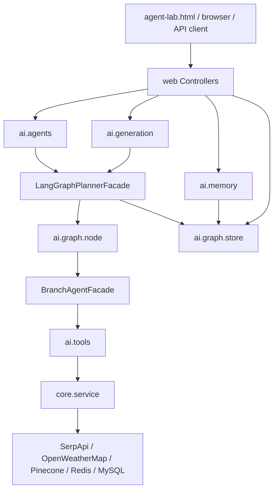
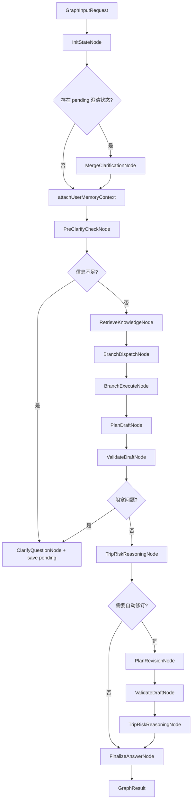
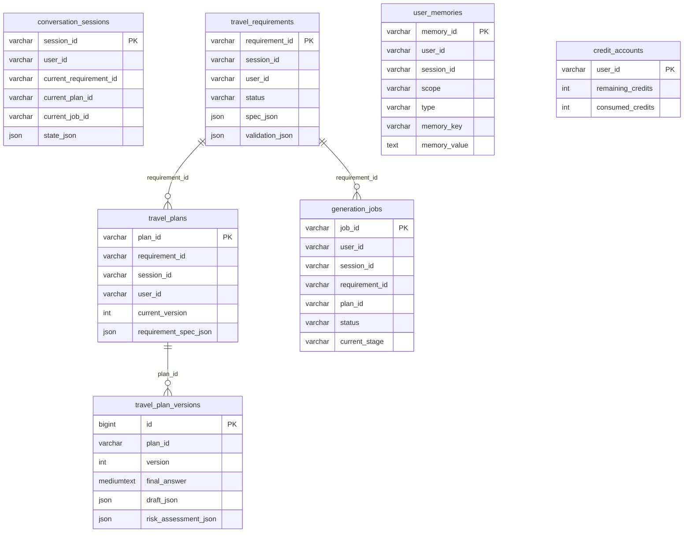
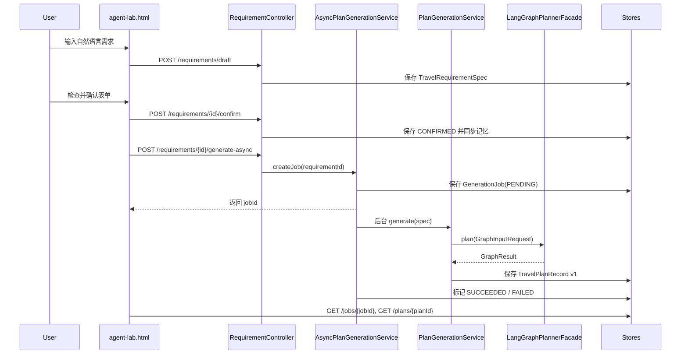

# 系统架构与类关系分析

更新时间：2026-06-06

本文档根据 `AgentProjectTrip` 当前代码同步更新，用来说明系统真实包结构、核心类职责、类之间的调用关系、数据持久化关系、前端调试台关系，以及当前 Agent 工作流的完成度。

一个重要前提：当前项目还没有真正引入 `langgraph4j` Maven 依赖。现在的 `LangGraphPlannerFacade` 是自研的“类 LangGraph”工作流门面，通过 Java 节点类、状态对象、Store 和 Service 手动实现图式编排。也就是说，业务上的 Agent 图流程已经成型，但技术框架层面的 LangGraph4j 迁移还没有开始。

## 1. 当前项目规模

当前系统已经从早期 Spring AI Demo 演进为一个可运行的 Agentic 旅行规划 MVP。

代码规模概览：

```text
main Java 文件：121 个
Graph 相关 Java 文件：63 个
Graph 节点类：16 个
test Java 文件：29 个
MySQL 业务表：7 张
前端静态调试页：2 个
```

当前核心能力概览：

```text
自然语言意图识别
结构化旅行需求表
前置澄清判断
RAG 检索
分支任务派发
天气 / 景点 / 知识库工具分支
核心规划模型生成草案
规则校验
模型级风险审查
自动修订
最终 Markdown 输出
MySQL / 内存双 Store
用户长短期记忆
积分扣费与失败退款
异步生成任务
旅行方案版本化
前端 Agent Lab 调试台
```

当前完成度判断：

```text
Agentic 产品 MVP：约 65%
核心 Graph 编排业务能力：约 55%-60%
真正 LangGraph4j 框架接入：约 0%-5%
生产级 Agent 系统：约 35%-40%
```

## 2. 顶层包结构

当前主包为：

```text
com.travel.agent
├── web
├── core
└── ai
```

包边界已经比较清晰：

```text
web  ：所有 HTTP 对外入口
core ：传统 Java 业务服务、DTO、ETL、外部 API 调用
ai   ：模型配置、Agent、工具封装、Graph、记忆、异步生成
```

顶层启动类：

```text
TravelAgentApplication
```

职责：

```text
启动 Spring Boot 应用
开启 Spring Cache
装配 Web / Core / AI 全部 Bean
```

## 3. 总体依赖方向

当前推荐依赖方向是：

```text
web
 -> ai.agents / ai.generation / ai.memory / ai.graph.store
 -> core.service

ai.agents
 -> ai.graph
 -> ai.tools
 -> core.service

ai.graph
 -> ai.graph.node
 -> ai.graph.model
 -> ai.graph.store

ai.tools
 -> core.service

core.service
 -> external API / Redis / Pinecone / MySQL
```

总体调用图：



## 4. Web 层

路径：

```text
com.travel.agent.web
```

职责：

```text
接收 HTTP 请求
解析请求参数和 JSON body
调用 Agent / Graph / Store / Service
返回 DTO 或纯文本结果
```

当前 Controller：

```text
AgentController
TravelController
RequirementController
PlanController
MemoryController
GenerationJobController
EtlController
KnowledgeController
DebugController
```

### 4.1 AgentController

接口：

```text
GET /api/v1/agent/chat?message=&sessionId=
```

调用关系：

```text
AgentController
 -> MastermindAgent.handleUserWorkflow(message, sessionId)
     -> GatekeeperAgent
     -> LangGraphPlannerFacade
```

职责：

```text
当前自然语言聊天和规划入口
适合快速测试 Gatekeeper -> Mastermind -> Graph 主链路
复杂规划会进入 LangGraphPlannerFacade
简单 DIRECT_CHAT 会直接返回 Gatekeeper 的 direct_reply
```

### 4.2 TravelController

接口：

```text
GET /api/v1/travel/health
GET /api/v1/travel/flights?origin=&destination=&date=
GET /api/v1/travel/chat?message=
```

调用关系：

```text
TravelController
 -> FlightService
 -> MastermindAgent.chat(message)
```

职责：

```text
保留早期旅行 API
提供航班查询调试入口
提供旧版单轮工具聊天入口
```

注意：`/api/v1/travel/chat` 是旧入口，不是当前推荐的结构化需求表和异步生成主流程。

### 4.3 RequirementController

接口：

```text
POST /api/v1/requirements/draft
PUT  /api/v1/requirements/{requirementId}
POST /api/v1/requirements/{requirementId}/confirm
POST /api/v1/requirements/{requirementId}/generate
POST /api/v1/requirements/{requirementId}/generate-async
```

调用关系：

```text
RequirementController
 -> RequirementExtractionAgent
 -> RequirementValidationNode
 -> RequirementStore
 -> UserMemoryService
 -> PlanGenerationService
 -> AsyncPlanGenerationService
```

职责：

```text
把自然语言旅行需求整理成 TravelRequirementSpec
允许前端以表单方式编辑需求
校验需求是否足够生成
确认需求并同步用户记忆
触发同步或异步完整规划生成
```

这是第五阶段以后最重要的产品入口，用于降低自然语言随意输入造成的无效生成概率。

### 4.4 PlanController

接口：

```text
GET  /api/v1/plans/{planId}
GET  /api/v1/plans/{planId}/versions/{version}
POST /api/v1/plans/{planId}/modify
```

调用关系：

```text
PlanController
 -> TravelPlanStore
 -> RequirementStore
 -> PlanModificationAgent
 -> PlanLocalRevisionNode
 -> RequirementPatchNode
 -> RequirementValidationNode
```

职责：

```text
读取已生成的旅行方案
读取历史版本
接收用户对第一版方案的自然语言修改要求
判断是局部修订、核心需求变更、追问还是普通评论
局部修订会新增 TravelPlanVersion
核心需求变更会 patch 回 TravelRequirementSpec
```

### 4.5 MemoryController

接口：

```text
GET    /api/v1/memories?userId=&sessionId=&scope=
POST   /api/v1/memories
DELETE /api/v1/memories/{memoryId}
```

调用关系：

```text
MemoryController
 -> UserContextResolver
 -> UserMemoryService
 -> UserMemoryStore
```

职责：

```text
查询当前用户记忆
手动新增偏好、约束或历史信息
禁用指定记忆
为前端 Agent Lab 提供记忆调试能力
```

### 4.6 GenerationJobController

接口：

```text
GET /api/v1/jobs/{jobId}
GET /api/v1/jobs?sessionId=&limit=
```

调用关系：

```text
GenerationJobController
 -> GenerationJobStore
 -> GenerationJobResponse
```

职责：

```text
查询异步生成任务状态
按 sessionId 查询最近任务
供前端轮询 PENDING / RUNNING / SUCCEEDED / FAILED 状态
```

### 4.7 EtlController

接口：

```text
GET /api/v1/etl/clean-xhs?fileName=&type=
GET /api/v1/etl/extract?inputFileName=&outputFileName=
```

调用关系：

```text
EtlController
 -> DataPreProcessor
 -> DataExtractionAgent
```

职责：

```text
清洗小红书 JSONL 原始数据
调用 LLM 抽取结构化旅行实体
为后续知识库灌入准备数据
```

注意：当前 ETL 输入目录在代码中仍有本地硬编码路径，属于开发期实现。

### 4.8 KnowledgeController

接口：

```text
GET /api/v1/knowledge/ingest?fileName=
```

调用关系：

```text
KnowledgeController
 -> KnowledgeBaseService
 -> Pinecone VectorStore
```

职责：

```text
把 JSONL 知识文件灌入 Pinecone
用于 RetrieveKnowledgeNode 和 KnowledgeTools 后续检索
```

### 4.9 DebugController

接口：

```text
GET /api/test/gatekeeper?message=
```

调用关系：

```text
DebugController
 -> GatekeeperAgent
```

职责：

```text
独立测试 Gatekeeper 意图识别 JSON
排查路由错误
```

## 5. Core 层

路径：

```text
com.travel.agent.core
```

职责：

```text
传统 Java 服务
外部 API 调用
缓存
积分服务
用户上下文解析
ETL 文件清洗
核心 DTO
```

当前结构：

```text
core
├── dto
│   ├── AttractionDTO
│   ├── FlightDTO
│   ├── HotelDTO
│   └── WeatherDTO
├── service
│   ├── CreditService
│   ├── FlightService
│   ├── KnowledgeBaseService
│   ├── PlacesService
│   ├── UserContextResolver
│   ├── WeatherService
│   └── impl
│       ├── FlightServiceImpl
│       ├── InMemoryCreditService
│       ├── JdbcCreditService
│       ├── PlacesServiceImpl
│       └── WeatherServiceImpl
└── etl
    ├── DataPreProcessor
    └── XhsJsonlPreProcessorImpl
```

### 5.1 Core DTO

```text
AttractionDTO ：景点查询结果
FlightDTO     ：航班查询结果
HotelDTO      ：酒店查询结果
WeatherDTO    ：天气查询结果
```

调用关系：

```text
core.service.impl
 -> core.dto
 -> ai.tools
 -> BranchAgentFacade / Controller
```

### 5.2 FlightService / FlightServiceImpl

调用关系：

```text
TravelController
 -> FlightService
 -> FlightServiceImpl
 -> SerpApi Google Flights
 -> FlightDTO

FlightTools
 -> FlightService
```

职责：

```text
调用 SerpApi 的 google_flights 能力
解析航班结果为 FlightDTO
使用 Redis Cache 缓存 flights 查询
```

当前限制：

```text
FlightTools 存在
TravelController 可以直接查航班
但 BranchAgentFacade 的 FLIGHT 分支当前仍是降级占位，没有真实接入 FlightTools
```

### 5.3 WeatherService / WeatherServiceImpl

调用关系：

```text
WeatherTools
 -> WeatherService
 -> WeatherServiceImpl
 -> OpenWeatherMap
 -> WeatherDTO
```

职责：

```text
查询城市当前天气
把外部 API 结果转为 WeatherDTO
失败时返回可读的降级 DTO，避免异常击穿 Graph
```

关键工程点：

```text
BranchAgentFacade 会先把“法国”“意大利”等国家名映射到 Paris / Rome
避免把国家名直接传给 OpenWeatherMap 造成 404 city not found
```

### 5.4 PlacesService / PlacesServiceImpl

调用关系：

```text
PlacesTools
 -> PlacesService
 -> PlacesServiceImpl
 -> SerpApi Local / Hotels
 -> AttractionDTO / HotelDTO
```

职责：

```text
查询城市热门景点
查询酒店信息
使用 Redis Cache 缓存 hotels 和 attractions
```

当前限制：

```text
SerpApi 偶尔可能返回 522 或外部网络错误
BranchAgentFacade 会把该分支标记为失败，不阻断主规划流程
```

### 5.5 KnowledgeBaseService

调用关系：

```text
KnowledgeController
 -> KnowledgeBaseService.ingestJsonl(...)
 -> Pinecone VectorStore

KnowledgeTools / RetrieveKnowledgeNode
 -> KnowledgeBaseService
```

职责：

```text
把清洗后的旅行知识灌入 Pinecone
提供旅行知识检索能力
支撑 RAG 上下文
```

### 5.6 CreditService

实现：

```text
InMemoryCreditService
JdbcCreditService
```

调用关系：

```text
PlanGenerationService
 -> CreditService.consumeGenerationCredit(sessionId)
 -> CreditService.refundGenerationCredit(sessionId)
 -> CreditService.getRemainingCredits(sessionId)
```

职责：

```text
每次完整生成扣除一次额度
生成失败或保存失败时退款
支持 memory / jdbc 两种持久化模式
```

### 5.7 UserContextResolver

调用关系：

```text
MemoryController / AsyncPlanGenerationService
 -> UserContextResolver
 -> userId / sessionId
```

职责：

```text
在正式登录系统接入前统一解析 userId 和 sessionId
优先级：显式 userId > sessionId > anonymous-default
让积分、记忆、需求表、计划和异步任务使用同一用户键
```

## 6. AI 配置层

路径：

```text
com.travel.agent.ai.config
```

当前配置类：

```text
AiClientConfig
MultiModelConfig
AsyncGenerationConfig
```

### 6.1 MultiModelConfig

职责：

```text
手动创建三个 ChatModel Bean
摆脱 Spring AI 单模型自动配置限制
```

模型 Bean：

```text
gatekeeperChatModel：DeepSeek Flash，用于低成本意图识别
coreChatModel      ：DeepSeek Pro，用于复杂行程规划、风险审查、自动修订
branchChatModel    ：Qwen 百炼，@Primary，用于分支模型、ETL、默认 ChatClient
```

Bean 名常量：

```text
AiModelBeanNames.GATEKEEPER_CHAT_MODEL
AiModelBeanNames.CORE_CHAT_MODEL
AiModelBeanNames.BRANCH_CHAT_MODEL
```

调用关系：

```text
GatekeeperAgent
 -> @Qualifier(gatekeeperChatModel)

PlanDraftNode / TripRiskReasoningNode / PlanRevisionNode / PlanLocalRevisionNode
 -> @Qualifier(coreChatModel)

DataExtractionAgent / RequirementExtractionAgent / Branch 默认能力
 -> branchChatModel 或默认 ChatClient
```

### 6.2 AiClientConfig

职责：

```text
配置 RestClient.Builder
提供模型调用通用 HTTP 客户端基础能力
```

### 6.3 AsyncGenerationConfig

Bean：

```text
generationTaskExecutor
```

调用关系：

```text
AsyncPlanGenerationService
 -> @Qualifier("generationTaskExecutor")
 -> 后台生成线程池
```

职责：

```text
让完整规划生成离开 HTTP 长请求
支持前端通过 jobId 轮询进度
```

## 7. Agent 层

路径：

```text
com.travel.agent.ai.agents
```

当前 Agent：

```text
GatekeeperAgent
MastermindAgent
BranchAgentFacade
RequirementExtractionAgent
PlanModificationAgent
DataExtractionAgent
```

### 7.1 GatekeeperAgent

职责：

```text
作为低成本前台模型
识别用户意图
抽取初步 entities
简单问题直接生成 direct_reply
复杂问题交给 MastermindAgent 继续路由
```

当前意图：

```text
DIRECT_CHAT
TOOL_WEATHER
TOOL_FLIGHT
PLAN_OR_RAG
```

调用关系：

```text
AgentController / DebugController / MastermindAgent
 -> GatekeeperAgent.routeRequest(message)
 -> GatekeeperResponse
```

### 7.2 MastermindAgent

职责：

```text
顶层 Agent 调度器
调用 Gatekeeper 判断路线
简单聊天直接返回 direct_reply
复杂规划进入 LangGraphPlannerFacade
保留旧版 chat(message) 工具聊天入口
```

调用关系：

```text
AgentController
 -> MastermindAgent.handleUserWorkflow(message, sessionId)
     -> GatekeeperAgent
     -> LangGraphPlannerFacade

TravelController
 -> MastermindAgent.chat(message)
```

当前注意点：

```text
PLAN_OR_RAG 已进入 Graph 主链路
DIRECT_CHAT 会直接返回 Gatekeeper 的 direct_reply
TOOL_WEATHER / TOOL_FLIGHT 在 MastermindAgent 层还不是成熟的工具分支产品流
正式复杂旅行规划应优先走 RequirementController 或 AgentController 的 Graph 路径
```

### 7.3 BranchAgentFacade

职责：

```text
承接 Graph 派发出来的 BranchTask
按 BranchTaskType 调用对应工具
把工具结果包装为 BranchResult
单个工具失败时返回失败分支，不中断整体规划
```

调用关系：

```text
BranchExecuteNode
 -> BranchAgentFacade.execute(task)
     -> WeatherTools
     -> PlacesTools
     -> KnowledgeTools
```

当前分支类型：

```text
WEATHER   ：已接入 WeatherTools
PLACES    ：已接入 PlacesTools
KNOWLEDGE ：已接入 KnowledgeTools
FLIGHT    ：当前是降级占位，尚未真实接入 FlightTools
```

工程细节：

```text
会把中文国家名或城市名规范化为外部 API 可识别英文城市
单次分支最多查询 3 个代表城市，避免外部 API 调用失控
```

### 7.4 RequirementExtractionAgent

职责：

```text
把自然语言旅行需求转换为 TravelRequirementSpec
支持目的地、出发地、时间、天数、人数、预算、偏好、避开项、住宿偏好、交通偏好等字段
模型失败时有规则兜底抽取
```

调用关系：

```text
RequirementController.draft
 -> RequirementExtractionAgent.extract(...)
 -> TravelRequirementSpec
 -> RequirementValidationNode
 -> RequirementStore
```

### 7.5 PlanModificationAgent

职责：

```text
判断用户对已有 plan 的自然语言后续要求属于哪种修改意图
```

当前意图：

```text
LOCAL_REVISION      ：局部修改当前方案
REQUIREMENT_CHANGE  ：核心需求变化，需要 patch 需求表
CLARIFICATION       ：需要追问修改范围
DIRECT_COMMENT      ：普通评论，不修改方案
```

调用关系：

```text
PlanController.modify
 -> PlanModificationAgent
 -> PlanLocalRevisionNode / RequirementPatchNode
```

### 7.6 DataExtractionAgent

职责：

```text
用于 ETL 阶段的 LLM 信息抽取
从清洗后的旅行文本中抽取结构化实体
服务于后续知识库构建
```

调用关系：

```text
EtlController.extract
 -> DataExtractionAgent
 -> JSONL 输出文件
```

## 8. AI Tools 层

路径：

```text
com.travel.agent.ai.tools
```

当前工具：

```text
FlightTools
WeatherTools
PlacesTools
KnowledgeTools
```

工具关系：

```text
FlightTools
 -> FlightService

WeatherTools
 -> WeatherService

PlacesTools
 -> PlacesService

KnowledgeTools
 -> KnowledgeBaseService
```

用途：

```text
给模型或分支 Agent 提供可控的工具入口
把 core.service 的外部 API 调用封装成更适合 Agent 使用的能力
```

当前真实使用情况：

```text
BranchAgentFacade 当前真实使用 WeatherTools / PlacesTools / KnowledgeTools
FlightTools 已存在，但 BranchAgentFacade 的 FLIGHT 分支尚未接入真实查询
```

## 9. Graph 工作流层

路径：

```text
com.travel.agent.ai.graph
```

核心门面：

```text
LangGraphPlannerFacade
```

职责：

```text
对外提供 plan(GraphInputRequest)
串联全部 Graph 节点
管理 pending 澄清状态
管理 RAG、分支、草案、校验、风险审查、自动修订、最终输出
捕获异常并返回 GraphResult 降级结果
```

当前主工作流：

```text
GraphInputRequest
 -> InitStateNode
 -> attachUserMemoryContext
 -> PreClarifyCheckNode
 -> RetrieveKnowledgeNode
 -> BranchDispatchNode
 -> BranchExecuteNode
 -> PlanDraftNode
 -> ValidateDraftNode
 -> TripRiskReasoningNode
 -> PlanRevisionNode
 -> ValidateDraftNode
 -> TripRiskReasoningNode
 -> FinalizeAnswerNode
 -> GraphResult
```

Graph 主流程图：



## 10. Graph 节点关系

路径：

```text
com.travel.agent.ai.graph.node
```

当前节点：

```text
InitStateNode
PreClarifyCheckNode
ClarifyQuestionNode
MergeClarificationNode
RetrieveKnowledgeNode
BranchDispatchNode
BranchExecuteNode
PlanDraftNode
ValidateDraftNode
TripRiskReasoningNode
PlanRevisionNode
FinalizeAnswerNode
DurationParser
RequirementValidationNode
RequirementPatchNode
PlanLocalRevisionNode
```

节点职责表：

| 节点 | 职责 | 主要输入 | 主要输出 |
|---|---|---|---|
| `InitStateNode` | 初始化 Graph 状态 | `GraphInputRequest` | `TravelPlanState` |
| `PreClarifyCheckNode` | 低成本前置澄清判断 | `TravelPlanState` | 可能设置 `NEEDS_CLARIFICATION` |
| `ClarifyQuestionNode` | 生成追问问题 | `ValidationIssue` / 状态缺口 | `ClarificationQuestion` / finalAnswer |
| `MergeClarificationNode` | 合并用户补充信息 | pending state + 新 request | 更新后的 `TravelPlanState` |
| `RetrieveKnowledgeNode` | RAG 检索 | 用户需求 / 目的地 / 偏好 | knowledge context |
| `BranchDispatchNode` | 派发分支任务 | 目的地、时间、关键词、需求表 | `List<BranchTask>` |
| `BranchExecuteNode` | 执行分支任务 | `List<BranchTask>` | `List<BranchResult>` |
| `PlanDraftNode` | 核心模型生成草案 | 需求、RAG、记忆、分支结果 | `PlannerDraft` |
| `ValidateDraftNode` | 规则校验草案 | `PlannerDraft` / 需求 | `ValidationIssue` |
| `TripRiskReasoningNode` | 模型级综合风险审查 | 草案、工具结果、校验结果 | `RiskAssessment` |
| `PlanRevisionNode` | 根据风险自动修订 | `RiskAssessment` + 草案 | 修订后的 `PlannerDraft` |
| `FinalizeAnswerNode` | 输出最终 Markdown | 草案、风险、校验、假设 | `GraphResult.answer` |
| `DurationParser` | 从自然语言解析天数 | message / keywords | `durationDays` |
| `RequirementValidationNode` | 校验结构化需求表 | `TravelRequirementSpec` | `RequirementValidation` |
| `RequirementPatchNode` | 合并核心需求变更 | 旧需求 + 修改指令 | 新 `TravelRequirementSpec` |
| `PlanLocalRevisionNode` | 局部重写已有方案 | 旧 plan + 修改指令 | `PlanLocalRevisionResult` |

## 11. 工作流节点中文解释

这组解释用于后续迁移到真正 LangGraph4j 时设计节点边界：

| 工作流节点 | 中文解释 | 当前对应代码 |
|---|---|---|
| `Gatekeeper` | 意图识别与路由判断。判断用户是在闲聊、查工具信息，还是进入复杂旅行规划。 | `GatekeeperAgent`、`MastermindAgent` |
| `Requirement / Clarify` | 需求结构化与缺失信息追问。把自然语言整理成目的地、时间、预算、人数、偏好等字段；信息不足时先追问。 | `RequirementExtractionAgent`、`RequirementValidationNode`、`PreClarifyCheckNode`、`ClarifyQuestionNode`、`MergeClarificationNode` |
| `RAG` | RAG 向量数据库检索。从私有知识库、攻略、防坑经验中检索上下文。 | `RetrieveKnowledgeNode`、`KnowledgeTools`、`KnowledgeBaseService` |
| `BranchDispatch` | 分支任务派发。判断当前规划需要哪些子任务，例如天气、景点、航班、知识库，并生成 `BranchTask` 列表。 | `BranchDispatchNode`、`BranchTask`、`BranchTaskType` |
| `BranchExecute` | 分支任务执行。调用分支 Agent 或工具完成任务，把结果整理为 `BranchResult` 回填给主流程。 | `BranchExecuteNode`、`BranchAgentFacade`、`BranchResult` |
| `PlanDraft` | 核心 Planner 生成初稿。核心模型基于用户需求、RAG、记忆和工具结果生成第一版旅行计划。 | `PlanDraftNode`、`PlannerDraft` |
| `Validate` | 规则层校验。检查天数、目的地、预算、阻塞缺口等硬性问题。 | `ValidateDraftNode`、`ValidationIssue` |
| `RiskReasoning` | 模型级综合风险推理。输出前检查天气冲突、交通风险、预算冲突、过载安排、人流冲突、工具不可用等问题。 | `TripRiskReasoningNode`、`RiskAssessment`、`RiskIssue` |
| `PlanRevision` | 自动修订方案。根据风险审查结果调整草案，例如暴雨天改室内、过满日拆分、预算超支替换低成本方案。 | `PlanRevisionNode` |
| `Finalize` | 最终答案生成。把修订后的计划整理成用户可读 Markdown。 | `FinalizeAnswerNode`、`GraphResult` |
| `Persist Plan / Job` | 持久化计划和任务状态。保存 `planId`、版本、异步任务状态、错误信息和扣费结果。它不是模型推理节点，而是 Graph 外层工程提交步骤。 | `PlanGenerationService`、`AsyncPlanGenerationService`、`TravelPlanStore`、`GenerationJobStore` |

用直线方式表达：

```text
Gatekeeper                意图识别
 -> Requirement / Clarify 需求表整理与前置澄清
 -> RAG                   私有知识库检索
 -> BranchDispatch        拆解并派发分支任务
 -> BranchExecute         执行天气、景点、知识库等分支任务
 -> PlanDraft             核心模型生成旅行计划初稿
 -> Validate              规则层评估
 -> RiskReasoning         模型层综合风险推理
 -> PlanRevision          根据风险自动修订方案
 -> Finalize              输出最终答案
 -> Persist Plan / Job    保存计划、版本和异步任务状态
```

## 12. Graph Model 层

路径：

```text
com.travel.agent.ai.graph.model
```

### 12.1 工作流输入输出模型

```text
GraphInputRequest ：Graph 入口请求，包含原始消息、GatekeeperResponse、sessionId、RequirementSpec
GraphResult       ：Graph 输出结果，包含 answer、success、errorMessage、validationIssues
TravelPlanState   ：Graph 内部核心状态对象
WorkflowStatus    ：Graph 内部流程状态
```

调用关系：

```text
MastermindAgent / PlanGenerationService
 -> GraphInputRequest
 -> LangGraphPlannerFacade
 -> TravelPlanState
 -> GraphResult
```

### 12.2 规划草案和校验模型

```text
PlannerDraft
ValidationIssue
ClarificationQuestion
```

调用关系：

```text
PlanDraftNode
 -> PlannerDraft
 -> ValidateDraftNode
 -> ValidationIssue
 -> ClarifyQuestionNode
 -> ClarificationQuestion
```

### 12.3 分支任务模型

```text
BranchTask
BranchResult
BranchTaskType
```

当前 `BranchTaskType`：

```text
WEATHER
FLIGHT
PLACES
KNOWLEDGE
```

调用关系：

```text
BranchDispatchNode
 -> BranchTask
 -> BranchExecuteNode
 -> BranchAgentFacade
 -> BranchResult
```

### 12.4 风险审查模型

```text
RiskAssessment
RiskIssue
RiskIssueType
RiskSeverity
```

当前 `RiskIssueType`：

```text
WEATHER_CONFLICT
CROWD_CONFLICT
BUDGET_CONFLICT
DURATION_MISMATCH
DESTINATION_MISMATCH
FLIGHT_BUDGET_CONFLICT
TRANSPORT_RISK
OVERLOADED_DAY
RAG_WARNING
TOOL_UNAVAILABLE
OPERATING_HOURS
BOOKING_REQUIRED
UNKNOWN
```

工程细节：

```text
RiskIssueType 支持 @JsonCreator
模型返回未知风险类型时会落到 UNKNOWN
避免因为 enum 反序列化失败导致整次风险审查丢失
```

### 12.5 结构化需求模型

```text
TravelRequirementSpec
RequirementStatus
RequirementValidation
RequirementPatch
```

`RequirementStatus` 生命周期：

```text
DRAFT
 -> NEEDS_USER_INPUT
 -> READY_TO_CONFIRM
 -> CONFIRMED
 -> GENERATING
 -> GENERATED
 -> CANCELLED
```

调用关系：

```text
RequirementExtractionAgent
 -> TravelRequirementSpec
 -> RequirementValidationNode
 -> RequirementStore
 -> PlanGenerationService
```

### 12.6 计划和版本模型

```text
TravelPlanRecord
TravelPlanVersion
PlanLocalRevisionResult
PlanModificationDecision
PlanModificationIntent
```

调用关系：

```text
PlanGenerationService
 -> TravelPlanRecord(v1)
 -> TravelPlanStore

PlanController.modify
 -> PlanModificationDecision
 -> PlanLocalRevisionNode
 -> TravelPlanVersion(v2...)
```

### 12.7 用户记忆模型

```text
UserMemory
MemoryScope
MemoryType
MemorySource
```

调用关系：

```text
UserMemoryService
 -> UserMemoryStore
 -> UserMemory
 -> LangGraphPlannerFacade.attachUserMemoryContext
```

### 12.8 异步任务模型

```text
GenerationJob
GenerationJobStatus
GenerationJobStage
```

`GenerationJobStatus`：

```text
PENDING
RUNNING
SUCCEEDED
FAILED
CANCELLED
```

`GenerationJobStage`：

```text
CREATED
VALIDATING_REQUIREMENT
CHARGING_CREDIT
RUNNING_GRAPH
SAVING_PLAN
REFUNDING_CREDIT
FINISHED
```

## 13. Store 和数据库关系

路径：

```text
com.travel.agent.ai.graph.store
```

Store 接口：

```text
ConversationStateStore
RequirementStore
TravelPlanStore
UserMemoryStore
GenerationJobStore
```

内存实现：

```text
InMemoryConversationStateStore
InMemoryRequirementStore
InMemoryTravelPlanStore
InMemoryUserMemoryStore
InMemoryGenerationJobStore
```

JDBC 实现：

```text
JdbcConversationStateStore
JdbcRequirementStore
JdbcTravelPlanStore
JdbcUserMemoryStore
JdbcGenerationJobStore
```

公共辅助：

```text
JdbcJsonSupport
```

持久化切换：

```text
travel.persistence.type=memory ：启用 InMemory Store
travel.persistence.type=jdbc   ：启用 Jdbc Store
```

当前 `application.properties` 默认：

```text
travel.persistence.type=jdbc
spring.datasource.url=jdbc:mysql://localhost:3306/agent_project_trip
spring.sql.init.mode=always
spring.sql.init.schema-locations=classpath:schema-mysql.sql
```

数据库表：

```text
conversation_sessions
travel_requirements
travel_plans
travel_plan_versions
user_memories
credit_accounts
generation_jobs
```

表和 Store 映射：

| 表 | Store / Service | 作用 |
|---|---|---|
| `conversation_sessions` | `ConversationStateStore` | 保存 pending Graph 状态和当前 session 关联对象 |
| `travel_requirements` | `RequirementStore` | 保存结构化需求表 |
| `travel_plans` | `TravelPlanStore` | 保存计划主记录 |
| `travel_plan_versions` | `TravelPlanStore` | 保存计划版本内容 |
| `user_memories` | `UserMemoryStore` | 保存用户长短期记忆 |
| `credit_accounts` | `CreditService` | 保存生成额度和消费数 |
| `generation_jobs` | `GenerationJobStore` | 保存异步生成任务状态 |

数据库关系图：



## 14. 需求表到完整规划的主链路

这是当前最推荐的产品链路：

```text
用户自然语言输入
 -> RequirementController.draft
 -> RequirementExtractionAgent
 -> TravelRequirementSpec
 -> RequirementValidationNode
 -> RequirementStore.save
 -> 前端表单展示和人工确认
 -> RequirementController.confirm
 -> UserMemoryService.syncFromConfirmedRequirement
 -> RequirementController.generateAsync
 -> AsyncPlanGenerationService.createJob
 -> GenerationJobStore.save(PENDING)
 -> generationTaskExecutor 后台执行
 -> PlanGenerationService.generate
 -> CreditService.consumeGenerationCredit
 -> LangGraphPlannerFacade.plan
 -> TravelPlanStore.save(TravelPlanRecord v1)
 -> GenerationJobStore.save(SUCCEEDED / FAILED)
 -> 前端轮询 jobId
 -> 前端根据 planId 加载完整方案
```

主链路图：



## 15. 同步生成和异步生成关系

### 15.1 PlanGenerationService

职责：

```text
统一完整规划生成业务
校验需求表
检查 CONFIRMED 状态
扣除生成额度
调用 LangGraphPlannerFacade
保存 TravelPlanRecord
失败时退款并恢复需求状态
```

调用关系：

```text
RequirementController.generate
 -> PlanGenerationService.generate

AsyncPlanGenerationService.runJob
 -> PlanGenerationService.generate
```

这是第八阶段的重要收敛点：同步接口和异步接口共用同一条生成逻辑，避免行为分叉。

### 15.2 AsyncPlanGenerationService

职责：

```text
创建 GenerationJob
防止同一 requirementId 重复创建运行中任务
把真实生成提交到 generationTaskExecutor
持续更新 current_stage
最终写入 SUCCEEDED 或 FAILED
```

调用关系：

```text
RequirementController.generateAsync
 -> AsyncPlanGenerationService.createJob
 -> GenerationJobStore
 -> generationTaskExecutor
 -> PlanGenerationService
```

## 16. 用户记忆关系

路径：

```text
com.travel.agent.ai.memory
```

核心类：

```text
UserMemoryService
```

调用关系：

```text
RequirementController.confirm
 -> UserMemoryService.syncFromConfirmedRequirement
 -> UserMemoryStore

MemoryController
 -> UserMemoryService
 -> UserMemoryStore

LangGraphPlannerFacade
 -> UserMemoryService.buildPromptContext
 -> TravelPlanState.userMemoryContext
```

记忆来源：

```text
确认后的 TravelRequirementSpec 自动同步
用户通过 MemoryController 手动新增
后续可扩展为从对话总结中提取
```

当前定位：

```text
记忆只作为 Planner prompt 的参考上下文
不直接覆盖本次 TravelRequirementSpec 中的明确输入
```

## 17. 计划修改和版本关系

当前修改链路：

```text
用户对已生成 plan 提出自然语言修改
 -> PlanController.modify
 -> PlanModificationAgent.decide
```

如果是局部修改：

```text
PlanModificationIntent.LOCAL_REVISION
 -> PlanLocalRevisionNode
 -> TravelPlanVersion(version + 1)
 -> TravelPlanStore.addVersion
```

如果是核心需求变化：

```text
PlanModificationIntent.REQUIREMENT_CHANGE
 -> RequirementPatchNode
 -> RequirementValidationNode
 -> RequirementStore.save
 -> 用户重新确认或重新生成
```

如果是澄清或普通评论：

```text
PlanModificationIntent.CLARIFICATION
 -> 返回追问

PlanModificationIntent.DIRECT_COMMENT
 -> 返回说明，不改计划
```

## 18. ETL 与 RAG 关系

ETL 链路：

```text
原始小红书 JSONL
 -> EtlController.clean-xhs
 -> XhsJsonlPreProcessorImpl
 -> cleaned JSONL
 -> EtlController.extract
 -> DataExtractionAgent
 -> entity JSONL
 -> KnowledgeController.ingest
 -> KnowledgeBaseService
 -> Pinecone
```

RAG 使用链路：

```text
LangGraphPlannerFacade
 -> RetrieveKnowledgeNode
 -> KnowledgeBaseService / VectorStore
 -> TravelPlanState.knowledgeContext

BranchAgentFacade
 -> KnowledgeTools
 -> KnowledgeBaseService
 -> BranchResult
```

当前定位：

```text
RetrieveKnowledgeNode 是主流程 RAG
KnowledgeTools 是分支工具式 RAG
两者都服务于减少模型幻觉和补充防坑信息
```

## 19. 前端调试台关系

静态文件：

```text
src/main/resources/static/agent-lab.html
src/main/resources/static/index.html
```

当前推荐使用：

```text
agent-lab.html
```

Agent Lab 支持：

```text
自然语言整理需求表
表单编辑需求
校验并确认需求
同步生成完整计划
异步生成完整计划
轮询 job 状态
查看生成后的 plan
查看 plan 历史版本
自然语言修改 plan
查看和新增用户记忆
查看原始 JSON
复制最终答案
```

Agent Lab 调用的主要接口：

```text
POST /api/v1/requirements/draft
PUT  /api/v1/requirements/{requirementId}
POST /api/v1/requirements/{requirementId}/confirm
POST /api/v1/requirements/{requirementId}/generate
POST /api/v1/requirements/{requirementId}/generate-async
GET  /api/v1/jobs/{jobId}
GET  /api/v1/plans/{planId}
GET  /api/v1/plans/{planId}/versions/{version}
POST /api/v1/plans/{planId}/modify
GET  /api/v1/memories
POST /api/v1/memories
DELETE /api/v1/memories/{memoryId}
```

## 20. 配置和外部依赖

Maven 关键依赖：

```text
Java 21
Spring Boot
Spring AI BOM
spring-boot-starter-web
spring-boot-starter-data-redis
spring-boot-starter-cache
spring-boot-starter-jdbc
spring-ai-starter-model-openai
spring-ai-starter-vector-store-pinecone
mysql-connector-j
spring-boot-starter-test
```

当前没有：

```text
langgraph4j
```

外部服务：

```text
DeepSeek Flash / Pro：意图识别和核心规划
Qwen 百炼：分支、ETL、默认模型能力
DashScope Embedding：Pinecone 向量化
Pinecone：向量数据库
OpenWeatherMap：天气
SerpApi：航班、酒店、景点
Redis：缓存
MAMP MySQL：业务持久化
```

## 21. 测试覆盖关系

当前测试目录包含 29 个测试类，覆盖范围包括：

```text
BranchAgentFacadeTest
MastermindAgentTest
PlanModificationAgentTest
RequirementExtractionAgentTest
AsyncPlanGenerationServiceTest
LangGraphPlannerFacadeTest
Graph node tests
InMemory store tests
UserMemoryServiceTest
InMemoryCreditServiceTest
```

重点覆盖方向：

```text
Agent 路由与降级
Graph 主流程
前置澄清
分支派发和执行
计划草案
风险审查
自动修订
需求表校验和 patch
计划局部修订
内存 Store 行为
记忆同步
异步任务创建和状态变化
积分扣费逻辑
```

## 22. 当前真实能力和限制

已经真实完成：

```text
包结构收敛到 web / core / ai
多模型 ChatModel Bean 手动配置
Gatekeeper 意图识别
Mastermind 顶层调度
结构化需求表
前置澄清
RAG 主流程
分支任务派发
天气 / 景点 / 知识库分支执行
Planner 初稿
规则校验
风险审查
自动修订
最终 Markdown 输出
MySQL / 内存双 Store
用户记忆
积分系统
异步生成任务
计划版本化
前端 Agent Lab
```

仍然不足或尚未完成：

```text
没有真正接入 langgraph4j
LangGraphPlannerFacade 仍是手写顺序编排
BranchExecute 不是严格并发图执行
FLIGHT 分支在 BranchAgentFacade 中仍是降级占位
酒店、签证、餐厅、预算明细等还不是独立分支 Agent
工具失败后的质量评估还偏基础
模型 JSON 输出虽然有兜底，但仍需要更强 schema 约束
用户体系仍是 sessionId 近似 userId
支付系统未接入，积分只是本地额度模型
前端是开发调试台，不是正式产品 UI
生产级 trace、观测、重试、取消、限流还未完善
```

## 23. 后续架构建议

下一步更值得做的不是继续堆新功能，而是把当前已验证的业务节点迁移成真正 LangGraph4j 状态图。

建议迁移顺序：

```text
1. 固定 TravelPlanState 作为图状态 schema
2. 把当前 16 个 node 分成标准 LangGraph4j 节点
3. 把 PreClarify / Validate / RiskReasoning 的分支判断改成条件边
4. 把 BranchDispatch / BranchExecute 改成可并发子图或 map-reduce 结构
5. 把 PlanRevision 做成最多 N 次循环边
6. 把 Persist Plan / Job 保留在 Graph 外层 Service，不放进模型推理图
7. 加 traceId / nodeRunId / tokenCost / toolCost 记录
8. 再扩展 Flight / Hotel / Visa / Budget / POI 分支 Agent
```

当前系统已经完成了一个很重要的转变：

```text
从“一次 prompt 直接生成答案”
变成了
“结构化需求 -> 用户确认 -> 异步任务 -> Graph 编排 -> 分支工具 -> 风险审查 -> 自动修订 -> 版本化保存 -> 后续自然语言修改”
```

这套骨架是正确的。下一轮真正要强化的是图框架本身、分支 Agent 的并行和反馈机制、以及可观测性。
